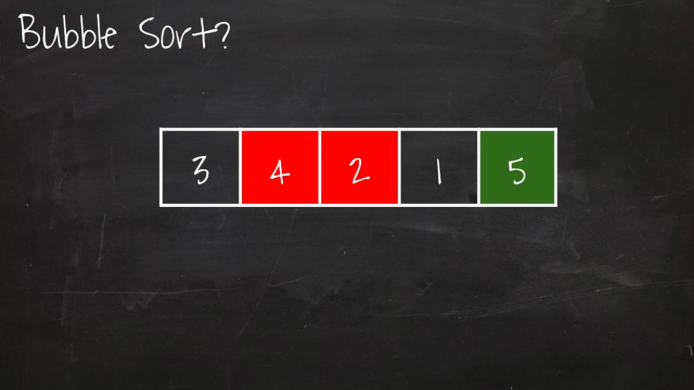
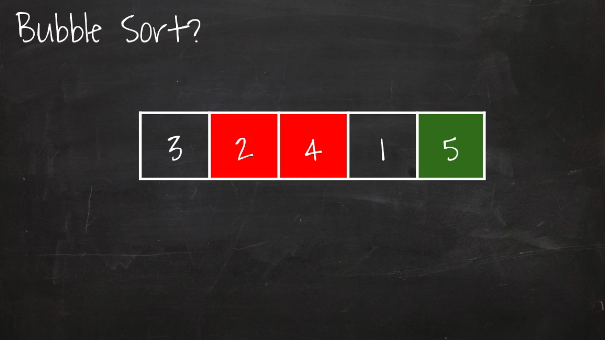

# 버블정렬(Bubble Sort) - O(n<sup>2</sup>)
> 출처: [엔지니어대한민국 YouTube - Bubble Sort](https://www.youtube.com/watch?v=YbsQiiubO74)





## Java
```java
public class BubbleSort {
	private static void bubbleSort(int[] arr) {
		bubbleSort(arr, arr.length - 1);
	}
	private static void bubbleSort(int[] arr, int last) {
		if(last > 0) {
			for(int i = 1; i <= last; i++) {
				if(arr[i - 1] > arr[i]) {
					swap(arr, i - 1, i);
				}
			}
			bubbleSort(arr, last - 1);
		}
	}
	private static void swap(int[] arr, int source, int target) {
		int tmp = arr[source];
		arr[source] = arr[target];
		arr[target] = tmp;
	}
	private static void printArray(int[] arr) {
		for(int data : arr) {
			System.out.print(data + ",");
		}
		System.out.println();
	}
	public static void main(String[] args) {
		int[] arr = {3,5,4,2,1};
		printArray(arr);
		bubbleSort(arr);
		printArray(arr);
	}
}

```

```
3,5,4,2,1,
1,2,3,4,5,
```
