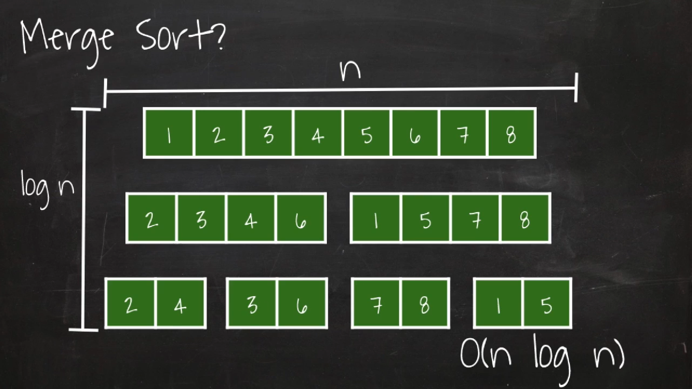

# 병합정렬(Merge Sort) - O(n log n)
> 출처: [엔지니어대한민국 YouTube - Merge Sort](https://www.youtube.com/watch?v=QAyl79dCO_k)



## Java
```java
public class MergeSort {
	private static void mergeSort(int[] arr) {
		int[] tmp = new int[arr.length];
		mergeSort(arr, tmp, 0, arr.length - 1);

	}
	private static void mergeSort(int[] arr, int[] tmp, int start, int end) {
		if(start < end) {
			int mid = (start + end) / 2;
			mergeSort(arr, tmp, start, mid);
			mergeSort(arr, tmp, mid + 1, end);
			merge(arr, tmp, start, mid, end);
		}
	}
	private static void merge(int[] arr, int[] tmp, int start, int mid, int end) {
		for(int i = start; i <= end; i++) {
			tmp[i] = arr[i];
		}
		int part1 = start;
		int part2 = mid + 1;
		int index = start;
		while(part1 <= mid && part2 <= end) {
			if(tmp[part1] <= tmp[part2]) {
				arr[index] = tmp[part1];
				part1++;
			}else {
				arr[index] = tmp[part2];
				part2++;
			}
			index++;
		}
		for(int i = 0; i <= mid - part1; i++) {
			arr[index + i] = tmp[part1 + i];
		}
	}
	private static void printArray(int[] arr) {
		for(int data : arr) {
			System.out.print(data + ",");
		}
		System.out.println();
	}
	public static void main(String[] args) {
		int[] arr = {3,9,4,7,5,0,1,6,8,2};
		printArray(arr);
		mergeSort(arr);
		printArray(arr);
	}
}
```

```
3,9,4,7,5,0,1,6,8,2,
0,1,2,3,4,5,6,7,8,9,
```
