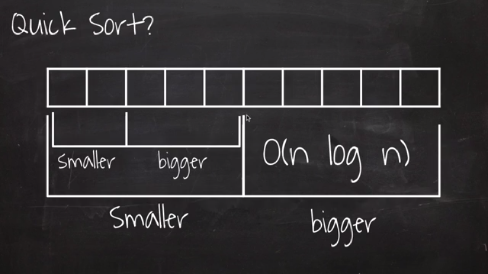
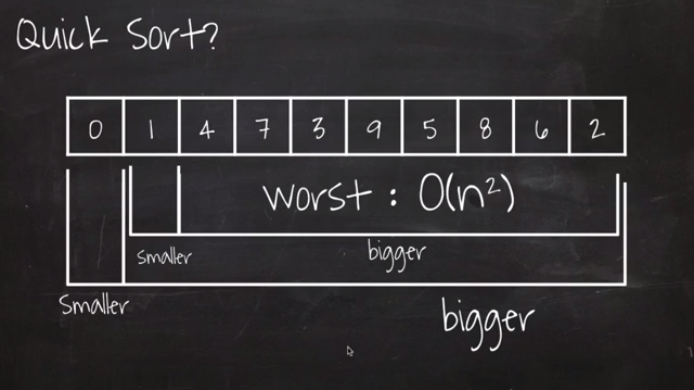
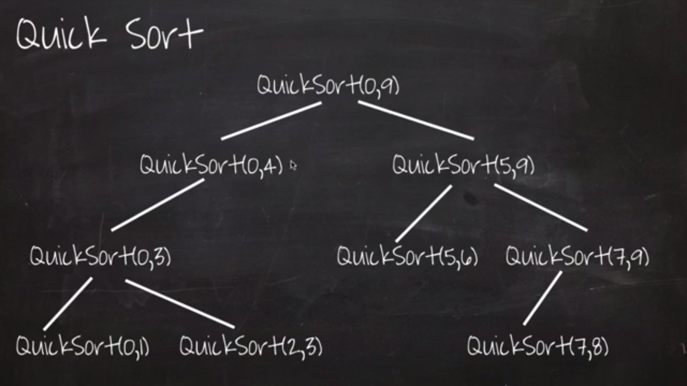

# 퀵정렬(Quick Sort) - O(n log n), worst: O(n<sup>2</sup>)
> 출처: [엔지니어대한민국 YouTube - Quick Sort](https://www.youtube.com/watch?v=7BDzle2n47c)







## Java
```java
public class QuickSort {
	private static void quickSort(int[] arr) {
		quickSort(arr, 0, arr.length - 1);
	}
	private static void quickSort(int[] arr, int start, int end) {
		int part2 = partition(arr, start, end);
		if(start < part2 - 1) {
			quickSort(arr, start, part2 - 1);
		}
		if(part2 < end) {
			quickSort(arr, part2, end);
		}
	}
	private static int partition(int[] arr, int start, int end) {
		int pivot = arr[(start + end) / 2];
		while(start <= end) {
			while(arr[start] < pivot) start++;
			while(arr[end] > pivot) end--;
			if(start <= end) {
				swap(arr, start, end);
				start++;
				end--;
			}
		}
		return start;
	}
	private static void swap(int[] arr, int start, int end) {
		int tmp = arr[start];
		arr[start] = arr[end];
		arr[end] = tmp;
	}
	private static void printArray(int[] arr) {
		for(int data : arr) {
			System.out.print(data + ",");
		}
		System.out.println();
	}
	public static void main(String[] args) {
		int[] arr = {3,9,4,7,5,0,1,6,8,2};
		printArray(arr);
		quickSort(arr);
		printArray(arr);
	}
}
```

```
3,9,4,7,5,0,1,6,8,2,
0,1,2,3,4,5,6,7,8,9,
```
