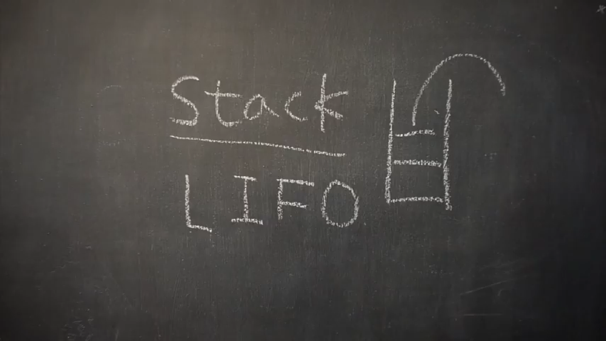

# 스택(Stack)
> 출처: [엔지니어대한민국 YouTube - Stack](https://www.youtube.com/watch?v=whVUYv0Leg0)



## Java
```java
import java.util.EmptyStackException;

class Stack<T> {
	class Node<T> {
		private T data;
		private Node<T> next;

		public Node(T data) {
			this.data = data;
		}
	}

	private Node<T> top;

	public T pop() {
		if(top == null) {
			throw new EmptyStackException();
		}

		T item = top.data;
		top = top.next;
		return item;
	}

	public void push(T item) {
		Node<T> t = new Node<T>(item);
		t.next = top;
		top = t;
	}

	public T peek() {
		if(top == null) {
			throw new EmptyStackException();
		}
		return top.data;
	}

	public boolean isEmpty() {
		return top == null;
	}
}

public class StackTest {
	public static void main(String[] args) {
		Stack<Integer> s = new Stack<Integer>();
		s.push(1);
		s.push(2);
		s.push(3);
		s.push(4);
		System.out.println(s.pop());
		System.out.println(s.pop());
		System.out.println(s.peek());
		System.out.println(s.pop());
		System.out.println(s.isEmpty());
		System.out.println(s.pop());
		System.out.println(s.isEmpty());
	}
}
```

```
4
3
2
2
false
1
true
```
