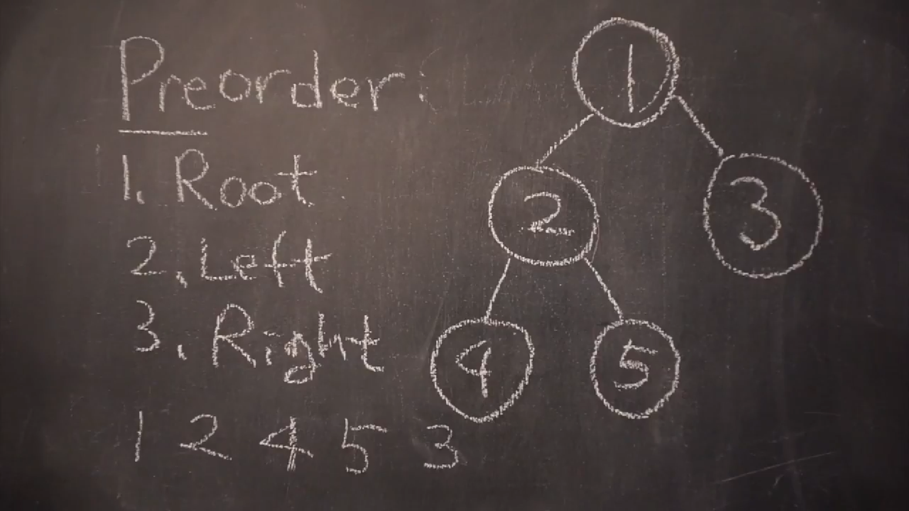

# 이진트리(Binary Tree)
> 출처: [엔지니어대한민국 YouTube - Binary Tree](https://www.youtube.com/watch?v=QN1rZYX6QaA)

## Inorder

## Preorder

## Postorder


## Java
```java
/*
       (1)
     ↙   ↘
    (2)   (3)
  ↙   ↘
(4)    (5)
Inorder (Left, Root, Right): 4 2 5 1 3
Preorder (Root, Left, Right): 1 2 4 5 3
Postorder (Left, Right, Root): 4 5 2 3 1
*/

class Node {
	int data;
	Node left;
	Node right;
}

class Tree {
	public Node root;

	public void setRoot(Node node) {
		this.root = node;
	}
	public Node getRoot() {
		return root;
	}
	public Node makeNode(Node left, int data, Node right) {
		Node node = new Node();
		node.data = data;
		node.left = left;
		node.right = right;
		return node;
	}
	public void inorder(Node node) {
		if(node != null) {
			inorder(node.left);
			System.out.println(node.data);
			inorder(node.right);
		}
	}
	public void preorder(Node node) {
		if(node != null) {
			System.out.println(node.data);
			preorder(node.left);
			preorder(node.right);
		}
	}
	public void postorder(Node node) {
		if(node != null) {
			postorder(node.left);
			postorder(node.right);
			System.out.println(node.data);
		}
	}
}

public class BinaryTree {
	public static void main(String[] args) {
		Tree t = new Tree();
		Node n4 = t.makeNode(null, 4, null);
		Node n5 = t.makeNode(null, 5, null);
		Node n2 = t.makeNode(n4, 2, n5);
		Node n3 = t.makeNode(null, 3, null);
		Node n1 = t.makeNode(n2, 1, n3);
		t.setRoot(n1);

		System.out.println("Inorder");
		t.inorder(t.getRoot());
		System.out.println("Preorder");
		t.preorder(t.getRoot());
		System.out.println("Postorder");
		t.postorder(t.getRoot());
	}
}
```
```
Inorder
4
2
5
1
3
Preorder
1
2
4
5
3
Postorder
4
5
2
3
1
```
