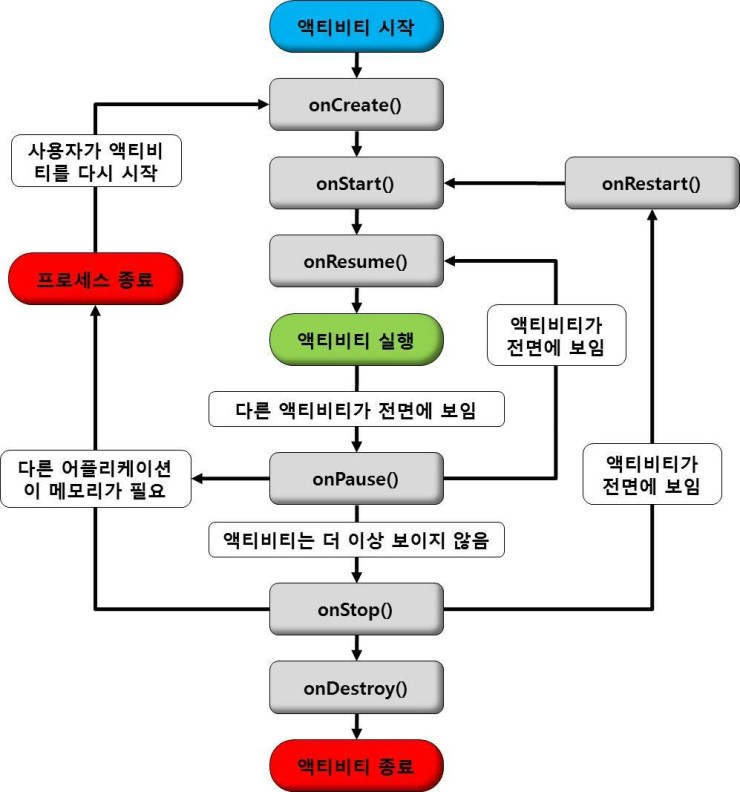

# 액티비티(Activity)
```
setContentView(Layout...)을 통해 화면에 보이도록 하는 요소들은 디스플레이 함
Intent를 통해 다른 Activity 간의 화면 전환을 할 수 있음
이 때, 다른 Activity를 실행할 때 데이터를 보낼 수 있는데, 반대로 새로 실행된 Activity가 호출자 Activity에게
데이터를 보내줄 수도 있음
- startActivityForResult()
```

## 액티비티(Activity) 생명주기

