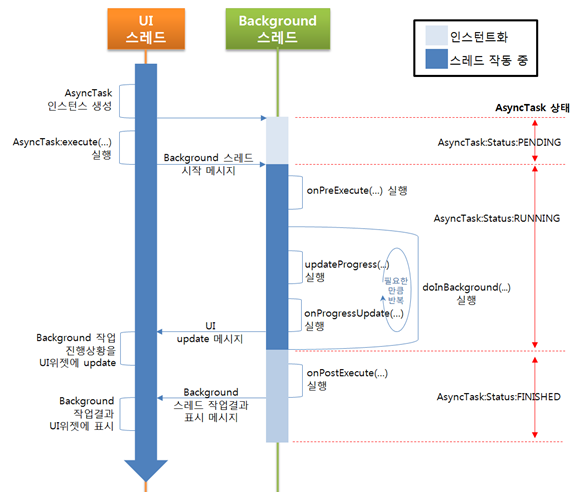

# AsyncTask 처리
> 참고: http://coding-factory.tistory.com/32

```
새로 만든 스레드에서 UI객체에 직접 접근할 수 없기 때문에 핸들러를 사용하게되는데
핸들러를 사용하면서 코드를 좀 더 복잡하게 만드는 문제가 생긴다.

이러한 백그라운드 작업을 좀 더 쉽고 간단하게 하고싶다면
AsyncTask 클래스를 사용할 수 있다
AsyncTask 객체를 만들고 execute()메소드를 실행하면
이 객체는 정의된 백그라운드 작업을 수행하고 필요한 경우에
그 결과를 메인 스레드에서 실행하므로 UI객체에 접근하는데 문제가 없게된다
```



## AsyncTask 주요 메소드

### doInBackground
```
새로 만든 스레드에서 백그라운드 작업을 수행한다
execute()메소드를 호출할 때 사용된 파라미터를 배열로 전달받는다
```

### onPreExecute
```
백그라운드 작업을 수행하기전에 호출된다
메인 스레드에서  실행되며 초기화 작업에 사용된다
```

### onProgressUpdate
```
백그라운드 작업의 진행상태를 표시하기위해 호출된다
작업수행 중간중간에 UI객체에 접근하는 경우에 사용된다
이 메소드가 호출되도록 하려면 백그라운드 작업중간에
publishProgress()메소드를 호출해야한다
```

### onPostExecute
```
백그라운드 작업이 끝난후에 호출된다
메인 스레드에서 실행되며 메모리 리소스를 해제하는 등의 작업에 사용된다
백그라운드 작업의 결과는 Result타입의 파라미터로 전달된다
```

### cancel
```
해당 메소드를 호출하면 작업을 취소할 수 있다
이 메소드를 통해 작업을 취소했을경우 onCancellde()메소드가 호출된다
```

### getStatus
```
해당 메소드를 호출하면 작업의 진행상황을 확인할 수 있다
이 메소드를 호출했을때 리턴되는 AsyncTask.Status객체는 상태를 표현하고 있으며
PENDING(작업시작 전), RUNNING(실행중), FINISHED(종료)로 구분된다.
```
