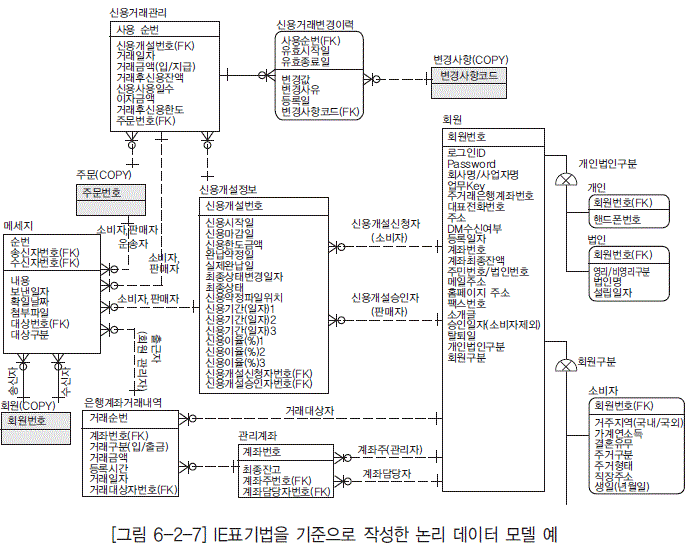

# 데이터모델링
> 출처: http://vnthf.logdown.com/posts/2016/03/18/650365
## 데이터모델이란 ?
관리하고자 하는 정보를 표현하기 위해 데이터구조를 논리적 으로 묘사하기 위해 사용되는 도구

* 개념적 데이터모델 현실 세계의 인식을 추상적인 개념으로 표현하는 과정 - 기획자
* 논리적 데이터모델 컴퓨터가 이해하고 처리가 가능하도록 컴퓨터 환경에 맞게 변환 - 개발자

## 데이터모델링 개념
### 데이터모델링 요소
* 엔티티 : 업무과 관여하는 어떤 것. 정보로 관리되어야 하는 식별 가능한 사람,장소,사물,개념,사건
* 속성 : 어떤 것이 가지는 고유한 특성이나 성격, 성질
* 관계 : 하나 혹은 두 개의 어떤 것 간에 업무와 관련되서 연관된 사항

### ERD
* 말로서 되어 있는 업무요구 사항을 그림으로 그려내어 관계를 표현한 것으로 엔티티타입과 엔티티간의 관계를 이해하기 쉽게 나타낸 것

## 데이터 모델링 프로세스
### 요구사항 분석
* 사용자의 요구사항을 도출하고 분석, 정의, 검증 하는 과정을 통해 구축하려는 서비스의 의도와 범위를 명확히 하는 단계
* 프로젝트 초기에 진행하는 것이 좋고 사용자/시스템, 기능적/비기능적등 여러 관점에서 구분하여 요구사항을 도출해야한다.

### 요구사항 분석과정
* 서비스 분석 - 서비스의 특징과 의미에 대한 큰 그림 파악
* 업무요건 분석 - 서비스의 세부 업무들의 구체적인 기능 요구사항 파악
* 개념적 실체 분석 - 주요 관리대상 데이터에 대한 식별 및 정의

### 개념모델링
* 데이터의 구조의 뼈대에 해당 하는 핵심 엔티티를 도출하고 핵심 엔티티 들간의 관계를 개괄적으로 표현하는 단계


> 이미지 출처 -  http://www.dbguide.net/db.db?cmd=view&boardUid=12829&boardConfigUid=9&categoryUid=216&boardIdx=37&boardStep=1

### 논리모델링
* 개념 모델링 단계에서 추출된 핵심 엔티티에 대한 설계를 구체화 하고 상세화 하는 단계
* 모든 업무를 구체적으로 ERD상에 그려내는 단계



> 이미지 출처 - http://www.dbguide.net/db.db?cmd=view&boardUid=12829&boardConfigUid=9&categoryUid=216&boardIdx=37&boardStep=1

### 물리모델링
* 특정 데이터 베이스에 맞도록 데이터 타입과 길이를 선정하고 데이터의 크기와 Access패턴을 분석하여 데이터를 분산하는 단계
    * 테이블 수직/수평분할
    * nBase는 알아서 수직/수평분할 벨런싱등을 자동으로 해줌(큐브리드만 지원, 차후 확장)

* 인덱스 실계/ 제약조건 설계, 성능을 위한 반정규화 설계


> 이미지 출처 - http://www.dbguide.net/db.db?cmd=view&boardUid=12830&boardConfigUid=9&categoryUid=216&boardIdx=37&boardStep=1

### 논리모델링
#### 주제영역 정의
* 데이터에 대한 상위 수준의 분류로 조직에서 관심을 가지는 기능 또는 주요 토픽에 대한 엔티티의 그룹
* 업무적인 연관성을 가진 엔티티를 그룹화함으로써 가독성을 향상시킴
* 사건의 진행에 따른 수직적 분할
* 업무연관성에 따른 수평적 분할

#### 엔티티
* 의미
    * 업무에 필요하고 유용한 정보를 저장하고 관리하기 위한 것 (개념모델링의 테이블)
    * 정보화하고자 하는 사람, 장소, 사물 또는 개념
* 후보선정
    * 행위 또는 객체의 집합인지
    * 관리하고자 하는 속성이 2개이상인지
    * 명사인지
    * 비슷한 의미의 집합이 없는지
    * 엔티티가 릴레이션이 아닌지, 속성으로 관리되어야 하는지도 검증
* 명명
    * 표준단어를 사용
    * 자연스러운 의미를 가장 명료하면서도 간단하게

#### 관계
* 의미
    * 데이터 집합에 속한 객체들 간의 연결고리
    * 무결성을 보장해주는 장치
    * 카디넬리티

### 정규화
#### 목적
* 입력/수정/삭제의 이상현상을 제거
* 데이터중복을 최소화
* 대부분 3차 정규화까지만 진행

#### 1차정규화
* 반복적인 속성값이 나타는 경우
* 저장할데이터가 두개이상일경우, 컬럼명이 1,2,3,4 같은게 나타날때
* 가장 큰 문제는 검색이 힘들고 추가삭제와 같은 확장성에서 자유롭지 않다.

#### 2차정규화
* 주식별자 전체에 종속적이지 않는 속성을 분리
* pk가 2개이상인데 전체에 대서 종속적이지 않고 일부에 관해서만 종속적일때

#### 3차 정규화
* 일반 속성에 종속적인 속성을 분리
* 일반 컬럼에 의존하는 속성들이 있다면 분리한다.

```
!정규화과정.PNG|border=1!
기본 - 1차 - 2차 -3차
```

### 반정규화
* 정규화한 속성을 성능향상과 단순화를 위해 구조를 조정하는 기법

### 정규화/비정규화
* 정규화한 속성은 무결성, 정합성 우선, 테이블이 많아서 select비용 과다
* 반정규화 속성은 단순화.성능 우선, 중복된 컬럼이 존재하므로 insert/update,delete 부하

### 절차
* 대상조사, 다른유도방법검토, 적용
* 데이터 등급과 같은 속성을 고정할수있는가. 담당그룹이 고정될수 있는가 -> 반정규화 대상
* ex) 장애등급은 5가지로 고정, 모든서비스의 등급은 5가지로 고정
* 데이터양이 많고 계족 증가할 경우
* null인 데이터 없이 모든 컬럼에 데이터되고 전체컬럼을 조회할경우 -> 반정규화 훨씬 사이즈가 작아짐
* 또 빠르기도 해서 통계테이블은 대부분 반정규화를 해서 진행함 (그림)

### M:M 관계 해소
* 일반적으로 m:m일 경우는 이 관계 자체만으로는 데이터 모델이 성립하지 않는다.
* 일반적으로 RDB 툴에서도 m:m관계는 그려지지 않는다.(관계엔티티 방법으로 변환해서 그려줌)
* 관계모델링에선 가끔씩 쓰기도 한다.
* 일반적으로 관계 엔티티로 해소한다.
* ex)주문 - 제품의 관계가 m:m이라면 주문 - 주문제품 - 제품 이런식으로 엔티티를 만들어서 해소하게 된다.

### super-sub type 관계
* 비슷한 성격의 엔티티들이 공통된 속성과 관계를 가지고 있을때
* ex) 접수를 슈퍼, 인터넷 접수, 방문접수, 전화접수를 서브로 놓는 경우
* 개념모델링 관계에서는 슈퍼서브타입관계로 그려나가면서 하는것이 편하지만
* 물리모델링 단계에서는 +반드시 해소해야함+. 대부분, 하나의 테이블로 구성하는 경우가 대부분

### Recursive관계
* 1:m 계층형 모델을 통합한 모델
* 계층구조로 만들 경우 단점
    * 참조하는 컬럼값의 계층이 다른경우
    * 계층 추가/삭제에 유연하지 않음
    * 전체계층을 함께 조회하며 sort가 일어나는 경우 불리
* 그래서 자기가 자기를 바라 볼 수 있는 Recursive를 사용한다.(단 양쪽이 모두 +optional+ 해야한다.)
* ex) 본부-센터-랩-팀이라는 엔티티 계층구조가 있을 경우, 사실 이것들 엔티티 모두는 부서이다. 이런것이 계층구조로 있으면 부서를 추가하거나 또는 구조를 삭제할 경우 확장성에서 제한을 많이 받게된다.
* ex)게시물의 답글, 답글의 답글

### Arc(베타)관계
* 하나의 자시 엔티티에대해 두개 이상의 부모 엔티티가 서로 배타적으로 존재
* ex) 평가라는 자식엔티티가 있고 부모엔티티가 고객, 법인 이렇게 두 개를 바라보고 있을 경우와 같다
* 컬럼들이 optional 해야한다.
* 항상 해소해야하는것은 아니지만 메인엔티티에서 나타날경우 해소하는게 좋다.
    * 해소할 경우 쿼리가 복잡해진다.
    * 가급적 상위엔티티에서 집합을 확장하여 Arc관계를 해소한다.
    * 어떻게 보면 슈퍼,서브타입을 합하는것과 비슷하다고 할 수 있다.
* 해소를 하지 않을 수도 있다.
    * 하나의 칼럼과 구분자를 받는방법과 개별 칼럼으로 받는방법이 있다.
    * 하나의 칼럼과 구분자를 받는방법
        * 부모타입의 키들을 합할 경우
        * 구분자 칼럼이 필요하다.
        * 아이디에 어떤값이 들어온닥 제약을 줄수가 없다.(참조무결성제약불가)
        * 인덱스를 걸 경우 좀 더 좋은속도를 낼 수 있다.
    * 개별 칼럼으로 받는방법
        * FK를 설정해서 각각의 키로 받을 경우가 있다.
        * 참조 무결성 가능
        * 인덱스가 많아진다.
        * 키에서 오류가 날경우 찾기가 힘들어진다.
        * 관리나 성능에서 불리해서 거의 사용하지 않는다. (그림)

#### 하나의 속성은 하나의 값만
* 컬럼에 리스트가 들어갈경우가 있다. xxx목록과 같은 컬럼
* 사실 중간에 짤라서 엔티티를 따로 만들어야 하지만 단일 디스플레이일 경우 이렇게 만들기도 한다.
* 옵션과 같은 경우에는 각 옵션들을 맞게 비트값으로 만들어서 하나의 컬럼에 저장할수 있다.
    * 다만 너무 로직이 복잡해지고 추가,삭제하려면 다 업데이트하고 또 다른사람이 알아볼수없는경우가 있으므로 잘 사용하지 않는다.
* 옵션을 컬럼 하나하나로 만들경우
    * 옵션을 여러개 써야할 경우 쿼리설계가 편해진다.
* 엔티티를 분리할 경우 - 가장 좋은 예
    * 확장성이 좋다.
    * 쿼리를 날릴 때 옵션개수만큼 조인이 발생한다. 여러 옵션에 AND,OR연산이 발생한다면 불편하다.

#### 추출속성
* 알아 낼 수 있는 속성값 들을 미리 만들어 놓는것
* count, total, max, min과 같은것
* 장점
    * 성능상의 빠른 응답속도, 쿼리 단순화
* 단점
    * 반정규화된 데이트이므로 업데이트에 관한 부담이 발생하고 일관성이 깨지기 쉬움, 저장공간 낭비
* when?
    * ex) 질문과 답변 : 답변수를 카운트 할 것인지 아님 답변수를 가지고 있을 지
    * 자주 보여지는 화면에서 수를 보여주어야 할때는 가지고 있는것이 좋다.
        * 추출속성을 이용한 소팅이나 인덱스 활용 경우에 훨씬 유리하다.
    * 리스트 출력시 동시에 출력하는 경우
    * 자주 변경하지 않는 경우
* 추출속성은 성능을 고려하여 존재의 가치를 고민하여 사용하여야한다.
