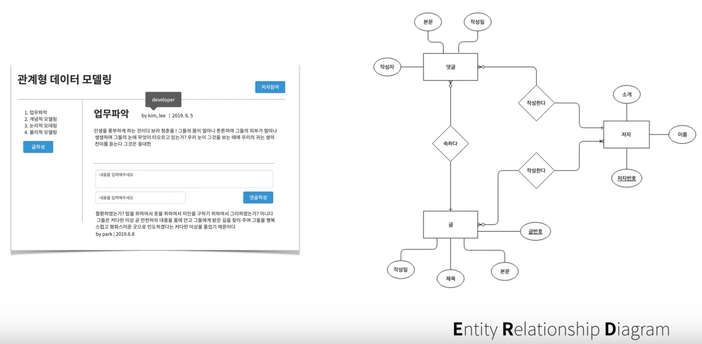

# 데이터베이스 - 생활코딩
## 데이터베이스의 본질
- Input
  - Create
  - Update
  - Delete
- Output
  - Read

## 데이터베이스 발전 순서
- File -> Spreadsheet -> Database

## 관계형 데이터 모델링
### 전체 흐름
- 업무파악 -> 개념적 데이터 모델링 -> 논리적 데이터 모델링 -> 물리적 데이터 모델링
  - 데이터 모델링이란 문제를 현실로부터 뜯어내서 고도의 추상화 과정을 거쳐 컴퓨터라는 새로운 현실로 옮겨 담는 작업
  - 이 두 개의 세계는 서로 다르기 때문에 처음에 해결하려고 했던 문제가 데이터베이스 표에 잘 담겼는지를 확인하는 작업을 끊임없이 계속해서 해야 하는 작업

### 업무파악
- UI를 같이 그려보자
  - 원하는 것을 분명히 할 수 있다
  - 말을 불신할수록 말의 신뢰성은 높아진다
- 도구
  - [Oven](https://ovenapp.io)

### 개념적 데이터 모델링
- 핵심
  - 필터
  - 언어
- ERD(Entity Relationship Diagram)

  - 정보
  - 그룹
  - 관계
- 요약
  - Entity -> Table
  - Attribute -> Column
  - Relation -> PK, FK
  - Tuple -> row
- 도구
  - [draw.io](https://draw.io)
  - [entity relational diagram helper](http://erd.yah.ac)

### 논리적 데이터 모델링
- 정규화
  - 정제되지 않은 데이터를 관계형 데이터베이스 패러다임에 잘 맞는 표로 만들어주는 레시피
  - [Wikipedia - Database normalization](https://en.wikipedia.org/wiki/Database_normalization)
  - [생활코딩 정규화 예제](http://bit.ly/2wV2SFj)
  - 제3정규형까지가 상업적으로 많이 사용
    - 제1정규화
      - Atomic columns
      - 각 행(row), 열(column)의 값들이 원자적이여야 한다
    - 제2정규화
      - No partial dependencies
      - 부분종속성이 없어야 한다
      - 표의 기본키 중에 중복이 있다면 해당 중복을 제거한다
    - 제3정규화
      - No transitive dependencies
      - 이행적 종속성을 제거한다
- 도구
  - [ER Master](http://ermaster.sourceforge.net)

### 물리적 데이터 모델링
- 선택한 데이터베이스 제품에 맞는 현실적인 고려를 하는 방법론
- 이 단계에서 가장 중요한 것은 성능
- just do it
- 성능을 높이기 위한 방법
  - find slow query
  - [denormalization](http://bit.ly/2WLMCko)
  - index
    - 읽기 성능 up
    - 쓰기 성능 down
  - application
    - cache 사용 고려