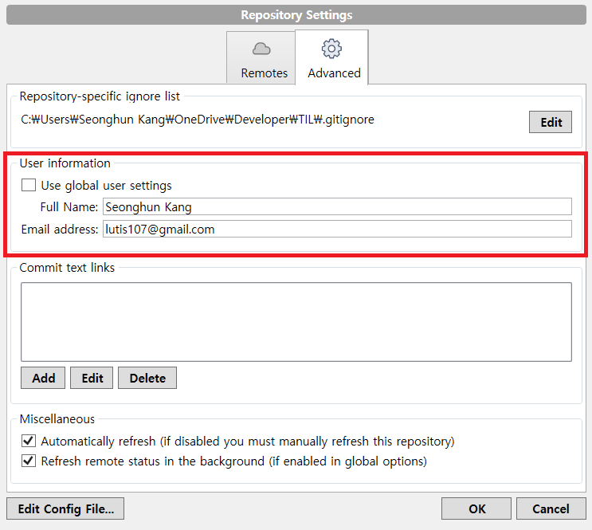
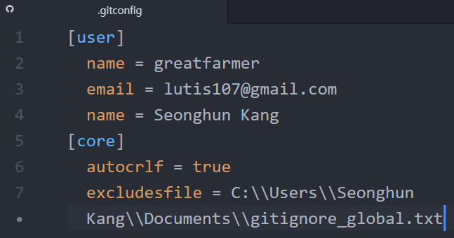
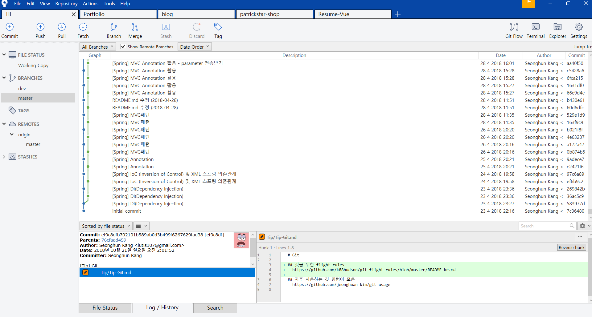
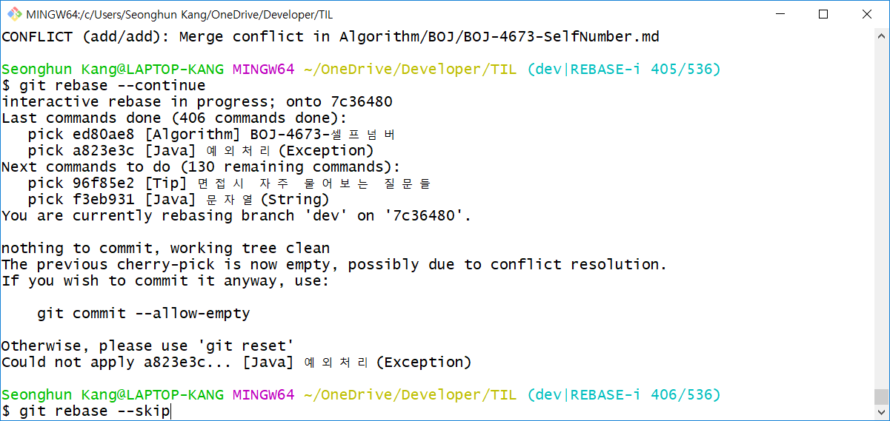
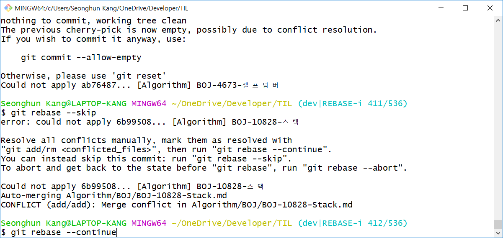
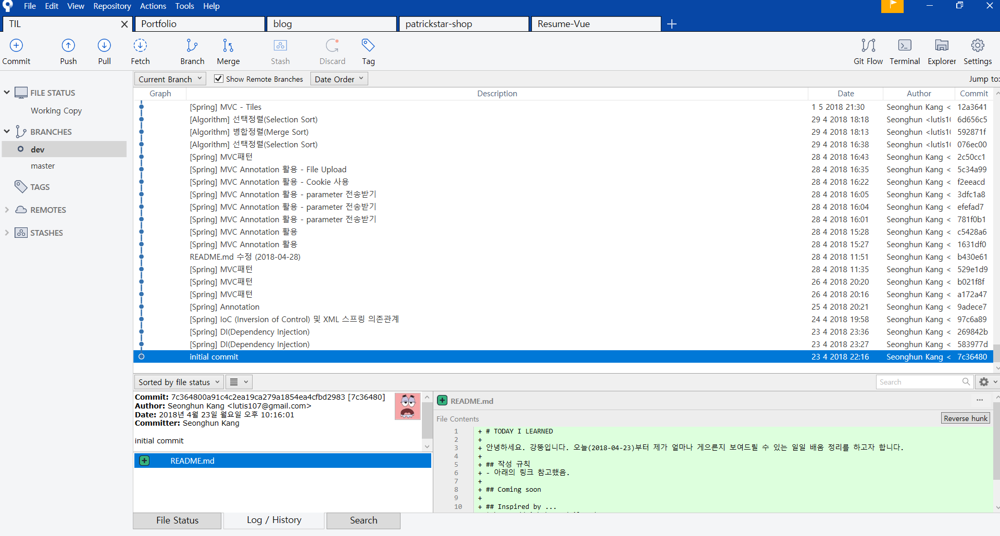

# Git

## 깃을 위한 flight rules
- https://github.com/k88hudson/git-flight-rules/blob/master/README_kr.md

## 자주 사용하는 깃 명령어 모음
- https://github.com/jeonghwan-kim/git-usage

## 좋은 커밋 메시지 작성하기
- https://item4.github.io/2016-11-01/How-to-Write-a-Git-Commit-Message/
- https://sujinlee.me/professional-github/
- https://djkeh.github.io/articles/How-to-write-a-git-commit-message-kor/

## gitignore
- [gitignore](Git-gitignore.md)
- [gitignore.io](https://www.gitignore.io/) | Create useful .gitignore files for your project

## GitHub language colors
- [GiHub-Colors](Git-GitHub-Colors.md)

## Trouble Shooting 바로가기
- [Sourcetree에서 User information 내용을 변경해도 새 Repository에서 적용이 되지 않을 경우](#sourcetree에서-user-information-내용을-변경해도-새-repository에서-적용이-되지-않을-경우)
- [리모트 저장소에 푸시한 커밋을 리베이스했을 경우](#리모트-저장소에-푸시한-커밋을-리베이스했을-경우)

## Trouble Shooting
### Sourcetree에서 User information 내용을 변경해도 새 Repository에서 적용이 되지 않을 경우

- .gitconfig 파일에서 내용을 변경
  - `C:\Users\<username>\.gitconfig`
  
  - https://community.atlassian.com/t5/Sourcetree-questions/Change-the-author-and-committer-name-and-e-mail-of-multiple/qaq-p/807008
  - (같이보기) https://git-scm.com/book/ko/v1/시작하기-Git-최초-설정

### 리모트 저장소에 푸시한 커밋을 리베이스했을 경우
- **(경고)** 기본적으로 **리모트 저장소에 푸시한 커밋은 리베이스하지 말 것**
  - https://djkeh.github.io/articles/Do-not-rebase-commits-that-you-have-pushed-to-a-public-repository-kor/
- 하지만, 이미 실수를 해버렸을 경우에 대한 내용이다
- 상황
  - 리모트 저장소 `master` 브랜치의 커밋 중 하나를 삭제하고 싶었다
  - `master` 브랜치에서 Interactive Rebase `git rebase -i <커밋 해시값>``를 통해 삭제하고 싶은 커밋을 drop 했다 **(핵심적인 실수)**
    - [Git rebase를 이용한 커밋 수정 (Interactive Rebase)](https://wckhg89.github.io/archivers/rebase)
  -  하지만, **기존 커밋이 중복**되는 결과가 나왔다
  
- 해결
  - **새 브랜치를 만들어 다시 Interactive Rebase 실행**
  - `dev`라는 브랜치를 만들고 이 브랜치로 checkout함
  - Sourcetree - Terminal (Git Bash)에서 `git rebase -i 7c36480`(7c36480은 Initial commit의 커밋번호) 실행
    - 해당 작업의 [Git Bash Log](data/git-rebase-log.docx)
  - `nothing to commit, working tree clean` 메시지
    - `git rebase --skip`
    
  - `CONFLICT (rename/add): Rename Spring/Spring-MVC->Spring/Spring-MVC.md in 4e63237... ` 메시지
    - conflict 해결 후
    - `git rebase --continue`
    
  - rebase 완료
    - 커밋 중복 제거된 상태
    
  - 고려해야 할 문제
    - rebase가 완료되면 기존 커밋날짜가 rebase가 완료된 날짜로 변경된다
    - 즉, GitHub의 Remote repository 경우 기존 Contributions(잔디심은 것)이 날아간다
  - 위의 문제가 상관없다면
    - 기존 `master`브랜치를 제거하고 `dev`브랜치의 이름을 `master`로 변경
  - 느낀점
    - **절대! `master` 브랜치에서 rebase작업을 하지말자**
      - rebase 작업은 별도의 브랜치를 만들어 진행하자
      - remote repository에 push한 커밋이라면 더 주의하자
        - 공동작업의 경우 더 심각한 상황을 초래한다
      - Best: 이런 상황 자체를 만들지 말자
        - 하지만, 세상은 생각대로만 흘러가지 않는다
