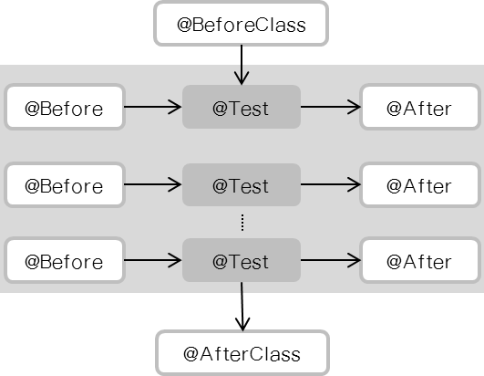

# JUnit
> https://en.wikipedia.org/wiki/JUnit

JUnit is a unit testing framework for the Java programming language. JUnit has been important in the development of test-driven development, and is one of a family of unit testing frameworks which is collectively known as xUnit that originated with SUnit.

JUnit is linked as a JAR at compile-time; the framework resides under package junit.framework for JUnit 3.8 and earlier, and under package org.junit for JUnit 4 and later.

A research survey performed in 2013 across 10,000 Java projects hosted on GitHub found that JUnit, (in a tie with slf4j-api), was the most commonly included external library. Each library was used by 30.7% of projects.

### Example of JUnit test fixture
```java
import org.junit.*;

public class FoobarTest {
    @BeforeClass
    public static void setUpClass() throws Exception {
        // Code executed before the first test method
    }

    @Before
    public void setUp() throws Exception {
        // Code executed before each test
    }

    @Test
    public void testOneThing() {
        // Code that tests one thing
    }

    @Test
    public void testAnotherThing() {
        // Code that tests another thing
    }

    @Test
    public void testSomethingElse() {
        // Code that tests something else
    }

    @After
    public void tearDown() throws Exception {
        // Code executed after each test
    }

    @AfterClass
    public static void tearDownClass() throws Exception {
        // Code executed after the last test method
    }
}
```

### Diagram


## 유닛 테스트
> https://ko.wikipedia.org/wiki/유닛_테스트

유닛 테스트(unit test)는 컴퓨터 프로그래밍에서 소스 코드의 특정 모듈이 의도된 대로 정확히 작동하는지 검증하는 절차다. <br>
즉, 모든 함수와 메소드에 대한 테스트 케이스(Test case)를 작성하는 절차를 말한다. <br>
이를 통해서 언제라도 코드 변경으로 인해 문제가 발생할 경우, 단시간 내에 이를 파악하고 바로 잡을 수 있도록 해준다. <br>
이상적으로, 각 테스트 케이스는 서로 분리되어야 한다. <br>
이를 위해 가짜 객체(Mock object)를 생성하는 것도 좋은 방법이다. <br>
유닛 테스트는 (일반적인 테스트와 달리) 개발자(developer) 뿐만 아니라 보다 더 심도있는 테스트를 위해 테스터(tester)에 의해 수행되기도 한다.

### 장점
- 문제점 발견
- 변경이 쉽다
- 통합이 간단하다

## 주의사항
- JUnit을 사용할 때, Main함수에는 @Test 어노테이션이 먹히지 않는다
- java.lang.Exception: Method parsePageNumber() should be public
  - method는 public이어야 한다
- java.lang.Exception: Method parsePageNumber should have no parameters
  - method에 파라미터가 없어야 한다

## References
- [Official site](https://junit.org/junit5/)
- [새내기 개발자의 JUnit 여행기](http://www.nextree.co.kr/p11104/)
- [Testing Framework JUnit이란?](https://nesoy.github.io/articles/2017-02/JUnit)
