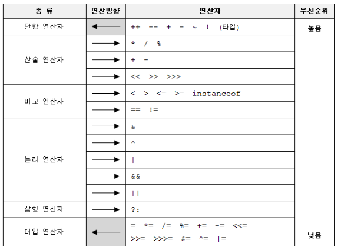
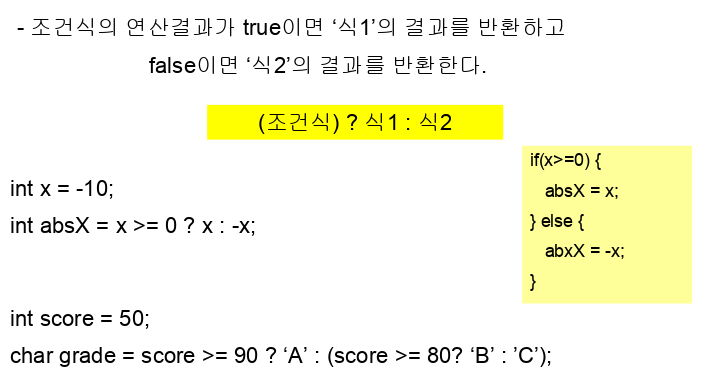

# 연산자(Operator)
> 참고: Java의 정석(남궁성 저)

## 연산자(Operator)란?
#### 연산자(Operator)

- 어떠한 기능을 수행하는 기호(+, -, *, / 등)
- 연산자의 작업 대상(변수, 상수, 리터럴, 수식)
- a + b

## 연산자의 종류
#### 단항 연산자: +, - (타입), ++, --, ~, !

#### 이항 연산자
- 산술: +, _, *, /, %, <<, >>, >>>
- 비교: >, <, >=, <=, ==, !=
- 논리: &&, ||, &, ^, |
- 삼항 연산자: ? :
- 대입 연산자: =

## 연산자의 우선순위

```

괄호의 우선순위가 제일 높다.

산술 > 비교 > 논리 > 대입

단항 > 이항 > 삼항

연산자의 연산 진행방향은 왼쪽에서 오른쪽(→)이다.

단, 단항, 대입 연산자만 오른쪽에서 왼쪽(←)이다.

                   3*4*5                               x = y = 3
```

## 이항연산자의 특징
```
이항연산자는 연산을 수행하기 전에 피연산자의 타입을 일치시킨다.

- int보다 크기가 작은 타입은 int로 변환한다.

(byte, char, short → int)

- 피연산자 중 표현범위가 큰 타입으로 형변환 한다.

byte + short → int + int → int

char + int → int + int → int

float + int → float + float → float

long + float → float + float → float

float + double → double + double → double
```

## 삼항연산자

