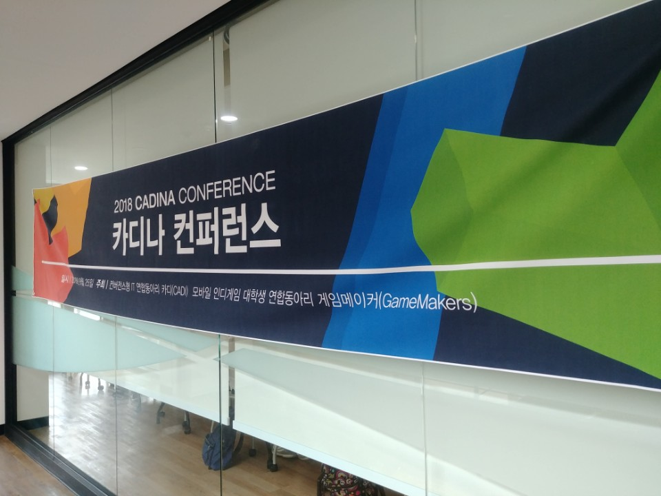

# 2018 카디나 컨퍼런스

- 주최: CADI, GameMakers
- 일시: 2018-08-25 (토) 12시 ~ 16시
- 장소: 서울대학교 해동학술관

## 1. 언제까지 개발하고 싶으세요?
### 연사 소개
(이상민 님)
- NHN Ent. 재직 중
- SDS -> Naver -> SK Planet -> NHN Ent.
- 19년차인데 PM거절, 기술리더로 개발자 생활을 계속하는 중
- 저서
	- God of java
	- Java perfomance tuning
	- ...10 more
	- **경험이 녹아 있는 책을 쓰자**

- 발표자료 제작툴: TOAST Dooray

### 발표 내용
- 인생의 목표
	- money?
	- 대학원은 천재라면 가자
		- 개인적으로 회사 -> 대학원 추천
	- wedding?
	- be famous?
		- 왜 유명해지려고 하는지?
	- house?
	- happiness?
		- 행복이 가장 중요
		- 어떻게 행복해질까?

- 연사의 생활 습관
	-	오전 6시 기상 -> 회사에서 샤워 -> 책 -> 업무 -> 오후 5시 반 퇴근

- 일과 취미의 차이
	- 게임 플레이와과 게임 개발은 다르다
	- 회사
		- 경제적 가치를 창출
	- 개발을 하는 목적을 잘 생각하자

- IT회사에서 일하려면
	- 인턴은 선택이 아닌 필수
		- 기회가 된다면 꼭 해보시길
		- 그 회사의 분위기를 파악하기 좋음
		- 아주 특출날 경우 인턴 후 채용이 될 수도
			- 인턴에게 실제 운영중인 개발을 업무로 주지 않는다. 실험적인 것, 귀찮은 것을 시킨다. -> 잘한다면 채용가능성 상승

- 취직을 먼저 - 자소서
	- **자소서는 굉장히 잘 써야한다**
	- 연사는 하루에 약 30명의 자소서를 봄
	- 최근 개인정보는 블라인드를 많이함
		- 자소서로 서류합격 여부가 결정될 수 있다
	- 친구꺼 베끼지 말고
		- 실제로 베낀 경우를 경험
	- 복붙하지 말고
	- 회사, 업무 파악
		- 뭔가 하고싶다는 의지표명

- 코딩
	- 코딩테스트 봄
		- 알고리즘 위주
	- 손코딩 연습 많이
	- 눈으로만 연습하지 말고 직접
	- **자신의 코드를 설명하는 연습 많이**
		- 친구랑 서로 코드리뷰 연습하는 것을 추천

- 면접
	- **자신감**
	- 거짓없이 성실하게
	- 아는척 X
		- 면접관들은 그 회사에서 인정받는 사람들이다

- 개발자와 비개발자
	- 비개발자: 기획자, PM, QA, 지원부서(인사, 총무, 재무, 교육 등)
	- 개발하다가 비개발자로 전향하는 경우도 적지 않음
	- Engineer
		- 개발자?
			- 입코더
			- Real 개발자
				- FE (프론트엔드)
				- BE (백엔드)
				- Full Stack
				- 게임 개발자
		- 개발자 분류
			- 솔루션, 서비스, 플랫폼, SI개발자
				- 솔루션
					- 예) 제니퍼소프트
				- 서비스
					- 예) 네이버 카페, 블로그
				- 플랫폼
					- 예) 서비스에 들어가는 프레임워크
				- SI개발자
					- 고객이 시키는 것을 만드는 것
					- like 진흙탕
					- 젊었을 때 해보는 것이 좋다고 생각
					- 하지만 추천하지 않는다
			- 인프라 엔지니어
				- 서버 operator
				- 서버 manager
			- 기술 지원 엔지니어
				- Real Technical Support
				- Sales Technical Support

- **영어공부는 잘 준비하세요**
	- 해서 후회될 것은 없다

- 커리어패스는 어떻게?
	- 일단 3년간 죽어라 개발만 할 것
		- 여러분이 지금까지 한 개발은 개발이 아닐 수 있다
	- 뭘 할지는 그 다음에 결정
	- 개발이라도 해야 무엇을 할 수 있다
	- 개발도 못하면...

- IT회사에서는 죽을 때 까지 공부
	- 하지않으면 '도태'
	- 10년 후 내가 원하는 곳을 갈 수 있는가?
	- 1년에 한번씩 이력서 갱신
		- 발전과정을 볼 수 있음
	- 주종목을 정하자
		- Java는 현재 먹고살 수 있음 (지금은)
	- 회사에서 3년동안 고3때처럼 공부
		- 어디서든지 인정받는다
	- 지치지 않으려면
		- 취미를 갖자
		- 야근 X
		- 집중해서 일을 하자
	- 5년 후, 10년 후 미래를 생각

- 내가 알고 있는 것을 남에게 잘 전달하는 것이 중요

- 개발의 가장 중요한 산출물
	- **코드**

### 질문
- 19년차시면 PM제의에 대한 압박이 크셨을 텐데, 어떻게 개발자로 계속 일할 수 있었는지요?
	- NHN Ent.는 매니저, 개발자 패스를 결정할 수 있음
	- 회사에서 매니저를 하라고 강요했다면 퇴사할 생각
	- 여러분 개발자로 계속 일하고 싶으면 저희 회사로 오세요

- 자바의 미래?
	- 오라클이 알고 있다
	- Open JDK가 있기 때문에 아직 괜찮을 것

## 2. Modern Micro Services Platform
### 연사 소개
(정윤진 님)
- Pivotal Advocate Team, Principal Technologist

### 발표 내용
- 뭘 만들까?
	- 2~3개월 간격으로 토이프로젝트 진행 추천
	- 연사의 토이프로젝트
		- [github.com/AutoRally](https://github.com/AutoRally)

- 책 추천
	- [Release It!](https://books.google.co.kr/books?id=UW7jAQAACAAJ&dq=Release+it&hl=ko&sa=X&ved=0ahUKEwjWu8Oa5IzdAhUTBIgKHRRPB2AQ6AEIKTAA)
	- [Cloud Native Java](https://books.google.co.kr/books?id=fZAwDwAAQBAJ&dq=cloud+native+java&hl=ko&source=gbs_navlinks_s)
	- [카프카, 데이터 플랫폼의 최강자](http://www.yes24.com/24/goods/59789254)

- 차세대 프로젝트
	- 우리은행
		- 명절에 한번에 배포
			- 문제 생길 소지가 큼
	- 아마존
		- 11초에 한 번씩 업데이트
		- 다운타임없이 프로덕트로 쉽핑
			- 차세대 중요한 요소

- 클라우드
	- Auto-scaling

- 마이크로 서비스
	- [Mastering Chaos - A Netflix Guide to Microservices](https://www.youtube.com/watch?v=CZ3wIuvmHeM)
	- ["Caching at Netflix: The Hidden Microservice" by Scott Mansfield](https://www.youtube.com/watch?v=Rzdxgx3RC0Q)
	- [Resilience4j](https://github.com/resilience4j/resilience4j)

- 일례
	- 우리나라의 우편번호가 5자리로 변경되었을 시기
		- 국내서비스 반영 X -> 아마존이 먼저 반영됨

- Netflix
	- 시작은 리테일 (DVD 배송)
	- 스트리밍으로 전환
		- 코어 비지니스를 변경함
	- [Netflix incloudsmarch8 2011forwiki](https://www.slideshare.net/KevinMcEntee/netflix-incloudsmarch8-2011forwiki)
	- 장애가 발생했을 시
		- 다시는 이런 장애가 일어나지 않게 근본적인 해결책을 생각
	- Cloud Native
	- Micro Service Architecture
		- 하나의 장애가 전체 장애로 이어지는 것을 방지
		- 사용자의 많은 요구 사항에 빠른 반응
	- Netflix Principal
		- You build it
		- You run it
		- You support it
	- [Full Cycle Developers](https://medium.com/netflix-techblog/full-cycle-developers-at-netflix-a08c31f83249)
	- [Netflix TechBlog](https://medium.com/netflix-techblog)
	- [SDLC](https://ko.wikipedia.org/wiki/소프트웨어_개발_수명_주기)
		- 소프트웨어 개발 수명 주기(Software Development Life Cycle, SDLC)
			- 절차가 많음
			- 오랜 시간이 걸림
	- SDLC + DevOps
		- "Operate what you build"
	- [Netflix OSS](https://netflix.github.io/)

- Amazon
	- 제프 베조스
		- 100만 회원
			- 100만개의 상점이 있어야 한다

- [콘웨이의 법칙](https://johngrib.github.io/wiki/Conway-s-law/)
	- 소프트웨어 구조는 개발 조직의 커뮤니케이션 구조를 닮는다

- SWE, SDET, SRE
	- SWE
		- [Software Engineering](https://en.wikipedia.org/wiki/Software_engineering)
	- SDET
		- [Software Development Engineer in Test](https://en.wikipedia.org/wiki/Software_Development_Engineer_in_Test)
	- SRE
		- [Site Reliability Engineering](https://en.wikipedia.org/wiki/Site_Reliability_Engineering)

- FAANG
	- Facebook
	- Apple
	- Amazon
	- Netflix
	- Google(Alphabet)

- **설정과 코드 분리**
	- 안좋은 예) 코드 안에 서버 IP주소를 넣은 경우

## 3. 게임 개발의 속도
### 연사 소개
(김현우)
- 유니티 게임 아카데미 대표

### 발표 내용
- 생각의 속도, 빌게이츠

- UI/UX
	- 게임 개발 속도와 관련

- 배틀그라운드
	- 30명, 1년 개발
	- 성공요소: 속도, 효율성, 장인정신 X
		- FPS게임은 틀이 있음 (속도)
		- 언리얼4 엔진 사용 (효율성)
			- 총기 20개는 그냥 마켓플레이스에서 사서 씀
		- 장인정신 배제함 (장인정신 X)

- 가장 싫어하는 개발자
	- 언리얼, 유니티 엔진을 이용해서 만드는 것을 부정하는 개발자
		- 장인정신을 가지고 있어서 시간, 비용이 많이 소요

- 던전&파이터
	- 개발비 5억
	- 2017년 연 매출 1조 4천억

- 넥슨
	- 흑역사
		- 제라
		- 우당탕탕 대청소
	- 직접 개발하지 않고, 매출이 좋은 회사를 인수

- 해외 기업과 일할 때
	- 문화
	- 전통
	- 규례
	- 윤리

- 기술은 항상 변한다
	- 트렌드
	- 정보

- 중요한 키워드 3개
	- 효율성
	- 속도
	- 가성비

## 4. 성공하는 어플리케이션의 비밀
- 개인 일정 상 강연을 듣지 못함

## 후기
신입 개발자로서 어떻게 공부해야하는 지 알 수 있는 시간이었다.   항상 생각했던 것과 같이 기초가 가장 중요하다는 생각이 들었다.   열심히 알고리즘을 공부하자.
