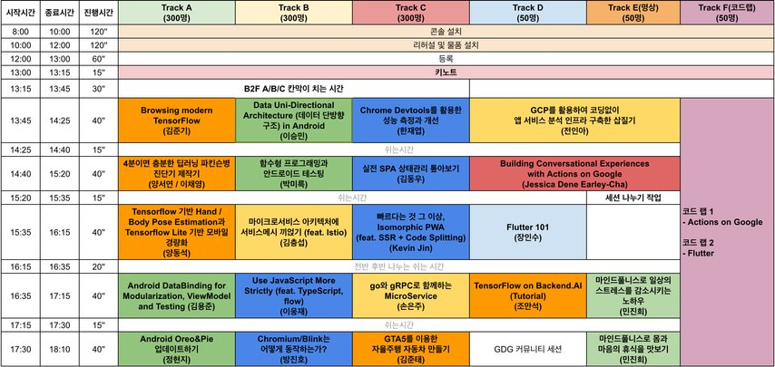
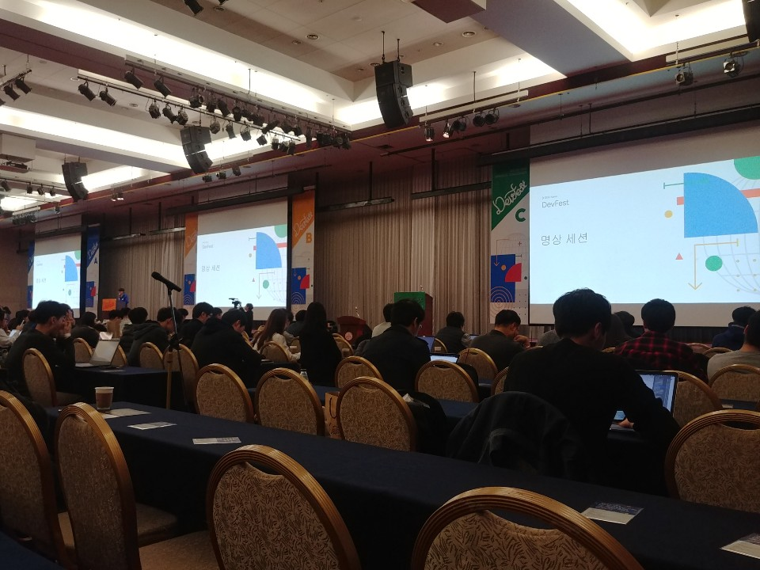
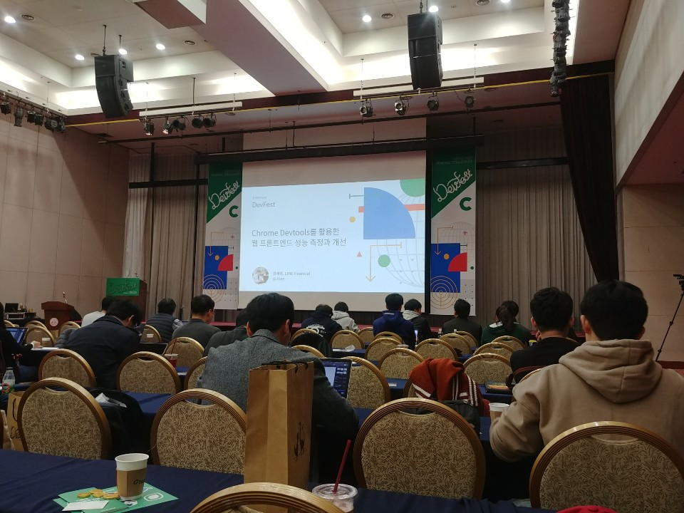
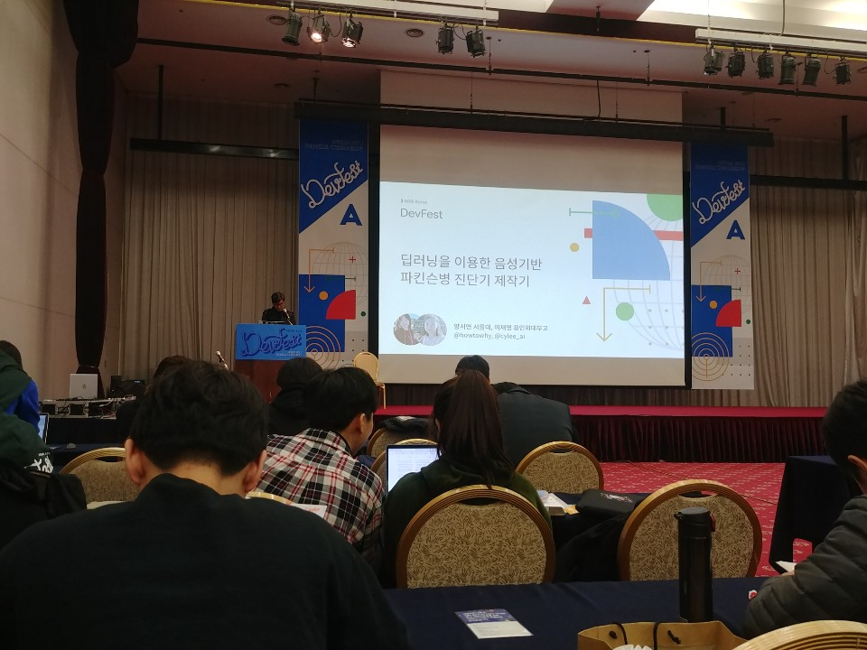
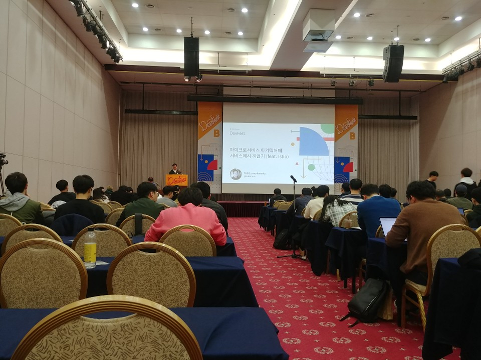
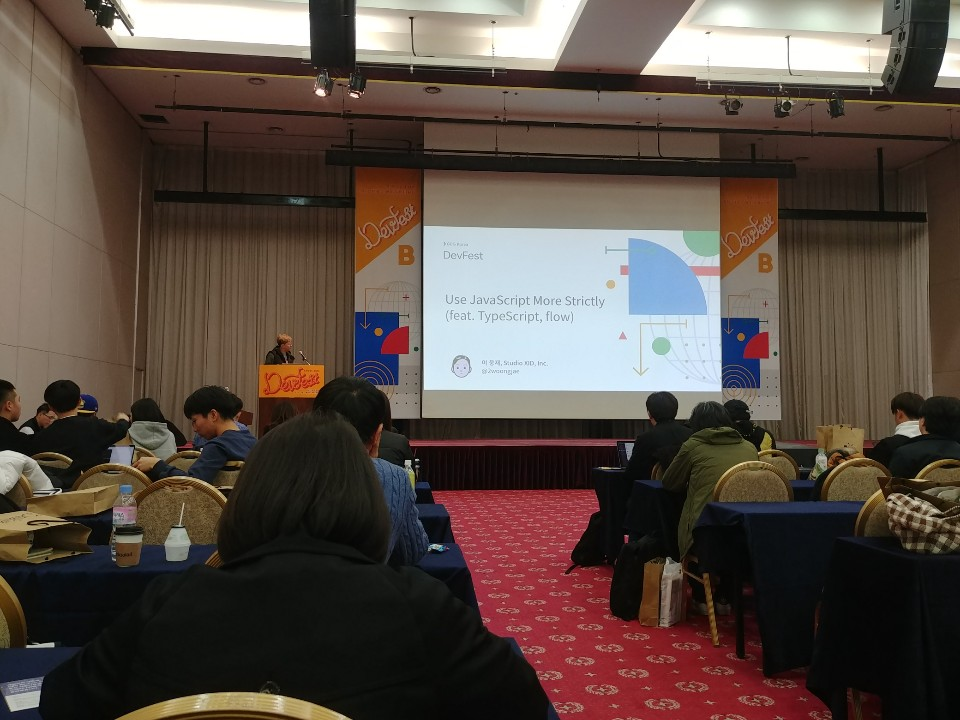

# DevFest Seoul 2018

- 주최: GDG Korea
- 일시: 2018-11-10 (토) 12시 ~ 18시
- 장소: 세종대 광개토관 컨벤션홀

## about
올해도 신나는 개발자의 축제 Devfest가 돌아왔습니다! 개발 기술을 주제로 개발과 관련된 모든 구성원이 한자리에 모여 서로의 경험과 지식을 교환하고, 아이디어를 공유하고, 기술에 대한 열정을 표출할 수 있는 장인 DevFest에 여러분을 초대합니다.

이번 DevFest에서는 개발자들의 축제라는 컨셉에 맞게 다양한 기술 세션과 코드랩을 준비할 예정입니다. 올해 발표된 디지털 웰빙의 핵심 컨셉인 ‘기술의 발전이 모두의 삶을 발전하는데 도움이 된다’는 기조에 맞추어 더욱 신중하게 세션을 배치할 예정이며, 디지털 라이프와 현실 세계의 적절한 균형감을 느낄 수 있도록 모니터와 기기에서 떨어져 나와 나의 정신과 몸, 나의 건강을 챙길 수 있는 명상 세션도 준비했습니다. 기술 세션과 코드랩으로 세상을 발전시키는 많은 지식도 얻어가고, 축제를 즐기는 도중에 힘이 들면 명상으로 휴식을 취해보세요!

## time table

## 키노트

## Chrome Devtools를 활용한 성능 측정과 개선

### 연사 소개
한재엽 님(@Jbee)
- LINE Financial
  - Jbee라는 필명으로 글을 쓰는 프론트엔드 엔지니어입니다. 생산성과 문서화에 관심이 많으며 타입스크립트를 좋아합니다.

### 발표 소개
서비스를 약 9개월 동안 개발을 했고 개발 과정 속에서 성능 개선한 부분을 공유하고자 합니다. Vanilla로 작성된 프로젝트이다보니 다른 라이브러리에 의존하지 않고 native 기능들을 사용하면서 알게 된 지식을 공유합니다. 다른 라이브러리 위에서 개발하시는 개발자 분들에게는 어떠한 원리로 동작하는지 알 수 있는 기회가 될 수 있을 것 같습니다.

`Web`

### 발표 내용
- 성능이란?
  - 성능이란 UX다
  - 사용자에게 끊기는 느낌이 없도록 부드럽게

- 측정할 수 없다면, 개선할 수 없다 - 피터 드러커

- 측정
  - RAIL
  - Audits

- 개선 과정에서 아쉬운 점
  - 귀찮다
  - 이슈를 발견해도 파악이 어렵다

- Audits
  - 웹 앱의 품질을 개선하는 오픈 소스 자동화 도구
  - 저사양으로 셋팅해서 돌려봄

- 개선
  - 로딩과정, 3R, 최적화

- 로딩 과정

- 3R
  - Request 개수 줄이기
    - With Webpack
      - Merge js file
      - Merge css file
      - CSS sprite
    - **Lazy loading**

- 최적화
  - Resource 크기 줄이기
    - With Webpack
      - minify
        - dce
      - obfuscation
      - tree-shaking
      - code-splitting
    - **이미지 최적화**

  - Rendering 시간
    - CRP 최적화
      - Script tag with async/defer keyword
    - Reflow 최소화
    - **부드러운 애니메이션**

- Lazy Loading
  - IntersectionOberserver
  - Custom Image Element
    - data-src
    - data-alt
    - ...
  - 스크롤이 될 때 이미지 초기화
    - 한 번 초기화된 것은 다시 할 필요가 없음

- 이미지 최적화
  - Data URI scheme
    - 이미지를 inline으로 박아두는 것
    - base64 encoding
  - 언제 적용하면 좋을까
    - 캐싱할 필요가 없는 데이터
      - 별도 파일이 아니므로 캐싱이 안된다
    - 작은 용량의 이미지 파일
      - 무채색의 이미지
  - srcset attribute
    - 디바이스의 pixel ratio 크기에 맞는 이미지 사용
  - srcset support
  - Remove useless metadata
    - 네이버는 이미지최적화시키는 팀이 따로 있다

- 부드러운 애니메이션
  - 하드웨어(GPU) 가속
    - CPU보다 GPU가 잘하는 일을 GPU에게 위임하는 것
    - Chrome Devtools - [layer] tab
      - 3D로도 볼 수 있음
  - 스크롤 이벤트 튜닝
    - Scroll Event
      - 기본적으로 스크롤은 가볍게 해야 한다
    - Use 'requestAnimationFrame'
      - 초당 60회 렌더링하는 디바이스 브라우저에 최적화
  - http://sculove.github.io/blog/2018/01/18/javascriptflow/

- 마무리
  - Case by Case 인 성능 튜닝
    - 여러 복합적인 요소가 영향
  - 개발이 어느 저도 완료된 후 진행하길 권장

  - 뭐가 성능이 더 좋나요?
    - react vs vue
    - redux vs mobx
    - 결론은 어떻게 사용하느냐에 따라 성능이 좌지우지됨

## 4분이면 충분한 딥러닝 파킨슨병 진단기 제작기

### 연사 소개
양서연 님(@howtowhy)
- 현 서울대기계항공 공학 석사과정 재학중
  - 딥러닝 하드웨어와 로보틱스 HCI 에 관심이 많음. GPS / INS 결합 스마트폰 보행자항법에 딥러닝을 적용하는 연구 진행중. 항공우주연구원 큐브위성경연대회 수상, 드론, IoT 센서디바이스 데이터 클라우드 딥러닝 연구.

이채영 님(@cylee_ai)
- 현 용인외대부고 3학년 학생
  - 스피치와 헬스케어 분야의 딥러닝에 관심이 많음. 지난 여름에 딥러닝캠프를 참여해 Conditional WaveGAN을 만들었고, 지난 겨울에는 2개월 동안 인공지능연구원에서 GAN을 이용한 프로젝트를 수행함.

### 발표 소개
89%의 파킨슨병 환자가 초기 증상으로 구음 장애가 오게됩니다. 저희는 Tensorflow 기반으로 목소리의 변화를 토대로 파킨슨병을 진단하는 4 클래스 분류기 모델을 만들고 충분한 양의 의료 데이터를 확보하기 어려운 점을 5000개의 샘플로 딥러닝을 수행할 수 있는 데이터 증강 GAN을 이용해 학습시킨 정확도 93% 모델을 만들었습니다. 딥러닝 모델을 하드웨어화 하기 위하여 Tensorflow lite 화해 탑재하는 로컬방식으로 스마트폰/라즈베리파이에 Android 와 Android Things os 환경에서 앱을 제작하여 파킨슨병을 진단 할 수 있는 진단기를 제작하였습니다. 저희가 제작하면서 익힌 딥러닝 모델을 하드웨어화 하는 오픈 소스와 가이드를 GDG에서 공개할 예정이니 관심있으신 많은 분들을 기다립니다. :)

`Machine Learning`

### 발표 내용
- 프로젝트 개요
  - 파킨슨병 오진 확률이 높음
  - 머신러닝을 이용한 파킨슨병 진단
    - 목소리를 통한 진단
      - 목소리가 떨리는 증상
      - 발음이 어눌해짐
      - 목소리 크기가 달라짐
    - 한국인을 위한 진단기 만들고 싶었음
      - 의료데이터가 많지 않음
  - 소규모 언어 데이터로도 파킨슨병 진단 모델을 만들어 보자

- Data Augmentation

- Transfer Learning
  - 대규모 데이터에서 얻은 인사이트 활용하기

- Optimal Brain Damage 알고리즘

- Modified Incremental Training

- GAN Domain Transfer

- 4클래스 진단 모델
  - VGG-16
  - Inception V3
  - 3-Layer CNN
    - 진단 정확도
  - MobileNet

- VoiceDoc
  - 딥러닝을 이용한 음성기반 파킨슨병 진단기구

- Local Type
  - TensorFlow -> TensorFlowLite -> 스마트폰

- Server Type
  - Flask, MongoDB

- freeze_graph.py
  - 저장된 Pb파일과 Ckpt를 불러와서 로드한 후 Freezing pb로 만들어주는 라이브러리 스크립트

- androidThings
  - Raspberry Pi OS
  - 리눅스 커널
  - HAL
  - 소프트웨어 레이어
  - 띵스 서포트 라이브러리
  - 구글 서비스
  - 자바 API 프레임워크
  - 서포트되는 라이브러리를 확인하고 사용해야 함

- Peripheral I/O
  - GPIO
  - PWM
  - Serial

- Tflite sample android code
  - https://github.com/googlecodelabs/tensorflow-style-transfer-android

- MoT 파킨슨 프로젝트 팀
  - https://github.com/deeplearning-hardware-project/parkinson-project

- 질문
  - 어떻게 이 알고리즘 생각?
    - 반대로 생각. 처음배워서 할 수 있었던 것
  - 적은량 데이터 처리 방법?
    - 사람으로 먼저 분류
  - 스마트폰 APP도 있는데 전용 하드웨어로 개발하실 생각?
    - 파킨슨은 노인. 진단기를 만들기위해 로컬. 적합화된 디바이스
    - 접근성

- 느낌점
  - 소프트웨어가 끝이 아닌 하드웨어로 변환하는 것에 대한 필요성을 느끼고 행동으로 옮기는 실행력에 감탄
  - 큰 목표가 있으면 작은 어려움들을 쉽게 극복할 수 있는 것인지?

## 마이크로서비스 아키텍처에 서비스메시 끼얹기 (feat. Istio)

### 연사 소개
김충섭 님(@subicura)
- purpleworks
  - 소프트웨어 엔지니어로 서버관리부터 개발까지 여러가지 일을 하고 있습니다. 개발자를 편하게 해주는 자동화 기술과 효율적인 개발 프로세스에 관심이 많습니다. DevOps와 관련된 툴에 관심이 많고 ruby on rails와 go언어를 좋아합니다.

### 발표 소개
마이크로서비스는 작게 쪼개진 수십/수백개의 서비스로 이루어져 있습니다. 이러한 서비스는 수천/수만개의 컨테이너로 이루어지고 이런 복잡한 구성에서 길을 잃지 않고 전체 서비스를 안정적으로 운영하기는 쉽지 않습니다. 서비스메시는 기존 소스를 수정하지 않고 프록시 방식으로 서비스간 트래픽을 관리하고 분산된 요청을 추적하고 서비스간 호출을 모니터링 할 수 있습니다.

`Cloud`

### 발표 내용
- 오늘 발표 이야기
  - 마이크로서비스와 서비스메시 + Istio 데모
  - 개발자가 개발에만 집중하는 방법

- 생산성에 대하여
  - 소스가 크고 복잡해질수록 커지는 문제점
    - 복잡한 소스 구조
    - 느린 빌드 속도
    - 오래 걸리는 테스트 코드 실행 + QA
    - 자꾸 죽고 느려지는 개발도구
    - 업데이트하기 어려운 라이브러리 / 프레임워크 버전
    - 단일 언어 / 단일 프레임워크 사용
  - 가장 큰 문제
    - 99버그 였는데 1버그수정하니 117개가 되는 문제
  - 문제점을 해결하는 방법
    - 더 정교한 프로젝트 설계
    - 서버리스 (Serverless)
    - 마이크로 서비스 아키텍처 (MSA)
      - 넷플릭스
      - 아마존
    - 고려사항
      - 회사의 규모
      - 분위기
      - 성향
      - 예산
      - 레거시

- 마이크로서비스 도입 - 희망편
  - 잘 설계된 서비스
  - 자동화된 프로세스
  - 모니터링 / 로깅 / 알람 서비스
  - 훌륭한 DevOps 문화
  - 빠른 릴리스
  - 원활한 팀 협업

- 마이크로서비스 도입 - 절망편
  - 결제 서비스 에러 났는데 하루동안 모름
  - 모니터 3대에 터미널 12개 띄움
  - 팀간 소통 안됨 / 분열
  - 운영/배포작업은 한 땀 한 땀 손으로
  - 넘치는 버그 / 불가능한 디버깅
  - 트랜잭션 오류
  - 자주 바뀌는 버전 / 명세

- 왜 서비스메시인가?
  - 단일 시스템에서 분산 시스템으로
    - 네트워크에 대한 이슈가 발생함
  - 분산 컴퓨팅에 대한 착오
    - 네트워크는 신뢰할 수 있다.
    - 레이턴시는 없다
    - 대역폭은 무제한이다
    - 네트워크는 안전하다
    - 네트워크 구성은 변하지 않는다
    - 관리자는 한 사람이다
    - 네트워크는 동일한 아키텍처와 OS로 연결되어 있다
    - **네트워크는 불안정하다 라는 가정으로 개발해야함**
  - 안정적인 운영을 위해 필요한 것
    1. 서킷 브레이커 (누전차단기)
    2. 재시도
    3. 로드밸런서
    4. 서비스 디스커버리
    5. 트래픽 분산
      - 90% / 10% 나누어서
    6. 로그
      - 한 눈에 볼 수 있도록
    7. 대시보드
      - 한 눈에 볼 수 있도록
  - Retry를 구현해보자
    - 서비스를 요청한다
    - 요청이 실패하면 동일한 요청을 n번 더 시도한다
    - 순서
      - 소스 작성
      - 라이브러리
        - JUUL
        - EUREKA
        - RIBBON
        - HYSTRIX
      - 서비스메시
        - No Code! Use Proxy!
          - config.yml
        - LINKERD
          - JVM/scala로 구현
          - Scalesforce, Paypal, Expedia, FOX, AOL등 많은 곳에서 사용 중
          - 최근 Rust를 이용한 2.0 발표
        - envoy
          - Lyft에서 C++로 만든 서비스간 통신을 처리하는 고성능 프록시
          - 작고 가볍고 빠름
          - Test
            - 2M req/s
        - Istio
          - Google, IBM, Lyft 참여
          - Kubernetes 연동
          - 컨테이너 기반, 클라우드 기반 환경에 적합
          - Envoy를 기반으로 관리기능(Control Plane) 추가 + @
      - 더 빠르게
      - 더 편리하게

- Istio
  - Istio가 제공하는 기능
    - Routing Management (경로 관리)
    - Fault Injection (오류 주입)
      - 일부러 오류를 발생시키는 기능
    - Security (보안)
      - TLS를 알아서 넣음
    - Distributed Tracing (분산 추적)
      - 코드 작성 필요 없음
    - Monitoring (모니터링)
      - 기본적으로 프로메테우스 사용
      - 200, 500, 400 몇 번 발생했는지
    - Observability (feat. Kiali)
      - 내부적으로 어떻게 서비스가 돌아가는 지 한 눈에 볼 수 있음

- Istio 아키텍처
  - 

- Istio 데모
  - 순서
    - 쿠버네티스
    - Istio 설치
    - Demo Web application 설치
    - 설정 데모
    - Add-on 소개
    - https://github.com/subicura/istio-demo

- 결론
  - 넷플릭스 OSS에서 지원하는 기능과 분산 모니터링 같은 기능을 완전히 새로운 방식으로 제공
  - 특정 언어에 종속적이지 않고 어떤 언어, 어떤 프레임워크에서도 사용 가능
  - 마이크로서비스에서 클라우드 네이티브 아키텍처로
  - 도커 -> 쿠버네티스 -> Istio
  - **개발자들은 제품 개발과 상관없는 운영은 똑똑한 플랫폼에 맡기고 제품 자체에 집중할 수 있다**

- Microservices + 쿠버네티스 + istio = ♥

- 느낀점
  - 연사분의 라이브 데모 준비력에 감탄
  - 서버 구성해보고 싶다
  - 얼른 도커를 알고 싶다 (쿠버네티스도...)
  - 좋은 방법이 계속계속 나온다
    - 계속계속 공부해야 된다

## Use JavaScript More Strictly (feat. TypeScript, flow)

### 연사 소개
이웅재 님(@2woongjae)
- Studio XID, Inc.
  - TypeScript 와 Electron 을 이용하여, 디자이너를 위한 인터렉션 프로토타이핑 툴인 프로토파이를 만들고 있다. 대규모 자바스크립트 어플리케이션 개발에 대한 더 나은 방향을 고민하고, 적용하기 위해 노력하고 있다. Microsoft MVP (TypeScript) 로 활동을 하며, 최신 웹기술에 대해 사람들과 이야기 하는 것을 즐긴다.

### 발표 소개
JavaScript 에 Type System 을 도입하는 대표적인 방법인 Flow 와 TypeScript 를 알아보고, 개발환경, 생태계 이용, 문법에 대해 비교한다. 타입 시스템을 이용하여 좀 더 견고한 JavaScript 어플리케이션을 만드는 방법에 대해 공유한다.

`Web`

### 발표 내용
- Human Error => Bug

- Type System 이요?
  - JavaScript에는 타입이 없나요?
    - 아니요. 있습니다.
    - JavaScript는 느슨한 타입 (loosely typed) 언어, 동적(dynamic) 언어
  - Static Type Checker
  - TypeScript
    - MS 오픈소스
    - VSCode
  - Flow
    - Facebook 오픈소스
    - React
  - JavaScript의 컴파일
    - 런타임에 동작 가능한 자바스크립트 소스를 만들고, 최적화 하는 일
      - 정말 실행할 자바스크립트를 만드는 과정
      - 바벨, 웹팩
  - Library의 Type은?
    - flow-typed
    - @types
  - Nominal typing vs Structural typing
    - 명목적 타이핑 vs 구조적 타이핑
    - Nominal
      - 이름에 의해 명시적
    - Structural
      - TypeScript
  - 선택?
    - Flow
      - 리액트와 많이 쓰임
    - TypeScript
      - 엄격하게 타입 시스템을 적용
  - 안전한 코드를 위한 노력
    - 테스트를 통해
    - 실수를 방지 (자발적 방어)
  - TypeScript Strict
    - tsconfig - strict
      - All Strict Checking
      - 점진적
  - 공변적 vs 반공변적
    - 반환 타입은 공변적(covariant)
    - 인자 타입은 반공변적(contravariant)

- 사례로 보는 안전한 코드 알아보기
  - 작업 규모
    - 35가지 종류의 에러
      - 1위. TS7006 - 1161건 (26.5%)
        - 타입 추론에 실패하여 any지만, 실제로 타입을 알 수 있는 경우는 타입을 지정해 준다.
        - 실제로 타입을 명시할 수 없는 경우, 명시적으로 any 처리 해주기.
      - 2위. TS2322 - 790건 (18%)
        - 암묵적으로 사용하던 null과 undefined 정리
      - 3위. TS2564 - 709건 (16.2%)
        - 클래스에서 멤버변수를 제대로 초기화 하지 않은 경우
      - 4위 이후는 생략
  - 작업 도중 느낀점
    - 중도 포기할 뻔
    - 너무 많고, 힘들고, 지치고
    - 할거면, 미리 할 걸
  - 작업 마친 직후
    - 겁나 힘들다
    - 이게 무슨 의미가 있나 싶음
  - 작업 마치고 수개월 후
    - 하기를 잘했다고 생각
    - 할거면 미리
    - **너무 믿으면, 타입을 값으로 믿어버리는 오류에 빠지기 쉬움.**

- 느낀점
  - 진짜 제목과 같이 빡빡하게 쓸 수 있구나
  - 실제로 겪은 내용을 전달해주려 했지만 경험해 보지 않은 내용이라 와닿지 않았다

## 후기
- 이미 상당한 경지에 이른 유명한 개발자분들도 계속 공부를 한다
- 우리나라에 개발자가 상당히 많다
- 스티커를 많이 얻어서 기분이 좋았다
