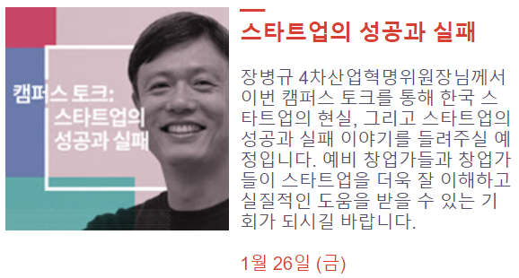

# 캠퍼스 토크: 스타트업의 성공과 실패

- 주최: Google
- 일시: 2018-01-26 (금) 19시 ~ 21시
- 장소: 삼성동 캠퍼스서울

## 연사 소개
(장병규 님)
  - 4차산업혁명위원장

## 강연 내용
### 결론: 스타트업 하지마라
- 스타트업을 창업하기 전에 스타트업에서 일해봐라. 진짜 어렵다.

- 친구를 많이 사귀어라. 네트워크가 중요하다.

- 어떤 일을 할 때, 자신이 할 수 있는지 없는지 판단하고 일을 할지, 말지를 결정해라.

- 투자자들에 맞추려고 하지마라. 창업자의 삶을 살아라.

- 공동 창업시 지분은 주/부가 나누어야 한다. 적어도 51:49 라도...

- 일주일 단위로 자기 삶을 돌아보고 평가하는 시간을 가져라.
  - 연사님은 토요일 하루는 온전히 혼자만의 시간을 갖는다고 합니다.

- 본인이 하고싶은 일에 집중해서 열심히 해라. 몰입해서, 자기의 무기를 만들어라.

- 결론적으로 스타트업 하지마라. 진짜 어렵다.

## 후기
본인이 하고 싶은 일을 해라
