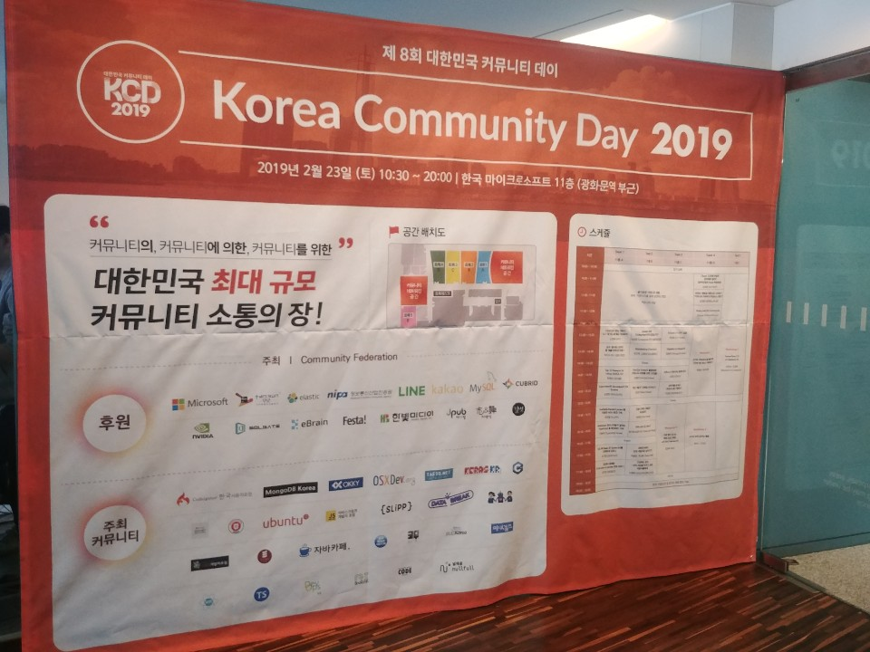

# KCD(Korea Community Day) 2019

- 주최: 대한민국 개발 커뮤니티
- 일시: 2019-02-23 (토) 10시 30분 ~ 20시
- 장소: Microsoft Korea 11층

> https://kcd2019.festa.io/

## 커뮤니티 대담
### 슬기로운 커뮤니티 생활 (부제 : 커뮤니티를 통해 성장하는 방법)
### 질문
- 일과 커뮤니티 활동을 균형을 어떻게 해야 할까요?
- 커뮤니티 생활이 회사랑 충돌할 때 어떻게 하시나요?
  - 대담자1 (이하 #1)
    - 9 to 6는 회사에 집중, 나머지 시간에 커뮤니티 일
    - **시간 스케쥴링, 태스크 관리를 밸런스 있게 해야 함**
  - 대담자2 (이하 #2)
    - **일 > 커뮤니티**
    - 짬이 나는 시간에 커뮤니티 관리
- 기존 회원과 신규 회원이 잘지내는 방법?
  - #1
    - 사람으로서 친밀감
    - **뒷풀이가 중요**
    - 다 같이 놀자
  - #2
    - 준비를 안하고 그날 주제를 정함
    - **출석이 중요**
    - 2인 1조로 활동 (짝코딩 처럼)
- 개발자 행사의 스피커가 되고 싶은데, 어떻게 자신감을 갖추고 스피킹을 할 수 있을까요?
  - #1
    - 소규모 발표 연습
      - 피드백 받을 수 있음
    - **우선 질러야 한다**
    - 커뮤니티의 도움을 받자
  - #2
    - 경험
    - **망해봐야 함**
- 커뮤니티를 통해 성장하는 것이 개인적인 것과 어떤 차별?
  - 지식을 내재화해야함
  - **얻은 지식 및 정보를 공유하자**
- 신입개발자가 커뮤니티에서 성장할 수 있는 방법? 어떻게 활용하면 좋을까요?
  - #1
    - 입사전
      - 커뮤니티를 통해 기술적인 발전을 기대함
    - 입사후
      - 기술적으로 회사에서 배우는 것이 더 많음
    - 커뮤니티의 장점
      - **다양한 경험, 시야 확장**
      - 다른 회사에서는 어떻게 일을 하는가? 등
      - 회사에서만 있다면 회사의 환경에 갇히게 된다
    - 신입이라면? 블로그를 하자
      - **내가 한것들을 정리하자**
      - [Notion](https://www.notion.so/)으로 시작하는 것도 좋다
  - #2
    - 신입, 기술스택이 정해지지 않은 사람들에게 좋음
    - 열심히 하시는 분들에게 영감, 동기부여를 받는다
    - 일을 하면서 막히는 부분을 얘기하면 답변이 달린다
      - 상부상조
    - **빨리 가려면 혼자가고, 멀리 가려면 같이가라**
- 오프라인에서는 어떻게 주변 개발자분들과 소통하시나요?
  - #1
    - **강남, 판교, 구로**
      - 개발자 90% 이상을 만날 수 있다
    - 개발로 만났지만, 결국 **사람사는 일**을 얘기하자
  - #2
    - 개발자와 소통할 때는?
      - 개발자들이 사용하는 언어를 같이 사용하자
    - **행사가 있다면 일찍 와서 그분들과 소통하자**
- (내가 한 질문) 커뮤니티 시작 인원이 몇명이 적절한가?
  - 인원은 상관은 없고 **관심분야**가 중요
  - (이 질문을 해서 [실습과 그림으로 배우는 리눅스](http://www.hanbit.co.kr/store/books/look.php?p_code=B2453522793) 책을 받았다)
- 커뮤니티 불화는 어떻게?
  - 커뮤니티의 **행동 강령**이 필요하다
  - 문제 발생시 중재를 해야하나 정답이 없다
    - 결국, 운영진이 해야할 역할인 것 같다

## Workshop 1 도커와 쿠버네티스를 활용하여 간단한 웹 서비스 구축해보기
### 연사 소개
- 최용호 님
  - 넥슨 코리아
  - 자바카페 운영진
  - AWSKRUG 판교 소모임 운영진

### 발표 소개
최근 퍼블릭 클라우드 3대장 AWS, GCP, Azure 모두 쿠버네티스를 기반으로하는 서비스를 제공하고 있고, 컨테이너를 활용한 서비스들이 점차 많아지고 있습니다. 많은 사람들이 컨테이너 기술을 공부하고 싶어하지만 진입하기가 쉽지만은 않습니다. 이번 워크샵을 통해 도커와 쿠버네티스의 모든 것을 알 수는 없지만 앞으로 더 많은 것을 알아가기 위한 기반을 다질 수 있었으면 좋겠습니다.
- docker 개념 및 실습 
- docker-compose를 사용하여 워드프레스 구축 실습 
- docker-compose를 사용하여 간단한 웹 서비스 구축 실습 
- Kubernetes 개념 및 실습 
- kubernetes를 사용하여 간단한 웹 서비스 구축 실습

### 발표 내용
> [발표자료](https://www.slideshare.net/secret/MOjHlo34a122fV)

> [실습자료](https://www.notion.so/c579f76ccd43456ca3a1d91b6160a104)

#### Docker
- Docker가 좋은 이유 #1
  - 재현성
  - 기존
    - 사내 위키를 보며 서버, 데이터베이스 구축설명
      - 문제: 반복, 매번 위키문서 갱신
  - 지금
    - 이미지
      - 노턴 코스트
      - AWS AMI
      - **도커 이미지**
  - 이미지의 내용도 확인, 버전관리 같이 하려면?
    - 이미지 내용을 코드화
        - [Terraform](https://www.terraform.io/)
        - [Dockerfile](https://docs.docker.com/engine/reference/builder/)
  - 도커를 사용하면?
    - 도커파일 작성
    - 이미지 만들기
    - 완성된 이미지를 이미지 저장소에 저장
    - 각 서버에 이미지를 다운 (컨테이너 형태)
  - 컨테이너란?
    - 독립적 사용
    - 리눅스 기술을 사용하여 선박의 컨테이너처럼 프로세스가 사용하는 자원을 격리
      - 리눅스 커널 사용
  - 이미 존재했지만 사용하기 어려웠던 리눅스 기술들을 도커가 잘 포장하여 제공
- Docker가 좋은 이유 #2
  - 호스트와 성능차이가 거의 없다
- Docker가 좋은 이유 #3
  - 이식성
    - 리눅스 기반의 호스트라면 동일한 환경 보장
    - Ubuntu, CentOS, Fedora -> 리눅스 커널을 기반으로
    - 도커는 커널의 기술을 사용하기 때문에 모든 배포판에서 사용 가능
  - 파일시스템은 주의가 필요
    - AUFS
      - Ubuntu의 파일시스템
      - 이미지 빌드 시 변경점에 대한 레이어 디렉토리 생성
      - 장점
        - 이미지를 만들면 그 위에 변경사항만 탑재가능 (관리, 유지보수 용이)
      - 단점
        - CentOS, fedora는 해당 AUFS 지원하지 않음
          - 드라이브 매퍼를 사용
    - overlay2 스토리지
      - 리눅스 커널에서 사용하는 파일시스템
- Docker가 좋은 이유 #4
  - 비용 절감
  - 자원을 효율적으로 사용
- Docker가 좋은 이유 #5
  - 표준화
    - 협업 용이
  - 도커 기반 서비스 지원
    - CaaS(Containers as a Service)
- 도커 명령어
  - 이미지 관리
  - 실행
  - 디버그
- [도커 허브](https://hub.docker.com)
- 실습
  - docker inspect [컨테이너명]
    - docker network ls
  - 컨테이너 포트가 외부에 어떻게 노출 될까?
    - iptables -t nat -L -n
  - 볼륨은 어떻게 될까?
    - 해당 컨테이너의 기반이 되는 이미지 레이어 디렉토리
    - ls -l /var/lib/docker/overlay2/[컨테이너ID]

#### Kubernetes
- **컨테이너 오케스트레이션 도구**
- 특징
  - 인텔리전트 스케쥴링
    - 노드의 리소스 상태에 따라 컨테이너 배치
  - 셀프 힐링
    - 장애가 발생한 컨테이너 복구
  - 정책에 따라 이미지를 배포하거나 롤백
  - 보안이 필요한 데이터와 설정 파일을 안전하게 저장
  - 흩어져있는 컨테이너에 명령 내리기
- 구성
  - Master, Node, Pod
- Node 내 Pod 구성
  - **Pod은 언제나 지워질 수 있고, 데이터가 유실될 수 있다**
  - 민감한 데이터는 Voulume을 지정하는 것이 좋다
  - Pod 하나에 컨테이너 하나를 주로 사용한다
- **API통신으로 명령을 내리고 결과를 받는다**
- ClusterIP
  - 내부IP
- NodePort
  - NAT를 사용하여 각 노드의 Port를 오픈
  - 30000~32767 범위의 포트 할당
  - 명시적으로 지정하지 않으면 범위 내에서 랜덤 할당
- LoadBalancer
  - External 로드밸런서를 만들어서 고정된 외부 IP배정
- 라벨(label)
  - key-value 쌍의 객체 집합이며 객체의 식별에 사용
  - **Pod를 그룹화할 때 사용**
  - 복제 컨트롤러, 복제 집합 등에서 사용
- 라벨 셀렉터
  - 라벨을 기반으로 객체를 선택
  - 동일한 라벨이 부여된 객체들을 연산자를 통해 일괄 선택 가능
- 스케일링
  - kubectl을 사용해서 스케일링
  - 트래픽이 증가하면 자동으로 스케일 아웃 수행
  - **Master가 알아서 Node에 Pod 확장 및 축소**
  - AWS의 오토스케일링과 유사
- 롤링 업데이트
  - Kubectl을 사용해서 수행
  - **무정지 배포**
  - 점진적으로 Pod를 하나씩 업데이트
  - **Pod을 제거하고 다시 만듦**
    - 따라서 데이터가 날아감
- 실습
  - kubectl version
  - cd ./kube/config
  - docker ps | grep -v k8s
    - k8s붙은 녀석들 제외

### 질문
- (내가 한 질문) 실습때 제공한 서버를 어떻게 준비하셨는지?
  - 개인 AWS EC2에 미리 인스턴스 100여개를 만들어놓음
    - 사람이름을 등록하면 queue로 매칭시킴 (스크립트로)

## 후기
- 커뮤니티활동을 활발히 하면 좋다
- 많은 개발자분들이 꾸준히 공부하고 있다
- 경품추첨에서 JetBrain All Products Pack 개인용 1년권에 당첨되었다
