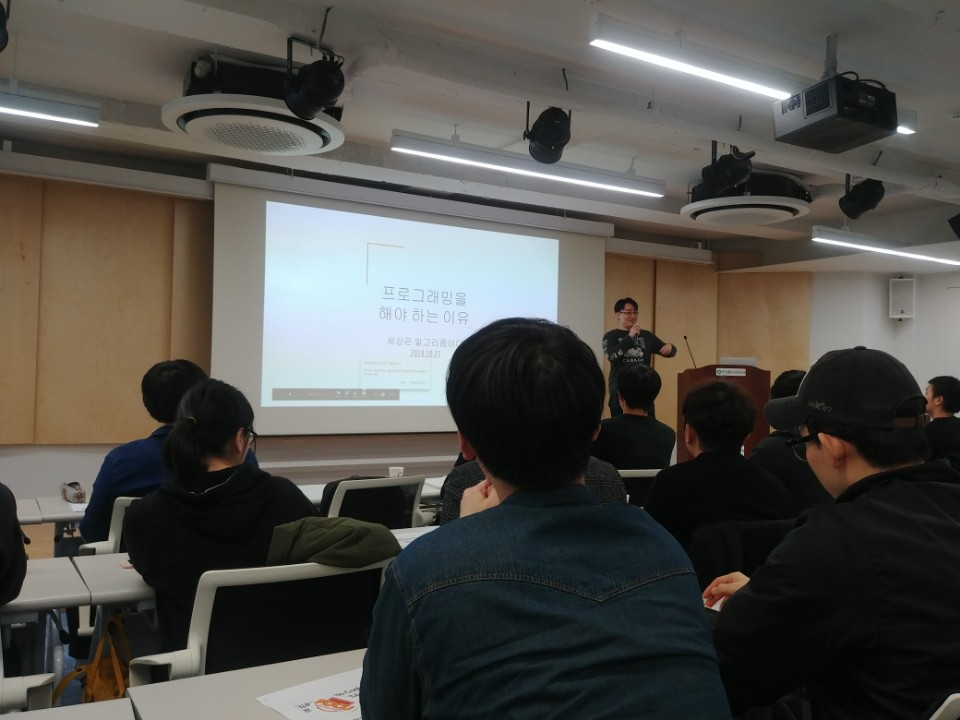
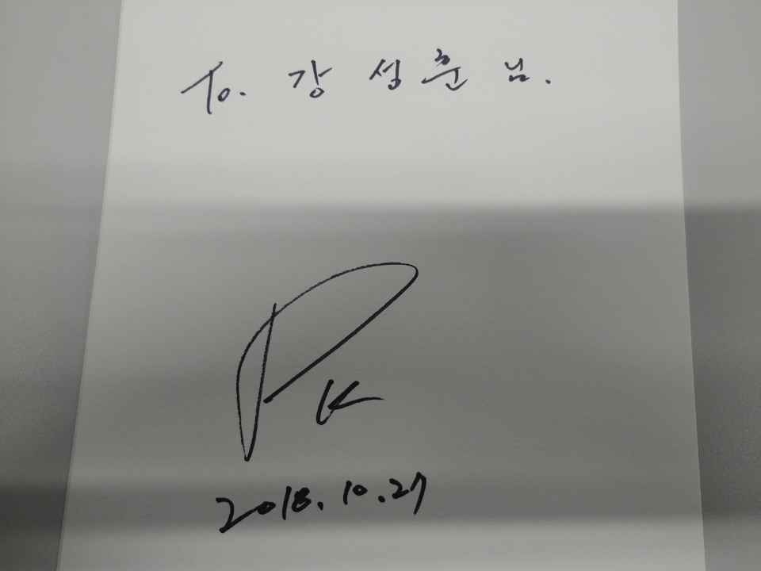

# '김포프'의 Hello Coding 프로그래밍 토크쇼

- 주최: 한빛미디어
- 일시: 2018-10-27 (토) 14시 ~ 18시
- 장소: 한빛미디어 리더스홀

> http://www.hanbit.co.kr/store/education/edu_view.html?p_code=S6991148847

## 연사 소개
김포프

꽃중년 소프트웨어 엔지니어. 연세대 법학과, 조지아테크 컴퓨터공학 대학원을 졸업했으며, 북미에서 헤일로, 피파, 마인크래프트 등의 게임개발에 참여했다. 현재 실리콘밸리 가상화폐 스타트업 글루와의 CTO로 재직 중이다. 유튜브 채널 [포프 TV](https://www.youtube.com/channel/UC63J0Q5huHSlbNT3KxvAaHQ)를 통해 유익한 개발 이야기를 공유하고 있다. 저서로는 『셰이더 프로그래밍 입문』, 『북미취업 가이드북(2판)』가 있으며, 『게임 개발자를 위한 물리(개정 2판)』를 번역했다. 그 외에도 『게임 매니악스 슈팅 게임 알고리즘』, 『유니티 쉐이더 스타트업』 등의 도서 감수에 참여했다.

## 프로그래밍을 해야하는 이유
- 실제 세상은 알고리즘에 의해 돈다
  - [The Secret Rules of Modern Living: Algorithms (2015)](https://www.imdb.com/title/tt5818010/)
  - 최대공약수
    - 유클리드 호제법
    - 화장실 타일깔기

- 알고리즘
  - 알고리즘(프로세스) 만들기
    - 쉽지 않음
    - 천재의 영역
  - 알고리즘 따라하기
    - 따라하기만 하면 안전하고 정확한 결과가 나옴
  - 일상생활 알고리즘
    - 라면 끓이기
      1. 물 600ml를 냄비에 넣는다
      2. 냄비를 불위에 넣고 끓인다
      3. 가끔씩 물이 끓는지 확인한다
      4. **물이 끓지 않았으면** 3번을 `반복`
      5. 면과 야채 건더기를 넣는다
      6. **5분 뒤** 불을 끄고 5숟가락을 남기고 버린다
      7. 스프와 미유를 넣고 **30초** `동안` 볶는다
    - 키순으로 줄세우기

- 가까운 미래의 프로그래밍
  - 모든 사람이 프로그래밍을 배우는 세상
  - 생활코딩 가능
  - 프로그래밍 할 줄 아는 사람은 셋으로 나뉠 것
    - 엔지니어
    - 코드몽키
    - 프로그래밍할 줄 아는 타 직장인

- 올바른 프로그래밍 입문법
  - 핵심: 컴퓨터가 이해할 수 있는 명령 내리기
  - 어떤 명령? 알.고.리.즘
  - 언어는 거들 뿐
    - 실수를 줄일 수 있는 언어
    - 도구가 좋은 언어
    - 그냥 강사가 아는 언어는 의미가 없음
  - 프로그래밍은 `조건문`, `반복문`으로 이루어져 있다
    - CPU 구조가 이렇게 되어 있다

- 그래서 어떻게 입문?
  - 일단 해보자. 해보고 잘 맞는지 생각해보자
  - 재밌어야 한다
  - 내가 좋아야 한다

- 입문 후 진로
  1. 생활코딩
    - 프로그래머를 업으로 삼지 않음
    - 필요한 프로그램이 없는 경우 간단한 1회성 코딩
    - 프로그래밍은 내 작업의 효율을 올릴 수 있는 훌륭한 툴

  2. 전문 프로그래머 - [코드몽키](https://namu.wiki/w/코더)급
    - 스타벅스의 바리스타 같은 존재 (교체가능한 인력)
    - 엔지니어급 프로그래머가 정해준 알고리즘을 프로그래밍 언어로 작성
    - 머신러닝으로 대체 될 수도 있는 직군
      - 기계를 돌렸을 때 사람보다 비용이 저렴하면 교체
    - 하지만 누구나 시작은 여기서 함
    - **코드몽키가 더 배울 것들**
      - 골 밑에서 80% 확률로 슛을 넣을 수 있을 정도의 실력 쌓기
      - 누군가 설계도를 주면 제품을 **조립** 해 줄 수 있어야 한다
      - 생활코더가 배운 것들 모두
      - 기초 알고리즘 및 데이터 구조 공부
      - 프로그래밍 실행 속도(CPU에 한정)에 대한 고민
      - 협업이 가능한 코딩 스타일 (가독성) 등
      - 버그 고치는 실력 늘리기
        - 코드 짠 시간 만큼 디버깅 시간이 걸림
        - 버그를 못고치면 실력이 없는 것이다
        - 원인 분석과 해결을 할줄 알아야 한다
        - 디버그 툴을 잘 써야 한다

  3. 전문 프로그래머 - 엔지니어 급
    - Top 1% 프로그래머
    - 뜬구름 잡는 요구를 받더라도 제품을 설계 가능
      - 예) 전체적으로 핑크한 느낌이 나게 해주세요
    - 요구를 받으면 방법을 제시할 수 있어야 한다
      - 예) 인테리어 시공자에게 일을 맡겼을 때 고객에게 방법을 제시해 주듯이
    - 여타 직장인과 매우 다름
    - 자기 삶의 주인이 될 수 있는 위치
    - 생활습관 자체에서 최적화된 알고리즘이 보임
    - 한국에서도 매우 처우가 좋은 프로그래머 직군
    - 머신러닝이 대체하기 어려운 프로그래머 직군
    - 뭘 해야될지 아는 사람
    - **엔지니어가 더 배워야 할 것**
      - 골 밑에서 80% 확률로 슛을 넣되 부상을 당하지 않을 실력 쌓기
      - 코드몽키가 배운 것 전부
      - 컴퓨터와 일심동체 (하드웨어의 이해)
      - 순수 CPU외에 운영체제, 메모리 작동방식에 따른 성능에 대한 이해
      - Managed 언어 하나와 Unmanaged 언어 하나의 완벽한 이해
        - Managed 언어 (메모리 자동관리)
          - 자바, C#, 파이썬, 자바스크립트, 스위프트 등
        - Unmanaged 언어 (메모리 수동관리)
          - C, C++
        - 둘 모두 해야된다. 제대로된 일을 하기 위해
        - 10년 뒤에도 제대로 프로그래밍하기 위해
      - 생활습관의 엔지니어화 = 일을 즐겨야 한다
      - 인간에 대한 이해
        - 실수가 어려운 설계를 만들 수 있는가?

- **오늘의 교훈: 코드 몽키로 남지말자. 제발...**

- 현재 교육 및 업계의 ~~잘못된~~ 트렌드
  - 모두를 위한 교육
  - 프로그래밍 교육의 하향 평준화
  - 교수진 품질의 저하
  - 다수결이 최고다
  - 눈가리고 아웅하기
  - 밥그릇 지키기
  - 현실을 깨달았을 땐 너무 늦음

- 어떻게 프로그래밍 공부를 할 것인가?
  1. 좋은 대학교
    - 운영체제, C/C++ 언어, 컴퓨터구조, 알고리즘을 가르치는 곳
    - 2년제 또는 단기 학원을 나온다면 회사 다닐 동안 더 노력해야 함
      - 뒤쳐져 있다는 것을 인지해야한다
      - 열심히 해야한다
    - 해외도 상황은 똑같다

  2. 좋은 직장
    - 대충 돌기만 하는 1회성 제품을 만드는 회사는 빨리 떠날 것
    - 외주보다는 자체 제품을 만드는 회사를 선호
    - 정부의 지원 및 수주를 받는 회사도 의심할만 함
    - 야근을 강요하지 않는 회사를 찾을 것
      - 야근을 하지않음으로써 부족한 부분을 보충할 수 있는 시간 확보
      - 야근을 하면
        - 피곤해서 쉰다
        - 하루가 무기력
        - 어차피 야근한다는 생각에 업무 집중력이 낮아진다

  3. 사이드 프로젝트
    - 회사에서 배우는 것은 한계가 있음
      - 회사 일만 반복하면 기술이 정체됨
    - 새로운 것을 해볼 기회가 적음
    - 1만 시간 법칙의 문제도
      - 10,000 / 20 시간 / 50주 = 10년
    - 사이드 프로젝트를 할 때는 새로운 기술들을 시도해보자
      - 새로운 기술 체험으로 회사에서 새로운 기회를 잡을 수 있다
    - 친절하지 않은 많은 기술을 접하며 컴퓨터가 생각하는 방식에 익숙해짐
    - 문제해결능력 향상

  4. 더 나은 교육기관 (광고)
    - 현재 열심히 개발 중인 **학원** (인가받을 계획 없음)
    - 엔지니어를 키우는 엘리트 교육이 목표 (학점 80~90% 이상만 졸업 가능)
    - 시작은 온라인, 하지만...
    - 멍때리며 따라한 뒤 '아~ 난 이제 이거 알아'라는 잘못된 자기만족을 지양
    - 컴퓨터 공학과 수준의 교육 (과제, 실습, 기말고사까지 있음)
    - 교양과목을 빼고 1.5~2년 정도가 목표
    - 최신 기술을 이용한 동기 및 승부욕 부여
    - 19년 1월 첫학기 시작 예정 (Proof of Concept University: https://pocu.academy)

## 질문
- 어떤 경로로 동기부여를 받으시는지?
  - 잘하는 사람을 보면 이 사람보다 잘해야지, 나아져야지 라는 생각
  - 어떻게 보면 경쟁심을 통해 성장
  - 무언가를 만들 때 어떻게든 10원이라도 벌자라는 생각

- 훌륭한 PM의 기준?
  - 중간자 입장

- 공부하다가 계속 발전이 없다면 어떻게 해야 하나?
  - 누군가 평가를 해줘야
  - 비교 대상이 있어야
  - **사이드 프로젝트** 하세요
    - 수익창출을 목표로
    - 제품 출시, 평가 받기

- 새로운 언어를 배울 때 효율적인 방법?
  - 입문서를 술술 넘기면서
    - 기존에 아는 언어와 비교
    - 작은 프로젝트
      - 동기부여가 됨

- 이직에 관해?
  - 연애와 비슷
  - 2년마다 이직 괜찮은 것 같다

- 실리콘밸리 취업은 어떤 메리트가 있는지?
  - 이름값
    - 대우가 좋아짐
  - 원격근무 하는 회사도 많다
  - 실제 일을 목적에 맡게 하지 않는 약파는 회사도 많다
    - 조심하자

- 하나의 언어를 '어느 정도 익혔다', '잘 다룬다' 기준?
  - 제품을 만들 수 있는 수준
    - 다른 제품과 비교를 해서 나은 부분이 있는지 확인
  - 누군가 물어볼 때, 설명해 줄 수 있을 정도

- Windows 개발자(응용프로그램 개발자) 의 미래?
  - 지금 잘하고 있다면, 어디서든 잘 할 수 있다

- 31살에 프로그래머로 전향하는 것이 늦은 건지?
  - 늦진 않았다고 생각 하지만 남들보다 3년 뒤쳐졌다고 생각
    - 3년을 어떻게 따라잡는지가 중요
    - 남들과 같이한다면, 계속 3년 늦춰진다
    - 남들보다 1.5배 열심히 해야된다

- 프로그래밍에서 어떤 수학이 중요?
  - 이산수학
  - 선형대수

- 프로그래밍을 하면서 재밌었던 점?
  - 내가 만든 것이 바로 눈에 보일 때
    - 성취감
  - 컴퓨터를 통해 사람들을 이해했다

- 신입개발자가 갖춰야 할 것
  - 실수하면서 나아지는 사람
  - 같은 실수를 두 번 안하는 사람
  - 구체적으로 질문할 수 있는 사람
  - 발전하는 모습이 보이는 사람
  - 결국 성장속도가 중요

- 자신이 코드몽키인지? 엔지니어인지? 스스로 판단하는 법?
  - 회사 동료들과 비교
  - 동료가 없다면
    - 회사에서 나에게 주어지는 일
      - 점점 책임감의 범위가 커지는지? (신뢰가 쌓이는 지?)
      - 같은 업무만 주고 있는지?
    - 연봉 상승률로 판단
    - 버그를 빨리 잘 고칠 수 있는 지 체크
      - 기록해서 수치화해보자
    - 온라인에서 자신의 위치를 타인과 비교

## 후기
- 프로그래밍 입문에 대한 중요성
- 현재 내 상황에서 동기부여가 되었다
- 코드몽키를 벗어나도록 노력하자
- 포프님 사인

- ~~포프님과 찍은 사진~~
