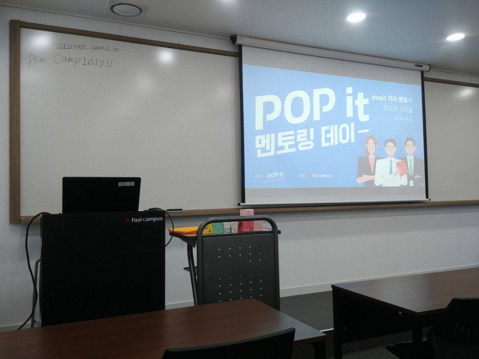

# Popit 멘토링 데이

- 주최: [Popit](https://www.popit.kr/)
- 일시: 2018-08-31 (금) 19시 ~ 21시 30분
- 장소: 강남 패스트캠퍼스

> https://www.popit.kr/popit-멘토링데이/

## Keynote
(김형준 님) - Popit 운영자
  - 글을 쓰자.
  - 일단 쓰자.
  - Popit 사이트 사용 기술
    - React
    - Go
    - Wordpress

## Session 1
### 멘토 소개
(강대명 님)
- Udemy
- Remote 근무 중

### 세션 소개
대규모 서비스를 개발하기 위한 아키텍처에 대한 논의나, 리모트 개발자의 삶에 대해서 얘기할려고 합니다. 또한 개발자 브랜딩에 대한 얘기도 할 해보면 재미있을듯 합니다.

### 세션 내용
- Remote 근무에 대해
  - 외롭다
  - 영어보다 팀원간의 접점이 중요
  - 시차
    - 팀원간 업무보다 개인업무를 많이 하게 됨

- 외국회사 근무 스타일
  - 내가 원하는 업무를 정해서 진행
  - 일정이 탄력적
    - 급한 이슈 처리기간 만큼 일정 딜레이
      - 업무가 합리적으로 타당하다면 조정 가능

- 대규모 서비스에서 중요한 점
  - DB분할
    - 샤딩
      - 서비스 확장을 어떻게 할 것인가?
    - 어떻게? 기준?
      - userid별로 분할
      - 사용자 밸런스 (어려움)

- 신뢰받는 개발자란?
  - 실수를 안하는 개발자 X
  - 실수
    - 어떻게 처리하는지?
    - 어떻게 대처하는지?
    - 한 번한 실수를 다시 하지 않도록
  - 실수를 하지 않기 위해
    - 자동화

- 이력서 내용
  - 어떤 것을 만들었다 X
  - 어떤 장애를 어떻게 개선했는지
  - 안해본 것은 기재 X
    - 주워 들은 것, 옆에서 본 것 X
  - 해본 것을 강조

- 번외
  - Java 7 -> Java 8
    - Hashmap 변경사항이 무엇인지?
  - 깊게 vs 넓게
  - 네이버, 카카오 (이상민 님 첨언)
    - 알고리즘을 엄청나게 공부해야 입사
      - 시중에 나오는 알고리즘 책 문제를 보고 바로 답을 낼 수 있을 정도로
      - 그렇지 않으면 힘듭니다

### 질문
- Udemy의 대략적인 가입 유저 수, 하루 이용 유저 수?
  - 굉장히 많습니다
- 신입에게 도움이 될만한 조언?
  - 회사 일에 충실
    - 그 이후에 나아가는 것을 추천
  - 구글링
    - "어? 따라하니까 돌아가네?" 로 끝나는 것이 아닌
    - 왜 그렇게 하면 해결되는지 원인파악

## Session 2
### 멘토 소개
(도경태 님)
- 삼성SDS

### 세션 소개
프론트 엔드의 미래라는 PWA(Progressive Web Apps) - 정말 대세가 될까요? 같이 한 번 살펴 봅시다.

개발 말곤 모르는 개발 그룹 "개발 바보들" 의 리더. 삼성 SDS에서 건담 전파와 덮어놓고 꼰대 역할을 하고 있습니다. 최근에 머릿속에 그리는 리액트 라는 책을 출간했습니다.

### 세션 내용
- 프론트엔드
  - Ajax
    - IE에서 시작
    - 주도권이 클라이언트 -> 서버
      - 기존: 서버 -> 클라이언트
    - 예) 구글 맵스
  - Mobile First 시대

- PWA
  - [Progressive Web Apps](https://developers.google.com/web/fundamentals/codelabs/your-first-pwapp/?hl=ko)
  - [프로그레시브 웹 앱스(Progressive Web Apps, PWA)를 이해하기 위한 신기술들](https://www.samsungsds.com/global/ko/support/insights/pwa2.html)
  - [App shell](https://developers.google.com/web/fundamentals/architecture/app-shell?hl=ko)
  - [서비스 워커](https://developers.google.com/web/fundamentals/primers/service-workers/?hl=ko)
  - PWA가 잘 적용된 사이트
    - [pokedex](https://www.pokedex.org/)

- 트렌드
  - [GitHub Trending](https://github.com/trending)
    - 기간을 this month 위주로
    - Awesome series
      - 각 언어마다 핫한 내용을 정리
      - [Awesome Java](https://github.com/akullpp/awesome-java)
      - [Awesome JavaScript](https://github.com/sorrycc/awesome-javascript)
      - ...
  - [Hacker News](https://news.ycombinator.com/)
  - [Awesome Devblog](https://awesome-devblog.herokuapp.com/#/)
  - [KLDP](https://kldp.org/)
  - [클리앙 새로운소식](https://www.clien.net/service/board/news)

- 블로그 작성
  - 추천드림

- 트렌드를 좇는 것도 좋지만 깊이 있는 개발자도 좋다
  - 잘 버텨야...

- 번외
  - [Docker](https://www.docker.com/)
    - [초보를 위한 도커 안내서 - 도커란 무엇인가?](https://subicura.com/2017/01/19/docker-guide-for-beginners-1.html)
  - [Kubernetes](https://kubernetes.io/)
    - [초보자를 위한 쿠버네티스 (Kubernetes) 소개](https://www.samsungsds.com/global/ko/support/insights/Kubernetes_inform_kr.html)
    - [쿠버네티스 written by 조대협](http://bcho.tistory.com/1255)

### 질문
- 6년차 자바개발자입니다. 앞으로 어떻게 해야할까요?
  - 모르는 것은 모른다고 하자
  - 감을 잃지 않는 것이 중요
  - 필요에 의한 아키텍쳐가 좋은 것 같다
  - 최신기술을 업무에 반영하려면?
    - 회사, 팀원들을 설득

- 같이 일하고 싶은 개발자의 기준이 무엇인가요?
  - 기술력이 조금 떨어져도
    - 많이 떨어지면 곤란
  - (개인적으로) PM을 지탱해주는 개발자
  - 다양한 성향의 개발자 필요
    - 묵묵한
    - 잘난척

- 신입에게 해주고 싶은 말?
  - 좋은 사람을 만나는 것이 중요
  - 멘토의 사수
    - 카카오 김상균 님
      - 카카오 컨퍼런스 가시면 강연 꼭 들어보시길
  - 개발자 커뮤니티 활동
  - 좋은책
    - 정독
    - [내 마음대로 선정한 프로그래머 필독서 50선](https://www.sangkon.com/2018/08/27/good_books_for_dev_2018/amp/?__twitter_impression=true)
  - 엉덩이가 무거워야
    - 많은 코딩량

## 후기
멘토링데이? 신기하다.  
아직 갈 길이 멀구나.
