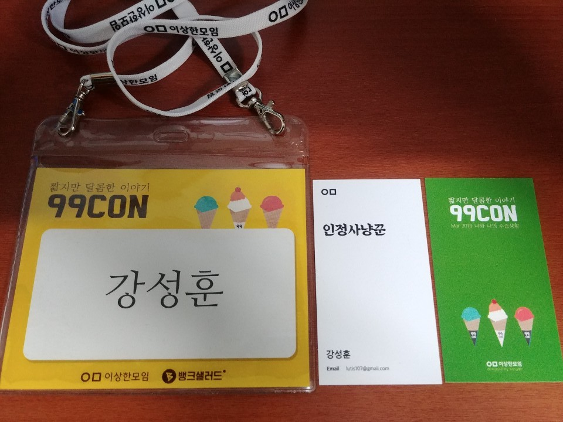

# 구구콘(99Con)

- 주최: [이상한모임](https://www.weirdx.io/)
- 일시: 2019-03-02 (토) 13시 ~ 18시
- 장소: 한빛미디어 리더스홀

> https://www.notion.so/99Con-f87534fb2d2348f3bd9e354bc9a7e5c2

3월 2일(토)에 한빛미디어 리더스홀에서 열리는 **제 1회 99콘의 주제는 '수습생활'** 입니다. 신입과 경력의 수습생활은 어떻게 다를지, 다른 환경에 놓여진 사람들이 어떻게 변화에 적응하는지에 대한 경험을 공유해보려 합니다. 2019년 새해를 맞이해도 특별한 변화없이 일상을 사는 분들에게 자극을 드릴 수 있길 기대합니다. 

99CON(이하 99콘)은 **짧지만 달콤한 이야기**를 컨셉으로 진행되는 컨퍼런스로, 스탭과 발표자를 포함하여 총99명의 참가자가 모이는 이상한모임의 커뮤니티 행사입니다.

## #1 토스 이직 & 적응기
### 발표자
- 이현섭, 비바리퍼블리카

### 발표 내용
- 이직 계기
  - 제안이 옮

- 이직을 유보함

- 4개월 뒤, 다시 제안이 옮
  - **"근데, 안되실 수도 있어요."**
    - 지원도 안하고 여러가지 생각을 함
    - 합격하든, 불합격하든 지원하면 얻는 것이 많다
      - 동기부여, 연봉협상 등
  
- 지원하자
  - 이력서 업데이트
    - 기여도 > 스킬
    - 어떤 기술을 어느 수준까지 다루는지
    - 내가 중요시 여기는 가치
    - 최소한의 디자인

- 면접
  - **솔직하게 말하기**

- 기대한 점
  - 편하지 않은 환경
  - 편하지 않은 분위기
  - **Comfort Zone에서 벗어나기 위해**

- 사람은 **스트레스**로 성장할 수 있다고 믿음

- 셀프질문
  - 업무 빡세요?
    - 네
    - 배경
      - 내가 팀원들에게 바라는 기대치 = 팀원들이 나에게 바라는 기대치

### 질문
- Toss에 호감 느꼈던 부분?
  - 내가 솔직한 것처럼 회사도 솔직해야 한다고 생각하는데, 그게 부합했다
- 블로그가 이직에 도움이 되었는지?
  - 개인적으로 채용 시, 글을 잘 쓰면 개발을 잘 할 것이라는 생각이 듦
  - 블로그를 하면 면접관들이 긍정적으로 본다고 생각
  - 블로그하세요. 100%이상 도움이 됨
- 스트레스 극복법
  - 스트레스를 받는 것이 좋다고 느낌
  - 힘들어도 한다
  - 극복을 하려고 하지 않음

## #2 기자 개조 3개월
### 발표자
- 장혜림, 슬로워크

### 발표 내용
- 변화
  - 기자 -> 마케터

- 기자였을 때
  - 최대치의 자율성
  - [제임스 고슬링 근황토크](https://www.youtube.com/watch?v=SqiR1LXu9Rk)

- 1차 개조: 기자 아닌 길을 접하다

- 2차 개조: 금귤을 접하다
  - 업무도구
    - [Gmail](https://www.google.com/gmail/)
    - [슬랙](https://slack.com/)
    - [구글캘린더](https://www.google.com/calendar)
    - [구글드라이브](https://www.google.co.kr/drive/apps.html)
    - [빠띠](https://parti.xyz/)
    - [지라](https://www.atlassian.com/software/jira)

- 3차 개조: 슬로워크를 접하다
  - 감정과 의견을 정제해서 드러낼 수 있는 회사 분위기

- 4차 개조: 진행 중...

### 질문
- 스트레스 극복법
  - 등산 등 취미활동을 함

## #3 아프니까 청춘이라구요? 너무 아픈데요!
## 발표자
- 이소정, 야놀자

### 발표 내용
- [git cherry-pick](https://meetup.toast.com/posts/45)
  - 다른 브랜치의 일부 커밋만 반영하고 싶을 때

- 수습이 연장됨
  - 핸디캡
    - 시니어 도움을 업무시간에 받을 때마다 감점

- 간단한 다짐
  - 질문 전, 스스로 먼저 찾아보고 시도하자
    - 정리해서 물어볼 것
  - 거지같은 글솜씨라도 문서로 끄적여보자
    - 업무일지 등
  - 뻔뻔해지자
    - 실수를 부끄러워하지 않고 당당하게 말하는 것
    - **솔직해지자**
  - 많이 보고, 많이 보여주자
    - 코드리뷰를 두려워하지 말자
    - **더 나은 코드를 작성**할 수 있다
    - 코딩 주관이 생긴다

- 회고
  - 취업만하면 끝!?
    - 더 공부해야 한다
  - 젊으니까 놀아도 돼
    - 더 잘하는 사람 많다
  - 하라는 것만 해야지
    - 발전이 없다
  - 다른 개발자들이랑 대화하기 무서워
    - 무지가 들어날까봐
    - **지금이야 말로 무지함을 들켜도 되는 시기**

- 지금의 '나'
  - 여전히 헤맴
  - 능력, 실력에 대한 고민이 생김
  - **존경받는 사람이 되도록 노력함**

### 질문
- 선배님의 업무일지?
  - 하루의 감정 등 모든 것들
  - 기술적인 것들
- 야놀자의 코딩테스트 난이도?
  - [Codility](https://www.codility.com/)로 봄
  - 4개의 문제
    - 1, 2, 3번은 실수만 없으면 괜찮
    - 4번도 복잡하지만 괜찮

## #4 리부트:경력자에게도 수습이 필요한 순간
### 발표자
- 안성현, 레이니스트

### 발표내용
- 이직 전 상황
  - 매너리즘에 빠져 있는 상황
  - 능력의 50% 미만을 사용해도 충분

- 고민
  - 개인적 고민
    - 안정적인 생활 vs 개인의 성장
    - 의견과 생각이 직급/나이/직책에 따라 편향됨
    - **잘못된 지식이 스스로 옳다고 믿고 전부라고 생각하는 상황이 됨**
    - 결론
      - 내가 무서워ㅠㅠ
      - 꼰대가 되어가는 것 같음
  - 기술적 고민
    - 상상속의 동물
    - 컨퍼런스에만 있는 기술
    - 튜토리얼/개인 프로젝트 이상의 경험이 필요
    - 관리자가 아닌 **계속 개발자를 하고 싶다**

- 이직을 생각함에 있어 **뒤를 돌아보지 않는 순간**이 왔다
  - 배수진을 치고 이직 하자

- 나는 어떤 회사를 가고 싶나?
  - 매순간 고민
  - 다 넣자

- 면접/코딩테스트는 많이 보는게 답
  - 하루에 아침, 점심, 저녁 3번 본 적도 있음

- 이직 결정표
  - [포프TV의 이직결정표 만들기](https://www.youtube.com/watch?v=wDzl8Gj1N0A) 참고
  - 매우 주관적
  - 시각적으로 수치화
  - 비슷한 점수의 회사가 있다면
    - 도메인을 비교

- 왜 스타트업을 선택했는가?
  - 현업 개발자로 일하고 싶다
  - 성장하고 싶다
  - **기술적인 부분에 대해서 수평적인 토론**을 하고 싶다
  - 기술조직/개발문화를 만들고 싶다

- 레이니스트 수습
  - 과제를 스스로 선정 및 합의
    - 스칼라로 모듈 생성
      - 스칼라 해본 적이 없음
      - 2개월 진행

- 모르는 것 투성이
  - **경력자도 모른다**

- DM을 지양하는 문화
  - 공개채널에 질의
    - 공개채널에 질의에 대한 두려움
      - 첫 2주동안 스트레스
        - 탈모...
        - **내 질문이 짜치지 않을까?**

- 두려움
  - 경력 != 시니어?
  - **시니어에 대한 기대감**

- 시니어리티(Seniority)?
  - 기술적/경험적으로 알려주기
  - 모르는 것은 모른다
  - **먼저 실천하기**

- 만남의 광장을 만듦 (질문을 위해)

- 공유하기
  - 어떤 작업을 하고 있는지 **공유**
  - 작업 내에서의 고민을 **공유**
  - 어떤 방향으로 하면 좋을지를 **공유**

- 피드백
  - 수습기간에 대한 피드백
    - **피드백을 통한 성장**, 컬처 핏에 맞춰가는 과정
    - **일방적으로 받는 것이 아니라, 회사에 피드백을 준다**
      - 그들도 듣고 싶어 한다

- 수습기간이란
  - 기술적 갈증을 해소하고
  - **다른 세대와 일하는 방법**을 알아가고
  - 스스로를 검증할 수 있고
  - 시니어리티에 대해서 고민해 볼 수 있는 시간

- 리부트
  - 일하는 방식
  - 협업/소통하는 방식
  - 개발하는 방식

### 질문
- 안에서 보는 회사와 밖에서 보는 회사
  - 협업하는 것이 처음에 당황
- (내질문) 전직장, 현직장에 대해 개발문서작성 양과 질의 차이?
  - 전: 개발관련 문서를 작성
  - 후: 개발자체 뿐아니라 코드리뷰를 어떻게 잘할 것인가에 대한 고민
  
## #5 인생 수습 2회차?! 하지만 난 괜찮아!!
### 발표자
- 정현아, 네이버

### 발표 내용
- 나에게 수습이란?
  - 인생을 수습하는 과정

- 어떤 계기로 개발자가?
  - 평생 열정을 쏟을 수 있는 일인가?
  - **지금이 아니면 할 수 없는 일**이라고 생각
    - (개발자가 된 계기가 나와 비슷하다고 생각)

- 준비
  - 포트폴리오 만들기
  - 컨퍼런스 참여 및 커뮤니티 활동
    - **개발자들을 가까이 하자**
    - 자극을 받음
    - 성장하는 원동력이 됨
    - 개발관련 정보 공유
    - 지인들이 회사채용 소식을 알려줌
      - 추천서도 줌
    - 나도 할 수 있다
      - 희망을 받음
  - 개발 블로그 만들기
    - hynable.github.io
    - 면접 전 개발도감
    - 면접관에게 좋은 이미지
  - 희망하는 회사 분석
    - CTO 및 **그 회사 개발자의 포스팅**을 봄

- 수습 1회차
  - 회사 서비스 관련 공부하기
    - Vision 분야에 관심이 생김
  - 회사 코드 내것 만들기
    - 클래스 다이어그램 만들어봄
  - 오픈소스를 보고 배우자
    - github 유명 repository를 보고 가이드로
  - 애자일 방식으로 일하기
    - 빨리 실행하고 빨리 실패하는 과정을 익힘
  - 포기
    - 수습이 수습하는 개발
    - 사수의 부재
    - 코드에 대한 자신이 없음
    - 방향을 잡는데 힘듦

- 수습 2회차
  - 신입이라면 갖춰야될 스킬
    - 알고리즘 스터디
    - 컴퓨터공학 전공책 보기
      - [공룡책](http://www.yes24.com/Product/goods/9253807) 등
    - **아는내용을 그림 그려가며 설명**해보기
      - 면접 때 굉장히 좋은 반응을 받음
      - 자기 자신에게 설명
    - 나만의 면접 질문 리스트 만들기
  - 기나긴 채용 프로세스
    - 합격
  - 소확실 (소소하지만 확실한 실수들)

- 아직도 수습하기 어려운 점
  - 여전한 실수
  - 어려운 일정 산정
  - 1명분 퍼포먼스 내기

- 수습 회고
  - 내 인생을 수습
    - 누구나 처음은 불안함
    - **조바심내지 않고 나아가자**
    - 여러분도 할 수 있습니다

### 질문
- 면접 준비를 어떻게?
  - 개발질문 뿐만 아니라 일반질문도 준비함
    - 예) 어떤 어플이 좋았던 것 등
- 비개발자로서 얼마의 시간이 걸려 원하는 회사 갔는지?
  - 시간으로는 1년
  - 늦게 시작했다고 생각해서 더 열심히 준비함
- 토이프로젝트 선정 기준
  - 만들고 싶은 아이디어를 정리함
  - 기획을 할 때, 팀원들에게 어필
    - 이 부분이 중요하다고 생각
  - 협업하면서 소통하는 법을 배우게 됨

## #6 두 번의 이직, 세 개의 회사
### 발표자
- 이재용, SK C&C

### 발표 내용
- 회사가 바뀔 때마다 느낀 중압감
  - 세 개의 회사가 결이 다름
  - 기술스택이 계속 바뀜

- 이직할 때마다 새로 다 배워야 한다니
  - 그래도 새로운 거 빨리 배우는 팁 같은거 있으시겠죠?
    - 그런 건 없다
    - 그냥 똑같이 공부
    - 그래도 도움이 되었던 습관
      - 당장에 써먹지 못하는 기술이라도 재미있어보이면 **넓고, 또 깊게** 훑어보던 습관
      - 넓고, 또 깊게
        - 지금 내분야가 아니긴 하지만
        - 딱히 몰라도 상관없긴 하지만
        - 기초체력을 위한 좋은 습관
      - Go언어를 접한 시기
        - 지금 세 번째 회사에서 쓰지만
        - 첫 번째 회사에서 접해봄
        - 토이프로젝트해봄
        - 인사이트가 생김

- 경력직의 수습기간은 쉽지 않다
  - 회의를 들어갔는데 반도 못알아듣겠다
    - 백그라운드 지식의 부재
    - 히스토리의 부재
  - 불안, 초조
    - 지금 필요한 두 가지 질문
      - 이 회사는 나를 왜 뽑았을까?
      - 나는 회사/팀/동료에게 어떤 기여를 할 수 있을까?
    - 그리고 필요한 두 가지 정신승리
      - 날 뽑기로 결정한 건 회사니 기다려 줘야지
      - 그래도 멘탈이 흔들흔들하면 내가 잘 하던 걸 다시 해보자
        - 내가 베테랑처럼 다룰 수 있는 것들
          - 가령 예전에 짰던 소스
      - 그래도 나는 나쁜개발자는 아니야, 잘 할 수 있어
        - 마인드 컨트롤

- Q. 경력직은 즉시전력감이어야 되는거 아닙니까?
  - **경력직에게도 적응할 시간이 필요하다**
    - 기술스택, 업무방식, 회사문화가 다를 수 있다
    - 그러니 경력 입사자를 잘 보살펴주세요.
      - 쓸쓸하고 외로운 사람들입니다.

- Q. 이직할 회사를 고르는 기준
  - **하고 싶은 거** 따라 왔습니다
  - 그러다보니 경력에 일관성이 없다

- **인생은 행복을 찾아 더듬거리는 과정**이니까
  - 계속해서 자기 자신에게 질문

- 인터뷰
  - 내가 대답을 잘못했나?
    - 내가 어떻게 보일까?
      - 긴장
        - 긴장되어 있다는 사실 인지
          - 긴장 증폭
            - 면접관의 말이 한국말로 안들림
              - 머리 속 백지
                - 사고 정지
  - 면접
    - 면을 접하다
    - 면접이 어려운 이유
      - 인간은 다면적이다
    - 미리 어필할만한 면들을 취사선택하여 이미지 트레이닝을 해놓을 필요가 있다
    - 개인적으로 면접 2시간 전 카페에 가서 이미지 트레이닝을 함
      - 반복적으로 연습
      - 가상면접
    - **면접이 끝나면 꼭 복기하고 기록해놓자**
      - 인간은 항상 같은 실수를 반복한다

### 질문
- 가보니 이런 상황인건지? 사전에 준비한건지?
  - 주니어때는 도메인 < 기술 중시
  - 지금은 도메인 변경을 미리 준비
- 인생의 변경함에 있어 가장 중요하게 생각하는 가치관
  - '너는 누구냐?'라는 질문에
    - **내가 좋아하는 것을 나열하는 것이 가장 좋은 설명**
- IT기업과 대기업의 차이
  - 부서마다의 힘이 다름
  - 휴가 올리는 방법
- 각 회사의 수습의 차이? 아쉬웠던 것
  - 신입때 질문을 많이 못했던 것
    - **신입때가 모르겠습니다를 자유롭게 말할 수 있는 시기**
  - 사람들과 인간적으로 친해지지 못했던 것
    - 업무를 할때 편하지 못했던 것 같음
    - 기술적으로 따라가기 바빴다

## #7 How to be a better Engineer
### 발표자
- 강대명, Udemy

### 개인적인 질문
  - **우선 현재 회사 일을 잘하는 것이 기본**
  - 대규모 트래픽을 개인적으로 경험할 수 방법
    - 클라우드에 인스턴스 스팟을 많이 띄어서 스스로 트래픽을 발생시켜보기
    - 실제로 해보는 것이 중요
      - 백문이 불여일견
  - 개발문화를 변경시킬 수 있는 방법
    - 어떤 기능을 구현한 것을 실제로 보여주고 쓰도록 권장

### 발표 내용
- 수습?
  - 일을 저질러도 위에서 수습해줘야 해서 수습인 줄 앎
    - 사전적 의미: 학업이나 실무 따위를 배워 익힘

- 사람이 들어오면 일을 늘이는게 아니라 줄여줘야함
  - 수습인 사람을 챙겨야하기 때문에

- 수습은 왜 필요할까요?
  - 회사에서도 지원자를 평가하지만
  - **지원자도 회사를 평가**하는 기간

- 수습 기간동안 우리는 어떤 모습을 보여줘야 할까?
  - **같이 일을 할 수 있는 사람**인지를 보여주자

- 수습이 끝나면 이런 모습을 안보여줘도 되는걸까요?
  - 항상 수습일 때 처럼 살아야함

- 한번 좋은 엔지니어는 계속 좋은 엔지니어일까요?
  - 보장할 수 없다

- **지속적으로 성장하는 엔지니어**가 되자

- 어떤 부분에서 성장해야 할까?
  - 기술능력(기술, 도메인)
    - 의도적인 연습
      - 피드백을 받는 것이 기술습득이 빠르다
      - 동기부여를 해주고 자기 수준보다 한 단계 높은 미션을 줘라
      - 구체적이고 도전적인 훈련 목표
      - 몰입할 수 있는 환경
      - 피드백
        - **피드백의 중요성**
          - 사람의 성향이나 나이에 따라서 피드백의 종류가 영향을 다르게 줄 수도 있다 (긍정적 피드백/부정적 피드백)
            - 잘못된 피드백은 스트레스가 될 수 있다
      - 피드백을 기꺼이 수용하려는 태도
        - 피드백을 받았어도 수용하지 않으면 의미가 없다
      - 예)
        - 어떤 목표를 정하고 만족하는 것을 만들겠다
      - 목표없이 하면 학습할 때 그때는 된 것 같다
        - 하지만, 테스트를 해보면 못 따라 간다
  - 커뮤니케이션(대화, 태도)

- 사실, 실력보다 중요한 것은 없다
  - 하나를 하더라도 어느 정도까지는 깊게
    - 예) JAVA
      - System.out.println(1/0);
        - java.lang.ArithmeticException: / by zero
      - System.out.println(1.0/0.0);
        - Exception이 일어나지 않음
  - 이런 식으로 깊게 파봐야 한다

- 비기술적 문제는 좀 더 모호합니다

- 커뮤니케이션
  - **함께 일하고 싶은 동료인가?**
  - [Am I a Brilliant Jerk?](https://www.infoq.com/presentations/emotional-intelligence-software)
    - 아무리 실력이 좋아도 인성이 나쁘면, 결론적으로는 팀의 생산성을 떨어뜨림
  - 자신의 상황을 자주 공유하라
    - 일정/기술/신뢰
    - 예) 5일짜리 일이 들어왔다면
      - 2, 3일째 되었을 때 문제를 미리 공유 (**신뢰감을 주는 사람**)
        - 상황에 따라 시간 필요 요청
        - 일의 상황을 더 빨리 알 수 있다
      - 5일 째 끝났다고 하는 사람
      - 5일 째 안됐다고 하는 사람
  - 계속 계속 질문하라. 모르면 질문, 또 질문 그리고 기억하라 (질문의 방법도 중요)
    - 같은 질문을 계속하는 것은 좋지 않다
      - **질문을 정리해 두자**
  - How, What 보다도 Why를 먼저 생각하자
    - Why를 생각하면 다른 방법으로도 문제를 해결 할 수 있다
    - 결정자가 없더라도 팀에 맞는 방법으로 갈 수 있다
    - 시키는 대로가 하면 커뮤케이션이 좋다고 할 수 없다
    - **왜 이걸 해야하는거지?**
  - 왜 이 일을 해야할지에 대해서 항상 고민하자
  - **(핵심)같은 팀에 일할 사람으로 추천할 수 있는 사람이 되어야 합니다**

- 결론
  - 수습 자체가 중요한 것이 아니라, 어떻게 지속적으로 성장할 것인가에 대해서 고민하자.

## #8 네버 엔딩 수습
### 발표자
- 정상준, 에멘탈

### 발표 내용

- 3+1 요약
  - 열정페이 스타트업
    - 스타트업 타임라인
      - 여유 -> 점점 없어짐
      - 업무 -> 점점 많아짐
      - 페이 -> 열정
    - 사실은 **육아이야기**
      - 수습
        - 나
      - VIP
        - 아기
      - 상사
        - 배우자
    - 육아 가정 == 스타트업
      - 나=만능
      - 번거로운 서류
      - 사람이 생김
      - 명절에 잔소리
        - 육아 X
        - 스타트업 O
  - 가족 같은 분위기
    - 사실은 가족 이야기
  - 그런데 눈 떠보니 내가 수습
    - 기: 꿈과 환상
      - 관리 = 내 시간이 생깁니다
      - 나도 가능할 줄 알았다
    - 승: 블랙기업이 눈 앞에
      - 처음 접하는 요구사항
        - 수박, 택시, 병원 = 평화
      - 휴가: 가끔 or 눈치
    - 전: 신규 VIP 취임
      - 가족 분위기 완성
      - 전쟁같은 행복 (2주)
      - 타협 불가능
    - 결: 사업 보고서
      - 사람
      - 체중
      - 신장
      - 가산
  - 그리고 네버 엔딩

- 후기
  - 현실적인 욕심이 남
    - 아기가 생기고 나서 생김
    - 집이 좁음
    - 큰 집은 욕조가 있음
    - **되게 잘자요**
  - 어르신 말씀 맞음
    - 아이는 많은 행복을 준다
      - 주의) 행복만 주진 않는다

## 후기
- '나는 수습기간을 잘 보냈는가?'라는 질문에 부끄러워짐
- 하지만, 나와 같은 생각을 가진 분들이 많아서 좋았음
- `인정사냥꾼` 명함을 얻음
