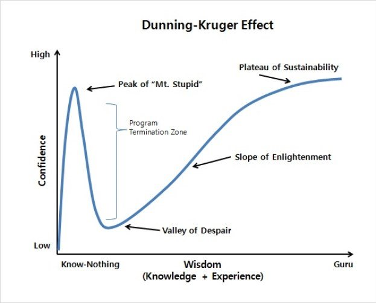

# 2019년 회고
## 요약
> 개발경력 1년이 되는 해

현업에서 개발경력이 1년 조금 넘게된 해이다.  
[더닝-크루거 효과](https://ko.wikipedia.org/wiki/더닝-크루거_효과)가 크게 적용된 해이기도 하다.

## 셀프인터뷰
### 현업에서 개발한 지 1년이 지난 것을 축하한다. 해보니 어떤가?
하드웨어 업무방식과 소프트웨어 업무방식의 차이를 몸소 깨달았다.  
운동에서 기초체력이 중요하듯, 개발에서 기초지식이 중요하다. 꾸준히 공부하겠다.  
이제 시작이다.

### 더닝-크루거 효과가 적용되었다는게 구체적으로 어떤 것인가?
업무에 익숙해지고, 여러 문제들을 해결하면서 어느 정도 자신감에 차있었다.  
하지만 개발공부를 할수록 부족함이 많이 느껴졌기에 아래 그림과 같이 Peak of "Mt.stupid"를 지나 Valley of Despair 단계에 진입했다고 생각한다.  

### 회사 생활 중 기억나는 것이 있다면?
- 모니터링 자동화한 일
  - 텔레그램봇으로 데이터 수집 이상 여부를 확인
  - 팀원분들이 잘쓰고 있다고 해줬을 때 보람찼다.
- 병목현상을 해결한 일
  - 멀티스레드 사용시 발생한 병목문제를 발견하고 해결
  - 평소에 읽던 자바 서적의 내용을 활용한 것으로 깊이 있는 학습에 관심을 더 갖게 되었다.
- DB 이관로직의 성능개선
  - 48시간 넘게 걸리던 이관작업을 12시간 내로 완료하도록 개선함
  - `맡은 일을 잘 할 수 있다` 라는 자신감을 얻게된 업무이다.

### 올 한 해 잘한 것과 아쉬운 것은?
- 잘한 것
  - 매일 업무일지를 적었던 것
  - 부족한 부분을 인지한 것
  - 작년보다 책을 많이 읽은 것
- 아쉬운 것
  - 아침 일찍 일어나지 못한 것
  - 운동을 게을리 한 것
  - 블로그를 하지 않은 것

### 작년에 하던 코딩스터디는 계속하고 있나?
그렇다.  
몇 차례 빠진 적은 있지만 꾸준히 하고 있다.  
각기 다른 개발환경에서 다양한 경험을 공유하는 것이 참 좋다.

### 일요코딩도 계속하고 있나?
물론이다.  
지금은 습관이 되서 안하면 허전하다.  
일주일 중 가장 마음 편히 코딩할 수 있는 시간이다.

### 건강은 잘 챙기고 있는지?
올해 잘먹고 지냈는지 체중이 늘었다.  
말로만 운동해야지 했는데 정말 해야겠다.  
지켜봐 달라. 

### 마지막으로 2020년의 목표는?
같이 일하고 싶은 사람이 되고 싶다.  
`이 사람과 같이 일하고 싶은데?` 라는 말을 듣고 싶다.