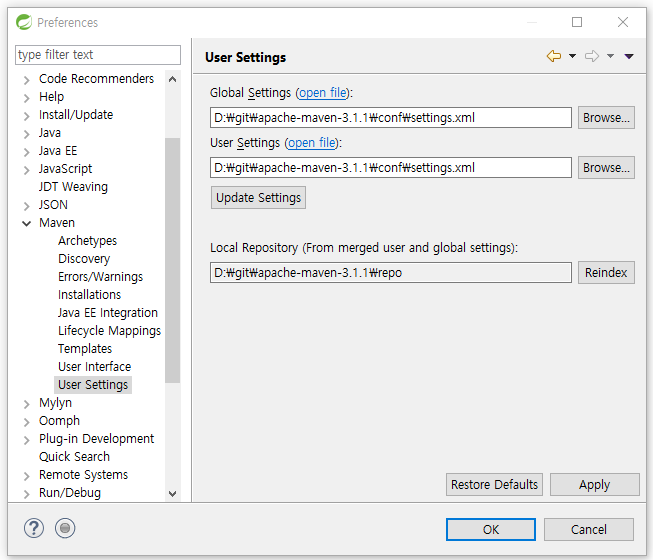
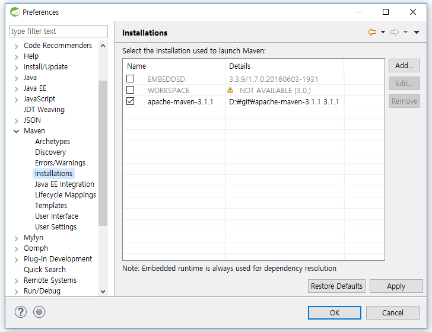

# Eclipse에서 Maven 설정

## Local Repository 설정
- [Window] - [Preferences] - [Maven] - [User Settings]
- Default Repository는 `C:\Users\사용자명\.m2\repository`

## Installations 설정
- [Window] - [Preferences] - [Maven] - [Installations]
- apache-maven 폴더 경로 추가

