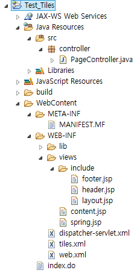
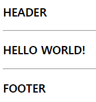
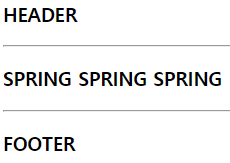

# Tiles

```
일반 Web project (Model2기반 MVC)에서 사용 가능하지만,
주로 Spring에서 사용
```

### Tiles 사이트
```
-http://tiles.apache.org/

-(API)
-http://tiles.apache.org/2.2/framework/getting_started.html

-(다운로드)
-http://tiles.apache.org/download.html

--버전 : 3.x.x  , 2.x.x
--http://www.apache.org/dyn/closer.cgi/tiles/v2.2.2/tiles-2.2.2-bin.zip
```

### web.xml
```xml
<!-- /WEB-INF/web.xml -->
...
<servlet>
  <servlet-name>dispatcher</servlet-name>
  <servlet-class>org.springframework.web.servlet.DispatcherServlet</servlet-class>
</servlet>
<servlet-mapping>
  <servlet-name>dispatcher</servlet-name>
  <url-pattern>*.do</url-pattern>
</servlet-mapping>
...
```

### dispatcher-servlet.xml
```xml
<context:component-scan base-package="controller" />

<!-- Tiles 설정 (Bean 객체 생성 주입) -->
<bean id="tilesConfigurer" class="org.springframework.web.servlet.view.tiles2.TilesConfigurer">
	<property name="definitions">
		<list>
			<value>/WEB-INF/tiles.xml</value>
		</list>
	</property>
</bean>

<!-- urlBasedViewResolver -->
<bean id="urlBasedViewResolver" class="org.springframework.web.servlet.view.UrlBasedViewResolver">
<property name="viewClass" value="org.springframework.web.servlet.view.tiles2.TilesView" />
</bean>

<!--
	public String form() {
		return "views.content";
	>> urlBasedViewResolver >> views.content url 값으로...
	>> 적용은: TilesView로 하겠다

	<definition name="*.*" template=""
	{1}/{2}.jsp
	>>views/content.jsp 를 client 전달
	}
-->
...
```

### tiles.xml
```xml
<!-- /WEB-INF/tiles.xml -->
<?xml version="1.0" encoding="utf-8"?>
<!DOCTYPE tiles-definitions PUBLIC
     "-//Apache Software Foundation//DTD Tiles Configuration 2.1//EN"
     "http://tiles.apache.org/dtds/tiles-config_2_1.dtd">
<tiles-definitions>
	<definition	name="*.*" template="/WEB-INF/views/include/layout.jsp">
		<put-attribute name="header" value="/WEB-INF/{1}/include/header.jsp" />
		<put-attribute name="footer" value="/WEB-INF/{1}/include/footer.jsp" />
		<put-attribute name="content" value="/WEB-INF/{1}/{2}.jsp" />
	</definition>
</tiles-definitions>
```

### PageController.java
```java
// /src/controller/PageController.java
package controller;

import org.springframework.stereotype.Controller;
import org.springframework.web.bind.annotation.RequestMapping;

@Controller
public class PageController {

	@RequestMapping("/index.do")
	public String index() {
		return "views.content";
	}

	@RequestMapping("/spring.do")
	public String spring() {
		return "views.spring";
	}
}
```

### header.jsp
```html
<!-- /WEB-INF/views/include/header.jsp -->
<%@ page language="java" contentType="text/html; charset=UTF-8"
    pageEncoding="UTF-8"%>
<div id="header">
	<h3>HEADER</h3>
</div>
<hr>
```

### footer.jsp
```html
<!-- /WEB-INF/views/include/footer.jsp -->
<%@ page language="java" contentType="text/html; charset=UTF-8"
    pageEncoding="UTF-8"%>
<hr>
<div id="footer">
	<h3>FOOTER</h3>
</div>
```

### content.jsp
```html
<!-- /WEB-INF/views/content.jsp -->
<%@ page language="java" contentType="text/html; charset=UTF-8"
    pageEncoding="UTF-8"%>
<h3>HELLO WORLD!</h3>
```

### spring.jsp
```html
<!-- /WEB-INF/views/spring.jsp -->
<%@ page language="java" contentType="text/html; charset=UTF-8"
    pageEncoding="UTF-8"%>
<h3>SPRING SPRING SPRING</h3>
```

### layout.jsp
```html
<!-- /WEB-INF/views/include/layout.jsp -->
<%@ page language="java" contentType="text/html; charset=UTF-8"
    pageEncoding="UTF-8"%>
<%@ taglib prefix="tiles" uri="http://tiles.apache.org/tags-tiles" %>
<!DOCTYPE html>
<html>
<head>
	<meta charset="UTF-8">
	<title>Tiles</title>
</head>
<body>
	<!-- Header 영역 -->
	<tiles:insertAttribute name="header" />

	<!-- Main 영역 -->
	<div id="main">
		<tiles:insertAttribute name="content" />
	</div>

	<!-- Footer 영역 -->
	<tiles:insertAttribute name="footer" />
</body>
</html>
```

### 디렉토리 구조


### 결과
```
http://localhost:8090/Test_Tiles/index.do
```


```
http://localhost:8090/Test_Tiles/spring.do
```

