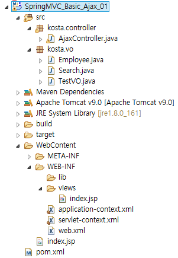

# SpringMVC에서 Ajax와 JSON

> 링크: http://www.nextree.co.kr/p11205/

## Ajax 예제
### 디렉토리 구조


### pom.xml
```xml
<!-- jackson lib -->
<dependency>
    <groupId>com.fasterxml.jackson.core</groupId>
    <artifactId>jackson-core</artifactId>
    <version>2.7.3</version>
</dependency>
<dependency>
    <groupId>org.codehaus.jackson</groupId>
    <artifactId>jackson-core-asl</artifactId>
    <version>1.9.13</version>
</dependency>
<dependency>
    <groupId>com.fasterxml.jackson.core</groupId>
    <artifactId>jackson-databind</artifactId>
    <version>2.7.3</version>
</dependency>
```

### web.xml
```xml
<?xml version="1.0" encoding="UTF-8"?>
<web-app xmlns:xsi="http://www.w3.org/2001/XMLSchema-instance" xmlns="http://java.sun.com/xml/ns/javaee" xsi:schemaLocation="http://java.sun.com/xml/ns/javaee http://java.sun.com/xml/ns/javaee/web-app_3_0.xsd" id="WebApp_ID" version="3.0">
  <display-name>SpringMVC_Basic_Ajax_01</display-name>
  <welcome-file-list>
    <welcome-file>index.htm</welcome-file>
  </welcome-file-list>
  <listener>
    <listener-class>
		org.springframework.web.context.ContextLoaderListener
	</listener-class>
  </listener>
  <context-param>
    <param-name>contextConfigLocation</param-name>
    <param-value>
		/WEB-INF/application-context.xml
	</param-value>
  </context-param>
  <servlet>
    <servlet-name>dispatcher</servlet-name>
    <servlet-class>org.springframework.web.servlet.DispatcherServlet</servlet-class>
    <init-param>
      <param-name>contextConfigLocation</param-name>
      <param-value>
  		/WEB-INF/servlet-context.xml
  		</param-value>
    </init-param>
  </servlet>
  <servlet-mapping>
    <servlet-name>dispatcher</servlet-name>
    <url-pattern>*.kosta</url-pattern>
  </servlet-mapping>
  <filter>
    <filter-name>EncodingFilter</filter-name>
    <filter-class>org.springframework.web.filter.CharacterEncodingFilter</filter-class>
    <init-param>
      <param-name>encoding</param-name>
      <param-value>UTF-8</param-value>
    </init-param>
  </filter>
  <filter-mapping>
    <filter-name>EncodingFilter</filter-name>
    <url-pattern>/*</url-pattern>
  </filter-mapping>
</web-app>
```

### application-context.xml
```xml
<?xml version="1.0" encoding="UTF-8"?>
<beans xmlns="http://www.springframework.org/schema/beans"
	xmlns:context="http://www.springframework.org/schema/context"
	xmlns:xsi="http://www.w3.org/2001/XMLSchema-instance"
	xsi:schemaLocation="http://www.springframework.org/schema/beans
http://www.springframework.org/schema/beans/spring-beans.xsd
http://www.springframework.org/schema/context
http://www.springframework.org/schema/context/spring-context.xsd
">

<bean class="org.springframework.web.servlet.view.InternalResourceViewResolver">
	<property name="prefix" value="/WEB-INF/views/" />
	<property name="suffix" value=".jsp" />
</bean>
</beans>
```

### servlet-context.xml
```xml
<?xml version="1.0" encoding="UTF-8"?>
<beans xmlns="http://www.springframework.org/schema/beans"
	xmlns:context="http://www.springframework.org/schema/context"
	xmlns:xsi="http://www.w3.org/2001/XMLSchema-instance"
	xsi:schemaLocation="http://www.springframework.org/schema/beans
http://www.springframework.org/schema/beans/spring-beans.xsd
http://www.springframework.org/schema/context
http://www.springframework.org/schema/context/spring-context.xsd
">
<context:component-scan base-package="kosta.controller" />
<!--
컨트롤로 사용하지 않고 View Mapping 가능  : /WEB-INF/views/index.jsp
컨트롤러에서 해줘야할 특정한 작업이 없고, 요청에 대해 단순히 뷰를 보여주고 싶을 때, 사용하는 컨트롤러이다.
요청된 url이 name="/index.kosta" 값과 같으면 view를 처리한다.

return index; 컨트롤러의 return 값
-->

<bean name="/index.kosta" class="org.springframework.web.servlet.mvc.ParameterizableViewController" >
	<property name="viewName" value="index"></property>
</bean>


<bean name="jsonview"
class="org.springframework.web.servlet.view.json.MappingJackson2JsonView" />
</beans>
```

### index.jsp
```html
<%@ page language="java" contentType="text/html; charset=UTF-8"
    pageEncoding="UTF-8"%>
<!DOCTYPE html PUBLIC "-//W3C//DTD HTML 4.01 Transitional//EN" "http://www.w3.org/TR/html4/loose.dtd">
<html>
<head>
	<meta http-equiv="Content-Type" content="text/html; charset=UTF-8">
	<title>Insert title here</title>
	<script src="https://code.jquery.com/jquery-2.2.4.min.js"></script>
	<script type="text/javascript">
		$(document).ready(function(){
			$('#ajaxBtn').click(function(){
				 var array = new Array();
				     array[0] = "a";
				     array[1] = "b";
				 $.ajax(
						 {
							type : "post",
							url  : "json.kosta",
							data : "command=AjaxTest&name=java&arr="+array,
							success : function(data){  //서버 {"menu",list}   //data > {}
								console.log(data);
								$('#menuView').empty();
								var opr="";
								$.each(data.menu,function(index,value){
									console.log(index + "/" + value);
									opr += index + "." + value + "<br>";
								});
								$('#menuView').append(opr);
							}
						 }
				       )    
			});


			$('#ajaxBtn2').click(function(){
				 $.ajax(
						 {   
							type : "post",
							url  : "json2.kosta",
							data : "command=AjaxTest2&name=java2",
							success : function(data){
								console.log(data);
								$('#menuView').empty();
								var opr="";
								$.each(data.menu,function(index,obj){  //obj > {}
									console.log(index + "/" + obj);
									opr += obj.beer + "<br>";
									opr += obj.food + "<br>";
									opr += index +"<br><hr>"
								});
								$('#menuView').append(opr);
							}
						 }
				       )    
			});


			$('#ajaxBtn3').click(function(){
				 $.ajax(
						 {
							type : "post",
							url  : "json3.kosta",
							success : function(data){
								console.log(data);
								$('#menuView').empty();
								var opr="";
								$.each(data.data,function(index,obj){
									console.log(index + "/" + obj);
									opr += obj.firstname + "<br>";
									opr += obj.lastname + "<br>";
									opr += obj.email + "<br>";
									opr += index +"<br><hr>"
								});
								$('#menuView').append(opr);
							}
						 }
				       )    
			});


			$('#ajaxBtn4').click(function(){
				var aaa = [];
				bbb = "NEWDATA";
				ccc = '[{"Product" : "Mouse", "Maker":"Samsung", "Price":23000},{"Product" : "KeyBoard", "Maker":"LG", "Price":12000}]';
				aaa.push(10);
				aaa.push(20);
				aaa.push(30);
				aaa.push(40);


				 $.ajax(
						 {
							type : "post",
							url  : "json4.kosta",
							data : {aaa:aaa, bbb:bbb, ccc:ccc}, //?aaa=aaa&bbb=bbb&
							success : function(data){
								console.log(data);
							}
						 }
				       )    
			});

		});
	</script>
</head>
<body>
	<input type="button" value="Spring-json" id="ajaxBtn">
	<input type="button" value="Spring-json" id="ajaxBtn2">
	<input type="button" value="Spring-json" id="ajaxBtn3">
	<input type="button" value="Spring-json" id="ajaxBtn4">
	<hr>
	<span id="menuView"></span>
</body>
</html>
```

### AjaxController.java
```java
package kosta.controller;

import java.util.ArrayList;
import java.util.Arrays;
import java.util.HashMap;
import java.util.Map;

import javax.servlet.http.HttpServletRequest;
import javax.servlet.http.HttpServletResponse;

import org.springframework.beans.factory.annotation.Autowired;
import org.springframework.stereotype.Controller;
import org.springframework.ui.ModelMap;
import org.springframework.web.bind.annotation.RequestMapping;
import org.springframework.web.bind.annotation.RequestMethod;
import org.springframework.web.bind.annotation.RequestParam;
import org.springframework.web.servlet.View;

import kosta.vo.Employee;
import kosta.vo.TestVO;

@Controller
public class AjaxController {

	//인터페이스의 다형성 사용
	//org.springframework.web.servlet.view.json.MappingJackson2JsonView
	@Autowired
	private View jsonview;

	@RequestMapping(value="json.kosta")
	public View jsonkosta(String command , String name, String[] arr , ModelMap map){
		System.out.println("command : " + command);
		System.out.println("name : " + name);
		System.out.println("arr : " + arr);
		System.out.println(Arrays.toString(arr));

		ArrayList<String> list = new ArrayList<>();
		list.add("치킨맥주");
		list.add("돈까스");
		list.add("치킨피자");

		map.addAttribute("menu", list);

		//private View jsonview 타입으로 리턴 //[Model, ModelMap, ModelAndView]
		//데이터를 객체(JSON) 담아 놓으면 자동...
		return jsonview;
	}
	@RequestMapping(value="json2.kosta")
	public View jsonkosta(String command , String name, ModelMap map){
		System.out.println("command : " + command);
		System.out.println("name : " + name);

		ArrayList<TestVO> list = new ArrayList<>();
		TestVO vo = new TestVO();
		vo.setBeer("라거");
		vo.setFood("골뱅이");

		list.add(vo);

		TestVO vo2 = new TestVO();
		vo2.setBeer("카스");
		vo2.setFood("치킨");

		list.add(vo2);

		map.addAttribute("menu", list);

		//{"menu":[{"beer":"라거","food":"골뱅이"},{"beer":"카스","food":"치킨"}]}

		return jsonview;  //private View jsonview 타입으로 리턴
	}

	@RequestMapping(value="/json3.kosta" , method = RequestMethod.POST)
	public View add(HttpServletRequest request, HttpServletResponse response,ModelMap map){

		Employee employee = new Employee();
		employee.setFirstname("kg");
		employee.setLastname("lim");
		employee.setEmail("i7027@naver.com");

		ArrayList<Employee> list = new ArrayList<>();
		list.add(employee);

		Employee employee2 = new Employee();
		employee2.setFirstname("h");
		employee2.setLastname("ong");
		employee2.setEmail("hong@naver.com");
		list.add(employee2);

		map.addAttribute("data", list);
		//{"data":[{"firstname":"kg","lastname":"lim","email":"i7027@naver.com"},{"firstname":"h","lastname":"ong","email":"hong@naver.com"}]}
		return jsonview;
	}

	@RequestMapping(value="/json4.kosta" , method = RequestMethod.POST)
	public void testType(
			@RequestParam(value="aaa[]", required=false) String[] aaa,
			@RequestParam(value="bbb", required=true) String bbb,
			String ccc
			)
	{
		Map<String, Object> result = new HashMap<String, Object>();

		// Array Request
		try{
		 for(int i=0,cnt=aaa.length; i<cnt; i++) System.out.println(aaa[i]);
		}catch(Exception e) {

		}

		// String Request
		System.out.println(bbb);
		System.out.println(ccc);

	}
}
```

### Employee.java
```java
package kosta.vo;

public class Employee {
	private String firstname;
	private String lastname;
	private String email;
	public String getFirstname() {
		return firstname;
	}
	public void setFirstname(String firstname) {
		this.firstname = firstname;
	}
	public String getLastname() {
		return lastname;
	}
	public void setLastname(String lastname) {
		this.lastname = lastname;
	}
	public String getEmail() {
		return email;
	}
	public void setEmail(String email) {
		this.email = email;
	}
}
```

### Search.java
```java
package kosta.vo;

public class Search {
	private String pname;
	private String lname;

	public String getPname() {
		return pname;
	}
	public void setPname(String pname) {
		this.pname = pname;
	}
	public String getLname() {
		return lname;
	}
	public void setLname(String lname) {
		this.lname = lname;
	}
}
```

### TestVO.java
```java
package kosta.vo;

public class TestVO {
	private String beer;
	private String food;
	public String getBeer() {
		return beer;
	}
	public void setBeer(String beer) {
		this.beer = beer;
	}
	public String getFood() {
		return food;
	}
	public void setFood(String food) {
		this.food = food;
	}
}
```
