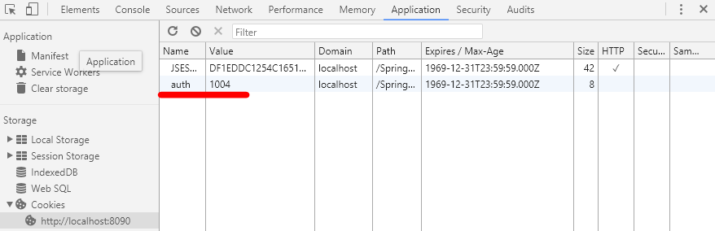

# Spring MVC Annotation (Cont.)

## TEST_5 Cookie 사용

### web.xml
> [Spring MVC Annotation](https://github.com/greatfarmer/TIL/blob/master/Spring/Spring-MVC-annotation.md) 과 동일

### dispatcher-servlet.xml
```xml
<!-- /WEB-INF/dispatcher-servlet.xml -->
...
<!-- TEST_5 Cookie 사용하기 @Cookievalue -->
    <bean class="com.controller.CookieController"></bean>
...
```

### SearchController.java
```java
// /src/com/controller/CookieController.java
package com.controller;

import javax.servlet.http.Cookie;
import javax.servlet.http.HttpServletRequest;
import javax.servlet.http.HttpServletResponse;

import org.springframework.stereotype.Controller;
import org.springframework.web.bind.annotation.CookieValue;
import org.springframework.web.bind.annotation.RequestMapping;

@Controller
public class CookieController {
	//필요하다면
	//HttpServletResponse parameter  사용가능
	//make(HttpServletResponse response , HttpServletRequest request)

	@RequestMapping("/cookie/make.do")
	public String make(HttpServletResponse response) {
		//javax.servlet.http.Cookie.Cookie(String name, String value)
		response.addCookie(new Cookie("auth","1004"));
		return "cookie/CookieMake";
	}

	/*
	org.springframework.web.bind.annotation.CookieValue
	@CookieValue(value="value", defaultValue="default") String parameter
	 */
	@RequestMapping("/cookie/view.do")
	public String view(@CookieValue(value="auth" , defaultValue="0") String auth) {
		System.out.println("클라이언트에서 read 한 쿠키값 : " + auth);
		return "cookie/CookieView";
	}
	//쿠키를 생성하지 않으면 >> [Console] 클라이언트에서 read 한 쿠키값 : 0
}
```

### CookieMake.jsp
```html
<!-- /WEB-INF/views/search/CookieMake.jsp -->
...
<body>
	<h3>CookieMake</h3>
</body>
...
```

### CookieView.jsp
```html
<!-- /WEB-INF/views/search/CookieView.jsp -->
...
<body>
	<h3>CookieView</h3>
</body>
...
```

### 결과

