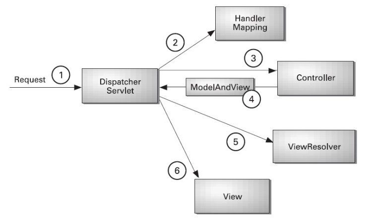

# Spring MVC패턴



## web.xml
```xml
<!-- /WEB-INF/web.xml -->
<?xml version="1.0" encoding="UTF-8"?>
<web-app xmlns:xsi=...>
  <display-name>SpringMVC_Basic01_Controller</display-name>
  <welcome-file-list>
    <welcome-file>index.html</welcome-file>
  </welcome-file-list>
  <servlet>
  	<servlet-name>spring</servlet-name>
    <!-- DispatcherServlet 클래스 (Spring 제공하는 FrontController, 요청 판단(url-pattern 설정)) -->
    <!-- web MVC framework 에서는 각 DispatcherServlet은 각자 자신의 WebApplicationContext [IOC  컨테이너]를 가지고 있다 -->
  	<servlet-class>org.springframework.web.servlet.DispatcherServlet</servlet-class>
  </servlet>
  <servlet-mapping>
  <!--
    **약속   <servlet-name>spring</servlet-name>
              : spring-servlet.xml 자동  read >> DispatcherServlet
        예)  <servlet-name>a</servlet-name>
              : 자동 : a-servlet.xml
  -->
  	<servlet-name>spring</servlet-name>
  	<url-pattern>*.do</url-pattern>
  </servlet-mapping>
</web-app>
```

## spring-servlet.xml
```xml
<!-- /WEB-INF/spring-servlet.xml -->
<!--
ViewResolver: view 설정을 담당하는 클래스
import org.springframework.web.servlet.view.InternalResourceViewResolver;
-->
...
<!-- id="/intro.do" >> url-pattern >> mapping 주소 -->
<bean id="/intro.do" class="kr.or.bit.IntroController"></bean>

<bean id="internalResourceViewResolver" class="org.springframework.web.servlet.view.InternalResourceViewResolver">
    <property name="prefix">
        <value>/WEB-INF/views/</value>
    </property>
    <property name="suffix">
        <value>.jsp</value>
    </property>
</bean>
<!--
    ModelAndView mav = new ModelAndView();
    mav.addObject("name", "kang"); //request.setAttribute("name", "kang");
    mav.setViewName("intro");

    경로
    /WEB-INF/views/ + intro + .jsp

    view주소: /WEB-INF/views/intro.jsp
-->
...
```

## IntroController.java
```java
// /src/kr/or/bit/IntroController.java
package kr.or.bit;

import javax.servlet.http.HttpServletRequest;
import javax.servlet.http.HttpServletResponse;

import org.springframework.web.servlet.ModelAndView;
import org.springframework.web.servlet.mvc.Controller;

public class IntroController implements Controller{
	public IntroController() {
		System.out.println("IntroController 객체 생성");
	}

	//handleRequest > servlet (doGET, doPOST) 역할
	@Override
	public ModelAndView handleRequest(HttpServletRequest request, HttpServletResponse response) throws Exception {
		System.out.println("IntroController 요청 실행: handleRequest");
		ModelAndView mav = new ModelAndView();
		mav.addObject("name", "kang"); //request.setAttribute("name", "kang");
		mav.setViewName("intro"); // WEB-INF/views/intro.jsp
		return mav;
	}
}
```

## intro.jsp
```html
<!-- /WEB-INF/views/intro.jsp -->
<%@ page language="java" contentType="text/html; charset=UTF-8"
    pageEncoding="UTF-8"%>
<!DOCTYPE html>
<html>
<head>
<meta charset="UTF-8">
<title>Intro</title>
</head>
<body>
	<h3>Intro</h3>
	VIEW: ${name} <!--EL사용 request.getAttribute("name"); -->
    <!-- 결과 >> VIEW: kang -->
</body>
</html>
```

## index.html
```html
<!-- /index.html -->
<!DOCTYPE html>
<html>
<head>
<meta charset="UTF-8">
<title>Insert title here</title>
</head>
<body>
<h3>Spring MVC</h3>
<!-- http://localhost:8090/SpringMVC_Basic01_Controller/intro.do -->
<a href="intro.do">intro.do 요청</a>
</body>
</html>
```
