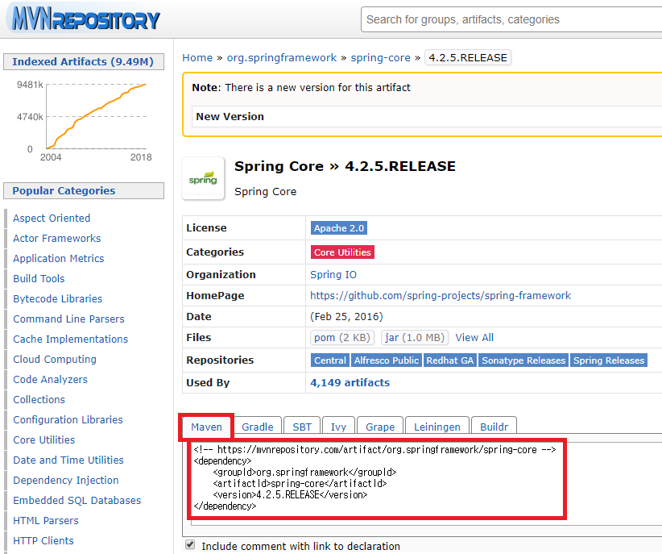

# Maven
> 참고: [Maven 기초 사용법 by 자바캔](http://javacan.tistory.com/entry/MavenBasic)

## STS
Spring Totol Suite

## POM
Based on the concept of a project object model <br>
pom.xml -> library를 maven을 통해 관리

### POM 파일 기본
pom.xml 파일은 Project Object Model 정보를 담고 있는 파일로서, <br>
다음과 같은 주요 설정 정보를 다룸.
* 프로젝트 정보 - 프로젝트의 이름, 개발자 목록, 라이센스 등의 정보를 기술
* 빌드 설정 - 소스, 리소스, 라이프 사이클 별 실행할 플러그인 등 빌드와 관련된 설정을 기술
* 빌드 환경 - 사용자 환경 별로 달라질 수 있는 프로파일 정보를 기술
* POM 연관 정보 - 의존 프로젝트(모듈), 상위 프로젝트, 포함하고 있는 하위 모듈 등을 기술

### POM 파일 태그
프로젝트 정보를 기술하는 태그
```
<name> - 프로젝트 이름
<url> - 프로젝트 사이트 URL
```
프로젝트간 연관 정보를 기술하는 태그
```
<groupId> - 프로젝트의 그룹 ID 설정
<artifactId> - 프로젝트의 Artifact ID 설정
<version> - 버전 설정
<packaging> - 패키징 타입 설정. jar뿐만 아니라 웹 어플리케이션을 위한 war나 JEE를 위한 ear 등의 패키징 타입이 존재
<dependencies> - 이 프로젝트에서 의존하는 다른 프로젝트 정보를 기술한다.
  <dependency> - 의존하는 프로젝트 POM 정보를 기술
    <groupId> - 의존하는 프로젝트의 그룹 ID
    <artifactId> - 의존하는 프로젝트의 artifact ID
    <version> - 의존하는 프로젝트의 버전
    <scope> - 의존하는 범위를 설정
```

### Maven Repository
> [Maven Repository 사이트](https://mvnrepository.com)를 통해 pom.xml에 maven library 적용



### 의존 설정
```html
<!-- pom.xml -->
<!-- 예) spring-core 모듈 -->
<dependency>
    <groupId>org.springframework</groupId>
    <artifactId>spring-core</artifactId>
    <version>4.2.5.RELEASE</version>
</dependency>
```

### pom.xml 예제
```html
<!-- pom.xml -->
<?xml version="1.0" encoding="UTF-8"?>
<project xmlns="http://maven.apache.org/POM/4.0.0" xmlns:xsi="http://www.w3.org/2001/XMLSchema-instance"
	xsi:schemaLocation="http://maven.apache.org/POM/4.0.0 http://maven.apache.org/maven-v4_0_0.xsd">
	<modelVersion>4.0.0</modelVersion>
	<groupId>a.a</groupId>
	<artifactId>a</artifactId>
	<name>SpringMVC_WebSite_Annotation_Tiles_MavenTemplate</name>
	<packaging>war</packaging>
	<version>1.0.0-BUILD-SNAPSHOT</version>
	<properties>
  	<org.springframework-version>
  			4.2.5.RELEASE
  	</org.springframework-version>
  	<db-version>
  			11
  	</db-version>
  	</properties>
  	<dependencies>
        <!-- Spring -->
  		<dependency>
    		<groupId>org.springframework</groupId>
    		<artifactId>spring-core</artifactId>
    		<version>${org.springframework-version}</version>
		</dependency>

        <!-- ... spring-beans, context, expression, aop 등등 동일 방식으로 추가 ...-->

		<!-- DB 작업(Oracle) Local repository를 활용한 추가  -->
		<dependency>
			<groupId>com.oracle</groupId>
			<artifactId>ojdbc</artifactId>
			<version>11</version>
		</dependency>
		<!-- File Upload 작업 -->
		<dependency>
    		<groupId>commons-fileupload</groupId>
    		<artifactId>commons-fileupload</artifactId>
    		<version>1.2.1</version>
		</dependency>
		<!-- File 쓰기 작업 -->
		<dependency>
    		<groupId>commons-io</groupId>
    		<artifactId>commons-io</artifactId>
    		<version>1.4</version>
		</dependency>
		<!-- Tiles -->
		<dependency>
    		<groupId>org.apache.tiles</groupId>
    		<artifactId>tiles-core</artifactId>
    		<version>2.2.2</version>
		</dependency>
		<dependency>
    		<groupId>org.apache.tiles</groupId>
    		<artifactId>tiles-jsp</artifactId>
    		<version>2.2.2</version>
		</dependency>
		<!-- JSP UI JSTL LIB -->
		<dependency>
    		<groupId>javax.servlet</groupId>
    		<artifactId>jstl</artifactId>
    		<version>1.2</version>
		</dependency>
		<!--  log 작업 -->
		<dependency>
    		<groupId>org.slf4j</groupId>
    		<artifactId>slf4j-api</artifactId>
    		<version>1.6.6</version>
		</dependency>
  	</dependencies>

    <!-- plugin -->
    <build>
        <plugins>
            <plugin>
                <artifactId>maven-eclipse-plugin</artifactId>
                <version>2.9</version>
                <configuration>
                    <additionalProjectnatures>
                        <projectnature>org.springframework.ide.eclipse.core.springnature</projectnature>
                    </additionalProjectnatures>
                    <additionalBuildcommands>
                        <buildcommand>org.springframework.ide.eclipse.core.springbuilder</buildcommand>
                    </additionalBuildcommands>
                    <downloadSources>true</downloadSources>
                    <downloadJavadocs>true</downloadJavadocs>
                </configuration>
            </plugin>
            <plugin>
                <groupId>org.apache.maven.plugins</groupId>
                <artifactId>maven-compiler-plugin</artifactId>
                <version>2.5.1</version>
                <configuration>
                    <source>1.8</source>
                    <target>1.8</target>
                    <compilerArgument>-Xlint:all</compilerArgument>
                    <showWarnings>true</showWarnings>
                    <showDeprecation>true</showDeprecation>
                </configuration>
            </plugin>
            <plugin>
                <groupId>org.codehaus.mojo</groupId>
                <artifactId>exec-maven-plugin</artifactId>
                <version>1.2.1</version>
                <configuration>
                    <mainClass>org.test.int1.Main</mainClass>
                </configuration>
            </plugin>
        </plugins>
    </build>
</project>

```

## 프로젝트 생성 방법
1. 일반 Dynamic Web Project >> Maven 변환 해서 사용하기
2. STS제공 Template 기반으로 프로젝트 생성 작업 <br>
([File]-[New]-[Spring Legcy Project]-[Spring MVC Project])

## 문제해결방법
1. STS 닫았다 다시 열어 보기
2. Maven >> update project >> 프로젝트 갱신
3. m2폴더 안에 jar파일 폴더 삭제하고 다시 POM.xml 통해서 다시 받기
```
(C:\Users\사용자명\.m2\repository\)
```
