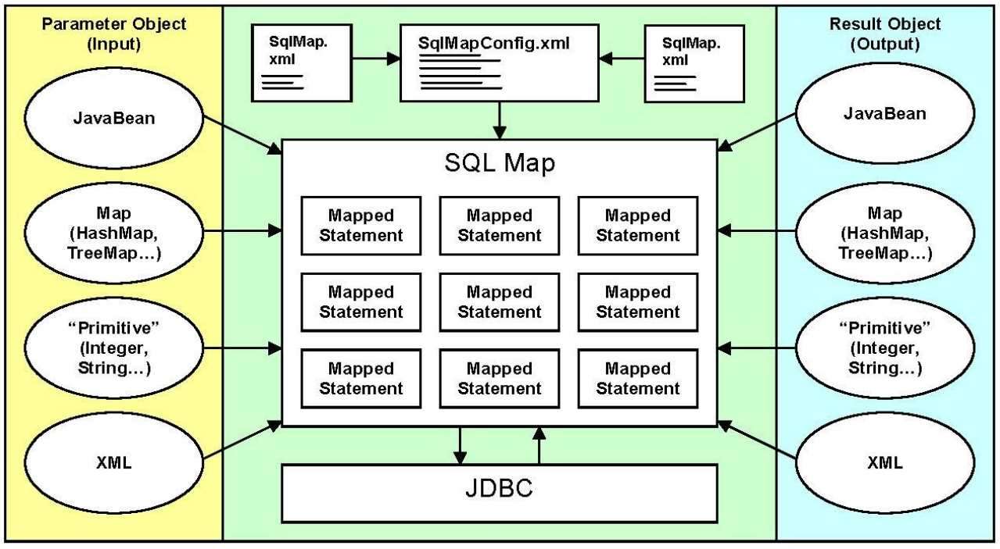

# MyBatis
> 참고: [MyBatis 한국어 페이지](http://www.mybatis.org/mybatis-3/ko/index.html)

Ibatis가 버전업 된 것이 Mybatis
* ORM 객체 매핑
* 자바빈즈를 SQL 구문에 매핑시킨다.

## MyBatis는 무엇인가?
마이바티스는 개발자가 지정한 SQL, 저장프로시저 그리고 몇가지 고급 매핑을 지원하는 퍼시스턴스 프레임워크이다. 마이바티스는 JDBC로 처리하는 상당부분의 코드와 파라미터 설정및 결과 매핑을 대신해준다. 마이바티스는 데이터베이스 레코드에 원시타입과 Map 인터페이스 그리고 자바 POJO 를 설정해서 매핑하기 위해 XML과 애노테이션을 사용할 수 있다.

## 스코프(Scope)와 생명주기(Lifecycle)
### SqlSessionFactoryBuilder
이 클래스는 인스턴스화되어 사용되고 던져질 수 있다. SqlSessionFactory 를 생성한 후 유지할 필요는 없다. 그러므로 SqlSessionFactoryBuilder 인스턴스의 가장 좋은 스코프는 메소드 스코프(예를들면 메소드 지역변수)이다. 여러개의 SqlSessionFactory 인스턴스를 빌드하기 위해 SqlSessionFactoryBuilder를 재사용할 수도 있지만 유지하지 않는 것이 가장 좋다.

### SqlSessionFactory
한번 만든뒤 SqlSessionFactory는 애플리케이션을 실행하는 동안 존재해야만 한다. 그래서 삭제하거나 재생성할 필요가 없다. 애플리케이션이 실행되는 동안 여러 차례 SqlSessionFactory 를 다시 빌드하지 않는 것이 가장 좋은 형태이다. 재빌드하는 형태는 결과적으로 “나쁜냄새” 가 나도록 한다. 그러므로 SqlSessionFactory 의 가장 좋은 스코프는 애플리케이션 스코프이다. 애플리케이션 스코프로 유지하기 위한 다양한 방법이 존재한다. 가장 간단한 방법은 싱글턴 패턴이나 static 싱글턴 패턴을 사용하는 것이다. 또는 구글 쥬스나 스프링과 같은 의존성 삽입 컨테이너를 선호할 수도 있다. 이러한 프레임워크는 SqlSessionFactory의 생명주기를 싱글턴으로 관리할 것이다.

### SqlSession
각각의 쓰레드는 자체적으로 SqlSession인스턴스를 가져야 한다. SqlSession인스턴스는 공유되지 않고 쓰레드에 안전하지도 않다. 그러므로 가장 좋은 스코프는 요청 또는 메소드 스코프이다. SqlSession 을 static 필드나 클래스의 인스턴스 필드로 지정해서는 안된다. 그리고 서블릿 프레임워크의 HttpSession 과 같은 관리 스코프에 둬서도 안된다. 어떠한 종류의 웹 프레임워크를 사용한다면 HTTP 요청과 유사한 스코프에 두는 것으로 고려해야 한다. 달리 말해서 HTTP 요청을 받을때마다 만들고 응답을 리턴할때마다 SqlSession 을 닫을 수 있다. SqlSession 을 닫는 것은 중요하다. 언제나 finally 블록에서 닫아야만 한다. 다음은 SqlSession을 닫는 것을 확인하는 표준적인 형태다.
```java
SqlSession session = sqlSessionFactory.openSession();
try {
  // do work
} finally {
  session.close();
}
```
코드전반에 이런 형태를 사용하는 것은 모든 데이터베이스 자원을 잘 닫는 것으로 보장하게 할 것이다.

### Mapper 인스턴스
Mapper는 매핑된 구문을 바인딩 하기 위해 만들어야 할 인터페이스이다. mapper 인터페이스의 인스턴스는 SqlSession 에서 생성한다. 그래서 mapper 인스턴스의 가장 좋은 스코프는 SqlSession 과 동일하다. 어쨌든 mapper 인스턴스의 가장 좋은 스코프는 메소드 스코프이다. 사용할 메소드가 호출되면 생성되고 끝난다. 명시적으로 닫을 필요는 없다.
```java
SqlSession session = sqlSessionFactory.openSession();
try {
  BlogMapper mapper = session.getMapper(BlogMapper.class);
  // do work
} finally {
  session.close();
}
```

### [0점짜리 코드] session을 static으로 사용
```java
public class SqlMapClient {
    private static SqlSession session;
    static {
        String resource = "SqlMapConfig.xml";
        try {
            Reader reader =  Resources.getResourceAsReader(resource);
            SqlSessionFactory factory = new  SqlSessionFactoryBuilder().build(reader);
            session = factory.openSession();
        }catch(Exception e) {

        }
    }
    public static SqlSession getSqlSession() {
        return session;
    }
}
```

### [100점짜리 코드] factory를 static으로 사용
```java
public class SqlMapClient {
    private static SqlSessionFactory factory;
    static {
        String resource = "SqlMapConfig.xml";
        try {
            Reader reader =  Resources.getResourceAsReader(resource);
            factory = new  SqlSessionFactoryBuilder().build(reader);
        }catch(Exception e) {

        }
    }
    public static SqlSessionFactory getFactory() {
        return this.factory;
    }
}
public class SqlExecution {
    public SqlSession getSqlSession() {
        private SqlSession session =  getFactory().openSession();
        try {

        }finally {
            session.close();
        }
    }
}
```

## iBATIS 데이터매퍼


## iBATIS 예제
```xml
<sqlMap>
    <select id="selectEmp"  parameterClass="java.lang.String"  resultClass="Ibatis.dto.Emp">
        select empno,ename,job,sal
        from emp
        where ename=#ename#
    </select>
    <insert id="insertEmp"  parameterClass="Ibatis.dto.Emp">
        insert into emp(empno,ename,job,sal)
        values(#empno#,#ename#,#job#,#sal#)
    </insert>
</sqlMap>
```

## 작성 순서
```
1. Mybatis 설정 (LIB) >> pom.xml
2. Oracle 원격 저장소 Maven설정 >> dependency
3. Mybatis > Config.xml (DB연결, Mapper 설정) > 별도의 객체를 설정...
            Spring -> 설정(Bean 객체를 ...작업)
4. mapper 파일 생성 (NoticeDao 인터페이스 연결)
```

## pom.xml
```xml
<!-- oracle repository -->
<repositories>
    <repository>
        <id>oracle</id>
        <name>ORACLE JDBC Repository</name>
        <url>http://maven.jahia.org/maven2</url>
    </repository>
</repositories>
<dependencies>
    ...
    <!-- Spring Mybatis -->
    <dependency>
        <groupId>org.mybatis</groupId>
        <artifactId>mybatis</artifactId>
        <version>3.1.1</version>
    </dependency>
    <dependency>
        <groupId>org.mybatis</groupId>
        <artifactId>mybatis-spring</artifactId>
        <version>1.2.2</version>
    </dependency>

    <!-- oracle jdbc -->
    <dependency>
        <groupId>com.oracle</groupId>
        <artifactId>ojdbc6</artifactId>
        <version>12.1.0.1</version>
        <scope>runtime</scope>
    </dependency>
    ...
</dependencies>
```

## root-context.xml
```xml
<!-- 공통 DB작업  -->
 <bean id="driverManagerDataSource" class="org.springframework.jdbc.datasource.DriverManagerDataSource">
 	<property name="driverClassName" value="oracle.jdbc.driver.OracleDriver" />
 	<property name="url" value="jdbc:oracle:thin:@localhost:1521:XE" />
 	<property name="username" value="springuser" />
 	<property name="password" value="1004" />
 </bean>

<!-- JDBCTemplate -->
 <bean id="" class="org.springframework.jdbc.core.JdbcTemplate" >
 	<property name="dataSource" ref="driverManagerDataSource"></property>
 </bean>

<!-- Mybatis 설정
기본 자바코드 : SqlMapConfig.xml 에서 설정했던 작업 (DB연결 ,mapper 설정)
파일 없어지고 설명파일안에서   > SqlSessionFactoryBean
기존 java 코드 : builder 사용 > Factory 객체 > sqlsession 생성 > 사용

두개의 클래스가 위 작업 처리
SqlSessionFactoryBean
SqlSessionTemplate
 -->
<bean id="sqlSessionFactoryBean" class="org.mybatis.spring.SqlSessionFactoryBean">
    <property name="dataSource" ref="driverManagerDataSource"></property>
    <property name="mapperLocations" value="classpath*:mapper/*xml" />
</bean>

<bean id="sqlSession" class="org.mybatis.spring.SqlSessionTemplate">
  <constructor-arg index="0" ref="sqlSessionFactoryBean"/>
</bean>
```

## NoticeDao.xml
```xml
<?xml version="1.0" encoding="UTF-8"?>
<!DOCTYPE mapper
PUBLIC "-//mybatis.org//DTD Mapper 3.0//EN"
"http://mybatis.org/dtd/mybatis-3-mapper.dtd">
<!--
	//게시물 개수
	public int getCount(String field, String query) throws ClassNotFoundException, SQLException;
	//전체 게시물
	public List<Notice> getNotices(int page, String field, String query) throws ClassNotFoundException, SQLException;
	//게시물 삭제
	public int delete(String seq) throws ClassNotFoundException, SQLException;
	//게시물 수정
	public int update(Notice notice) throws ClassNotFoundException, SQLException;
	//게시물 상세
	public Notice getNotice(String seq) throws ClassNotFoundException, SQLException;
	//게시물 입력
	public int insert(Notice n) throws ClassNotFoundException, SQLException;
-->
<mapper namespace="dao.NoticeDao">
	<!-- 초강력 주의!
		<select id="getCount" resultType="Integer">
			SELECT COUNT(*) CNT
			FROM NOTICES
			WHERE ${param1} LIKE '%${param2}%'; <- 처럼 ; 붙이면 안됨!!!!
		</select>
	 -->
	<!--
		parameter 1개 (생략)
		parameter 2개 이상 ...DTO 없는 경우: hashMap
		parameter 2개 이상 ...DTO > vo.Notice

		KEY POINT
		parameter 1개 생략: #{value} > 1개는 param1 적용 (x)
		parameter 2개 이상: getCount(String field, String query)

		1. 순서
		> String field > param1,
		> String query > param2

	-->
	<select id="getCount" resultType="Integer">
		SELECT COUNT(*) CNT
		FROM NOTICES
		WHERE ${param1} LIKE '%${param2}%'
	</select>
	<!--
	//전체 게시물
		public List<Notice> getNotices(int page, String field, String query) throws ClassNotFoundException, SQLException;

		parameter logic:
		int srow = 1 + (page-1)*5;
		int erow = 5 + (page-1)*5;

		parameter: int page, String field, String query
		param1, param2, param3

		1건 이상: return List<Notice>;
		1건: return Notice;
	-->
	<select id="getNotices" resultType="vo.Notice">
		SELECT * FROM
			(SELECT ROWNUM NUM, N.* FROM
				(SELECT * FROM NOTICES WHERE ${param2} LIKE '%${param3}%' ORDER BY REGDATE DESC) N)
		WHERE NUM BETWEEN 1 + (${param1}-1)*5 AND 5 + (${param1}-1)*5
	</select>
	<!--
	//게시물 상세
		public Notice getNotice(String seq);
		parameter 1개 생략 가능: param1 안되요
	-->
	<select id="getNotice" resultType="vo.Notice">
		SELECT seq,title,writer,content,regdate,hit,filesrc,filesrc2
		FROM NOTICES
		WHERE SEQ=#{seq}
	</select>
	<!--
		public int delete(String seq)
		delete, insert, update returntype (x)
	-->
	<delete id="delete">
		DELETE NOTICES WHERE SEQ=#{seq}
	</delete>
	<!--
	//게시물 수정
		public int update(Notice notice);
		원칙: <update id="update" parameterType="vo.Notice">
		VO, DTO 타입 Parameter 사용시 생략가능:

		FILESRC=#{fileSrc}
		FILESRC2=#{fileSrc2}

		파일 수정: null, null
		한개 수정: null, 1.jpg
		두개 수정: 1.jpg, 2.jpg

		#{fileSrc, jdbcType=VARCHAR}로 정의하면, 값이 없을 경우: 기본타입으로 update
	-->
	<update id="update">
		UPDATE NOTICES
		SET TITLE=#{title},
		CONTENT=#{content},
		FILESRC=#{fileSrc, jdbcType=VARCHAR},
		FILESRC2=#{fileSrc2, jdbcType=VARCHAR}
		WHERE SEQ=#{seq}
	</update>
	<!--
		//게시물 입력
		public int insert(Notice n)
		Parameter 생략 가능: Notice n

		INSERT INTO NOTICES(SEQ, TITLE, CONTENT, WRITER, REGDATE, HIT, FILESRC , FILESRC2)
		VALUES( (SELECT MAX(TO_NUMBER(SEQ))+1 FROM NOTICES), ?, ?, 'newleckosta', SYSDATE, 0, ?,?)

		selectKey 사용
	-->
	<insert id="insert">
		<selectKey order="BEFORE" keyProperty="seq" resultType="String">
			SELECT MAX(TO_NUMBER(SEQ))+1 FROM NOTICES
		</selectKey>
		INSERT INTO NOTICES(SEQ, TITLE, CONTENT, WRITER, REGDATE, HIT, FILESRC , FILESRC2)
		VALUES(#{seq}, #{title}, #{content}, 'bituser', SYSDATE, 0, #{fileSrc, jdbcType=VARCHAR}, #{fileSrc2, jdbcType=VARCHAR})
	</insert>
</mapper>
```

## 주의사항
```
전제조건: 특정한 이름(예: boardid)으로 UI, Java, DB단을 매핑시켜줘야 한다.
```
- UI
```html
<input type="text" name="boardid">
```
- Java
```java
//DTO
private int boardid() {}
```
- DB
```sql
create table board (boardid)
```
