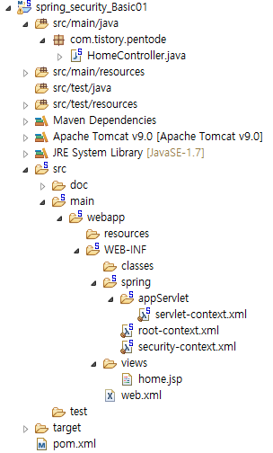
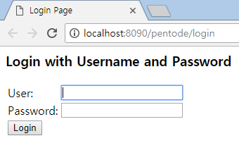
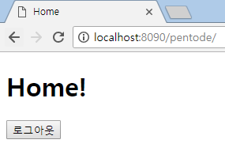
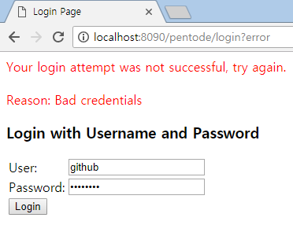

# Spring Security
> 출처: [pentode.tistory.com](pentode.tistory.com)

## 정리
|<center>표현식</center>|<center>설명</center>|
|---|---|
|hasRole([role])|현재 로그인된 사용자가 지정된  role을 가지고 있으면 true를 반환합니다. 제공된  role이 'ROLE_'로 시작하지 않으면 기본적으로  'ROLE_'를 추가합니다. 이것은  DefaultWebSecurityExpressionHandler에서  defaultRolePrefix를 수정하여 커스터마이즈할 수  있습니다.|
|hasAnyRole([role1,role2])|현재 로그인된 사용자가  콤마(,)로 분리하여 주어진 role들 중 하나라도 가지고  있으면 true를 반환합니다. 제공된 role이 'ROLE_'로  시작하지 않으면 기본적으로 'ROLE_'를 추가합니다.  이것은 DefaultWebSecurityExpressionHandler에서  defaultRolePrefix를 수정하여 커스터마이즈할 수  있습니다.|
|hasAuthority([authority])|현재 로그인된 사용자가  지정된 권한이 있으면 true를 반환합니다.|
|hasAnyAuthority([authority1,authority2])|현재  로그인된 사용자가 콤마(,)로 분리하여 주어진 권한들중  하나라도 가지고 있으면 true를 반환합니다.|
|principal|현재 사용자를 나타내는 principal 객체에  직접 접근할 수 있습니다.|
|authentication|SecurityContext로 부터 얻은  Authentication 객체에 직접 접근할 수 있습니다.|
|permitAll|항상 true로 평가 됩니다.|
|denyAll|항상 false로 평가 됩니다.|
|isAnonymous()|현재 사용자가 익명사용자(로그인  안됨) 사용자이면 true를 반환합니다.|
|isRememberMe()|현재 로그인된 사용자가 remember-me  사용자이면 true를 반환합니다. <br> (로그인 정보 기억 기능에  의한 사용자)|
|isAuthenticated()|현재 사용자가 로그인된  사용자라면 true를 반환합니다.|
|isFullyAuthenticated()|로그인 정보  기억(remember-me)이 아니라 아이디/비밀번호를  입력하여 로그인 했다면 true를 반환합니다.|
|hasPermission(Object target, Object permission)|사용자가 주어진 권한으로 제공된 대상에 액세스 할  수 있으면 true 를 반환합니다. 예,  hasPermission(domainObject, 'read')|
|hasPermission(Object targetId, String  targetType, Object permission)|사용자가 주어진  권한으로 제공된 대상에 액세스 할 수 있으면 true 를  반환합니다. 예, hasPermission(1,  'com.example.domain.Message', 'read')|

## 우선순위
```
<intercept-url pattern="/login/loginForm.do"  access="permitAll" />
<intercept-url pattern="/**"  access="hasAnyRole('USER, ADMIN')" />
```
두 가지 경우에는 경로가 명시되어 있는 "/login/loginForm.do"가 우선된다.

## 예제
### 디렉토리 구조


### pom.xml
```xml
...
<!-- Spring Security -->
<dependency>
    <groupId>org.springframework.security</groupId>
    <artifactId>spring-security-core</artifactId>
    <version>4.2.1.RELEASE</version>
</dependency>

<dependency>
    <groupId>org.springframework.security</groupId>
    <artifactId>spring-security-web</artifactId>
    <version>4.2.1.RELEASE</version>
</dependency>

<dependency>
    <groupId>org.springframework.security</groupId>
    <artifactId>spring-security-config</artifactId>
    <version>4.2.1.RELEASE</version>
</dependency>
...
```

### Web.xml
```xml
<?xml version="1.0" encoding="UTF-8"?>
<web-app xmlns:xsi="http://www.w3.org/2001/XMLSchema-instance" xmlns="http://java.sun.com/xml/ns/javaee" xsi:schemaLocation="http://java.sun.com/xml/ns/javaee http://java.sun.com/xml/ns/javaee/web-app_3_0.xsd" version="3.0">
  <filter>
    <filter-name>springSecurityFilterChain</filter-name>
    <filter-class>org.springframework.web.filter.DelegatingFilterProxy</filter-class>
  </filter>
  <filter-mapping>
    <filter-name>springSecurityFilterChain</filter-name>
    <url-pattern>/*</url-pattern>
  </filter-mapping>
  <context-param>
    <param-name>contextConfigLocation</param-name>
    <param-value>
		  /WEB-INF/spring/root-context.xml
		  /WEB-INF/spring/security-context.xml
		</param-value>
  </context-param>
  <listener>
    <listener-class>org.springframework.web.context.ContextLoaderListener</listener-class>
  </listener>
  <servlet>
    <servlet-name>appServlet</servlet-name>
    <servlet-class>org.springframework.web.servlet.DispatcherServlet</servlet-class>
    <init-param>
      <param-name>contextConfigLocation</param-name>
      <param-value>/WEB-INF/spring/appServlet/servlet-context.xml</param-value>
    </init-param>
    <load-on-startup>1</load-on-startup>
  </servlet>
  <servlet-mapping>
    <servlet-name>appServlet</servlet-name>
    <url-pattern>*.do</url-pattern>
  </servlet-mapping>
  <welcome-file-list>
    <welcome-file>home.do</welcome-file>
  </welcome-file-list>
  <error-page>
    <error-code>500</error-code>
    <location>/WEB-INF/views/error.jsp</location>
  </error-page>
</web-app>
```

### root-context.xml
```xml
<?xml version="1.0" encoding="UTF-8"?>
<beans xmlns="http://www.springframework.org/schema/beans"
	xmlns:xsi="http://www.w3.org/2001/XMLSchema-instance"
	xmlns:tx="http://www.springframework.org/schema/tx"
	xmlns:context="http://www.springframework.org/schema/context"
	xmlns:aop="http://www.springframework.org/schema/aop"
	xsi:schemaLocation="http://www.springframework.org/schema/jdbc http://www.springframework.org/schema/jdbc/spring-jdbc-4.3.xsd
		http://www.springframework.org/schema/beans http://www.springframework.org/schema/beans/spring-beans-4.3.xsd
		http://www.springframework.org/schema/context http://www.springframework.org/schema/context/spring-context-4.3.xsd
		http://www.springframework.org/schema/aop http://www.springframework.org/schema/aop/spring-aop-4.3.xsd
		http://www.springframework.org/schema/tx http://www.springframework.org/schema/tx/spring-tx-4.3.xsd">

</beans>
```

### security-context.xml
```xml
<?xml version="1.0" encoding="UTF-8"?>
<beans:beans xmlns="http://www.springframework.org/schema/security"
    xmlns:beans="http://www.springframework.org/schema/beans"
	xmlns:xsi="http://www.w3.org/2001/XMLSchema-instance"
	xsi:schemaLocation="http://www.springframework.org/schema/security http://www.springframework.org/schema/security/spring-security.xsd
		http://www.springframework.org/schema/beans http://www.springframework.org/schema/beans/spring-beans-4.3.xsd">

    <!-- 검사 URL -->
    <http>
        <intercept-url pattern="/**" access="hasRole('USER')" />
        <form-login />
        <logout />
    </http>

    <!--  provider  -->
    <authentication-manager>
        <authentication-provider>
            <user-service>
                <user name="user" password="password" authorities="ROLE_USER" />
            </user-service>
        </authentication-provider>
    </authentication-manager>

</beans:beans>
```

### servlet-context.xml
```xml
<?xml version="1.0" encoding="UTF-8"?>
<beans:beans xmlns="http://www.springframework.org/schema/mvc"
	xmlns:xsi="http://www.w3.org/2001/XMLSchema-instance"
	xmlns:beans="http://www.springframework.org/schema/beans"
	xmlns:context="http://www.springframework.org/schema/context"
	xmlns:aop="http://www.springframework.org/schema/aop"
	xsi:schemaLocation="http://www.springframework.org/schema/mvc http://www.springframework.org/schema/mvc/spring-mvc-4.3.xsd
		http://www.springframework.org/schema/beans http://www.springframework.org/schema/beans/spring-beans.xsd
		http://www.springframework.org/schema/context http://www.springframework.org/schema/context/spring-context.xsd
		http://www.springframework.org/schema/aop http://www.springframework.org/schema/aop/spring-aop-4.3.xsd">

	<!-- DispatcherServlet Context: defines this servlet's request-processing infrastructure -->

	<!-- Enables the Spring MVC @Controller programming model -->
    <annotation-driven />
    <context:component-scan base-package="com.tistory.pentode" />


	<!-- Handles HTTP GET requests for /resources/** by efficiently serving up static resources in the ${webappRoot}/resources directory -->
	<resources mapping="/resources/**" location="/resources/" />

	<!-- Resolves views selected for rendering by @Controllers to .jsp resources in the /WEB-INF/views directory -->
	<beans:bean class="org.springframework.web.servlet.view.InternalResourceViewResolver">
		<beans:property name="prefix" value="/WEB-INF/views/" />
		<beans:property name="suffix" value=".jsp" />
	</beans:bean>


	<beans:bean class="org.springframework.web.servlet.handler.SimpleMappingExceptionResolver">
      <beans:property name="exceptionMappings">
        <beans:props>
            <beans:prop key="java.lang.Exception">error</beans:prop>
        </beans:props>
      </beans:property>
    </beans:bean>

</beans:beans>
```

### HomeController.java
```java
package com.tistory.pentode;

import java.util.Locale;

import org.slf4j.Logger;
import org.slf4j.LoggerFactory;
import org.springframework.stereotype.Controller;
import org.springframework.ui.Model;
import org.springframework.web.bind.annotation.RequestMapping;
import org.springframework.web.bind.annotation.RequestMethod;

/**
 * Handles requests for the application home page.
 */
@Controller
public class HomeController {
	private static final Logger logger = LoggerFactory.getLogger(HomeController.class);

	/**
	 * Simply selects the home view to render by returning its name.
	 */
	@RequestMapping(value = "/home.do", method = RequestMethod.GET)
	public String home(Locale locale, Model model) {
		logger.info("Welcome home! The client locale is {}.", locale);

		return "home";
	}
}
```

### home.jsp
```html
<%@ page language="java" contentType="text/html; charset=UTF-8" pageEncoding="UTF-8"%>
<%@ taglib prefix="c" uri="http://java.sun.com/jsp/jstl/core" %>
<%@ taglib prefix="form" uri="http://www.springframework.org/tags/form" %>
<!DOCTYPE html>
<html lang="ko">
<head>
    <meta http-equiv="Content-Type" content="text/html; charset=UTF-8" />
	<title>Home</title>
</head>

<body>

<h1>Home!</h1>

<form:form action="${pageContext.request.contextPath}/logout" method="POST">
    <input type="submit" value="로그아웃" />
</form:form>

</body>
</html>
```

## 결과
|메인화면|로그인|로그아웃|에러|
|---|---|---|---|
|||||
