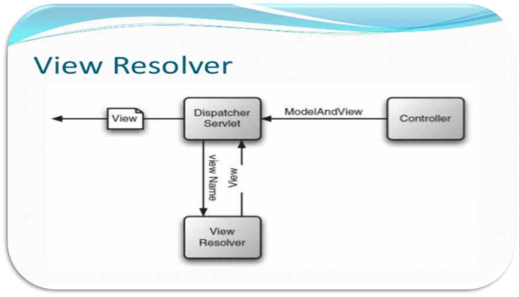
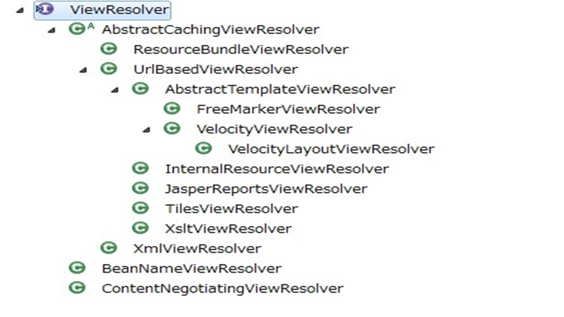
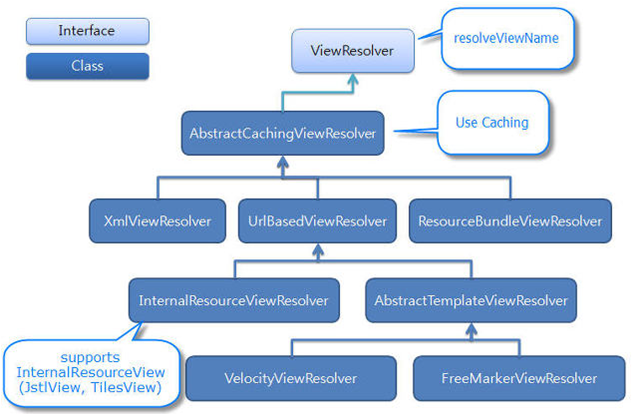

# View Resolver
> 비트캠프 자바 104기 1조 Spring과제 발표자료 <br>
https://www.slideshare.net/emprovise/13-spring-mvcview <br>
https://docs.spring.io/spring-framework/docs/current/javadoc-api/org/springframework/web/servlet/ModelAndView.html <br>
https://docs.spring.io/spring-framework/docs/current/javadoc-api/org/springframework/web/servlet/RequestToViewNameTranslator.html <br>
https://stackoverflow.com/questions/6875255/what-does-it-mean-when-spring-mvc-controller-returns-null-view-name

## ModelAndView
* ModelAndView는 단지 controller가 model과 view를 묶어서 하나로 return하는 역할
* ModelAndView는 특별한 기능이 아니고 단지 Model + View인 세트


## Diagram


## Interface


**Key Point**
* XmlViewResolver, BeanNameViewResolver -> 없을 시 null값 리턴
* InternalResourceViewResolver -> 없을 시 예외가 떨어짐, 따라서 우선순위를 마지막에 두어야 한다.

## Structure


## 5가지 구현
### 1. ModelAndView를 return
```java
@RequestMapping("/hello")
public ModelAndView hello(HttpServletRequest request) throws Exception {
    String name = request.getParameter("name");
    Map<String, Object> map = new HashMap<String, Object>();
    map.put("name", name);
    return new ModelAndView("hello.jsp", map);
    //return ModelAndView("hello.jsp").addObject("name", name);
}
```
```java
@RequestMapping("/hello")
public ModelAndView hello(@RequestParam String name, Model model) throws Exception {
    model.addAttribute("name", name);
    return new ModelAndView("hello");
}
```

### 2. String을 return
```java
@RequestMapping("/hello")
public String hello(@RequestParam String name, Model model) throws Exception {
    model.addAttribute("name", name);
    return "hello";
}
```

### 3. void
```java
@RequestMapping("/hello")
public void hello(@RequestParam String name, Model model) throws Exception {
    model.addAttribute("name", name);
}
//Controller의 return type이 void인 경우 RequestToViewNameTranslator에 의해서
//요청 주소가 view name으로 해석된다.
```

### 4. View
```java
@RequestMapping("/user/xml")
public View userxml(@RequestParam int id) {
    //...
    return new InternalResourceView("/WEB-INF/view/hello.jsp");
}
```

### 5. @ResponseBody
```java
@RequestMapping("/hello")
@ResponseBody
public String hello() {
    return "<html><body>Hello World</body></html>";
}
//@ResponseBody -> 비동기에서 사용 (Resolver 태우지 않고 데이터만 리턴)
```
