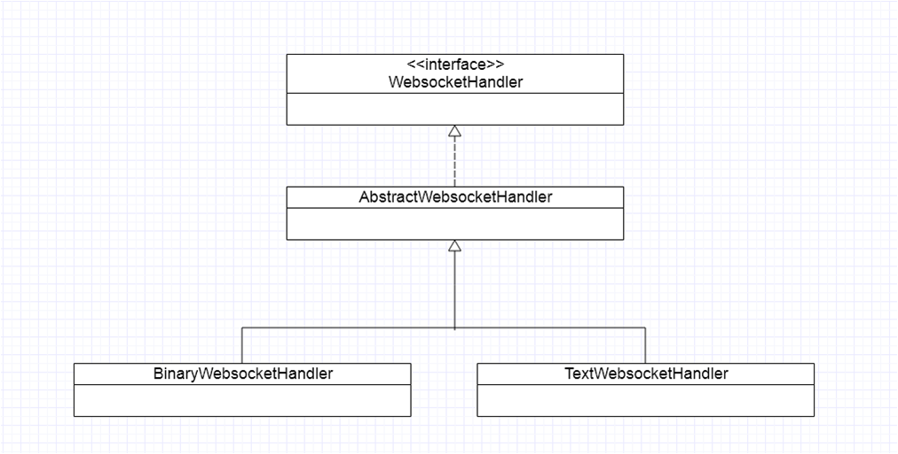
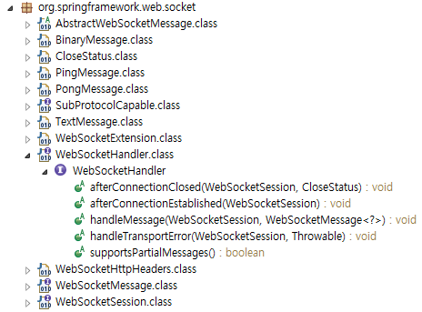
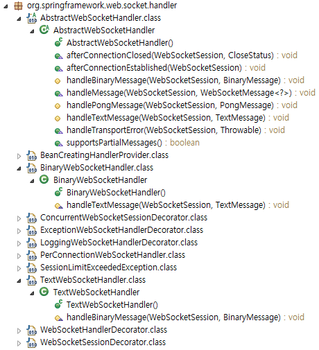

# Spring WebSocket

## spring-websocket-4.2.5.RELEASE.jar
### package org.springframework.web.socket
### interface WebSocketHandler




```java
/*
 * Copyright 2002-2013 the original author or authors.
 *
 * Licensed under the Apache License, Version 2.0 (the "License");
 * you may not use this file except in compliance with the License.
 * You may obtain a copy of the License at
 *
 * http://www.apache.org/licenses/LICENSE-2.0
 *
 * Unless required by applicable law or agreed to in writing, software
 * distributed under the License is distributed on an "AS IS" BASIS,
 * WITHOUT WARRANTIES OR CONDITIONS OF ANY KIND, either express or implied.
 * See the License for the specific language governing permissions and
 * limitations under the License.
 */

package org.springframework.web.socket;

/**
 * A handler for WebSocket messages and lifecycle events.
 *
 * <p>Implementations of this interface are encouraged to handle exceptions locally where
 * it makes sense or alternatively let the exception bubble up in which case by default
 * the exception is logged and the session closed with
 * {@link CloseStatus#SERVER_ERROR SERVER_ERROR(1011)}. The exception handling
 * strategy is provided by
 * {@link org.springframework.web.socket.handler.ExceptionWebSocketHandlerDecorator
 * ExceptionWebSocketHandlerDecorator} and it can be customized or replaced by decorating
 * the {@link WebSocketHandler} with a different decorator.
 *
 * @author Rossen Stoyanchev
 * @author Phillip Webb
 * @since 4.0
 */
public interface WebSocketHandler {

	/**
	 * Invoked after WebSocket negotiation has succeeded and the WebSocket connection is
	 * opened and ready for use.
	 * @throws Exception this method can handle or propagate exceptions; see class-level
	 * Javadoc for details.
	 */
	void afterConnectionEstablished(WebSocketSession session) throws Exception;

	/**
	 * Invoked when a new WebSocket message arrives.
	 * @throws Exception this method can handle or propagate exceptions; see class-level
	 * Javadoc for details.
	 */
	void handleMessage(WebSocketSession session, WebSocketMessage<?> message) throws Exception;

	/**
	 * Handle an error from the underlying WebSocket message transport.
	 * @throws Exception this method can handle or propagate exceptions; see class-level
	 * Javadoc for details.
	 */
	void handleTransportError(WebSocketSession session, Throwable exception) throws Exception;

	/**
	 * Invoked after the WebSocket connection has been closed by either side, or after a
	 * transport error has occurred. Although the session may technically still be open,
	 * depending on the underlying implementation, sending messages at this point is
	 * discouraged and most likely will not succeed.
	 * @throws Exception this method can handle or propagate exceptions; see class-level
	 * Javadoc for details.
	 */
	void afterConnectionClosed(WebSocketSession session, CloseStatus closeStatus) throws Exception;

	/**
	 * Whether the WebSocketHandler handles partial messages. If this flag is set to
	 * {@code true} and the underlying WebSocket server supports partial messages,
	 * then a large WebSocket message, or one of an unknown size may be split and
	 * maybe received over multiple calls to
	 * {@link #handleMessage(WebSocketSession, WebSocketMessage)}. The flag
	 * {@link org.springframework.web.socket.WebSocketMessage#isLast()} indicates if
	 * the message is partial and whether it is the last part.
	 */
	boolean supportsPartialMessages();

}
```
## package org.springframework.web.socket.handler


### class AbstractWebSocketHandler
```java
/*
 * Copyright 2002-2013 the original author or authors.
 *
 * Licensed under the Apache License, Version 2.0 (the "License");
 * you may not use this file except in compliance with the License.
 * You may obtain a copy of the License at
 *
 * http://www.apache.org/licenses/LICENSE-2.0
 *
 * Unless required by applicable law or agreed to in writing, software
 * distributed under the License is distributed on an "AS IS" BASIS,
 * WITHOUT WARRANTIES OR CONDITIONS OF ANY KIND, either express or implied.
 * See the License for the specific language governing permissions and
 * limitations under the License.
 */

package org.springframework.web.socket.handler;

import org.springframework.web.socket.BinaryMessage;
import org.springframework.web.socket.CloseStatus;
import org.springframework.web.socket.PongMessage;
import org.springframework.web.socket.TextMessage;
import org.springframework.web.socket.WebSocketHandler;
import org.springframework.web.socket.WebSocketMessage;
import org.springframework.web.socket.WebSocketSession;

/**
 * A convenient base class for {@link WebSocketHandler} implementation with empty methods.
 *
 * @author Rossen Stoyanchev
 * @author Phillip Webb
 * @since 4.0
 */
public abstract class AbstractWebSocketHandler implements WebSocketHandler {

	@Override
	public void afterConnectionEstablished(WebSocketSession session) throws Exception {
	}

	@Override
	public void handleMessage(WebSocketSession session, WebSocketMessage<?> message) throws Exception {
		if (message instanceof TextMessage) {
			handleTextMessage(session, (TextMessage) message);
		}
		else if (message instanceof BinaryMessage) {
			handleBinaryMessage(session, (BinaryMessage) message);
		}
		else if (message instanceof PongMessage) {
			handlePongMessage(session, (PongMessage) message);
		}
		else {
			throw new IllegalStateException("Unexpected WebSocket message type: " + message);
		}
	}

	protected void handleTextMessage(WebSocketSession session, TextMessage message) throws Exception {
	}

	protected void handleBinaryMessage(WebSocketSession session, BinaryMessage message) throws Exception {
	}

	protected void handlePongMessage(WebSocketSession session, PongMessage message) throws Exception {
	}

	@Override
	public void handleTransportError(WebSocketSession session, Throwable exception) throws Exception {
	}

	@Override
	public void afterConnectionClosed(WebSocketSession session, CloseStatus status) throws Exception {
	}

	@Override
	public boolean supportsPartialMessages() {
		return false;
	}

}
```

## class BinaryWebSocketHandler
```java
/*
 * Copyright 2002-2013 the original author or authors.
 *
 * Licensed under the Apache License, Version 2.0 (the "License");
 * you may not use this file except in compliance with the License.
 * You may obtain a copy of the License at
 *
 * http://www.apache.org/licenses/LICENSE-2.0
 *
 * Unless required by applicable law or agreed to in writing, software
 * distributed under the License is distributed on an "AS IS" BASIS,
 * WITHOUT WARRANTIES OR CONDITIONS OF ANY KIND, either express or implied.
 * See the License for the specific language governing permissions and
 * limitations under the License.
 */

package org.springframework.web.socket.handler;

import java.io.IOException;

import org.springframework.web.socket.CloseStatus;
import org.springframework.web.socket.TextMessage;
import org.springframework.web.socket.WebSocketHandler;
import org.springframework.web.socket.WebSocketSession;

/**
 * A convenient base class for {@link WebSocketHandler} implementation that process binary
 * messages only. Text messages are rejected with {@link CloseStatus#NOT_ACCEPTABLE}. All
 * other methods have empty implementations.
 *
 * @author Rossen Stoyanchev
 * @author Phillip Webb
 * @since 4.0
 */
public class BinaryWebSocketHandler extends AbstractWebSocketHandler {

	@Override
	protected void handleTextMessage(WebSocketSession session, TextMessage message) {
		try {
			session.close(CloseStatus.NOT_ACCEPTABLE.withReason("Text messages not supported"));
		}
		catch (IOException e) {
			// ignore
		}
	}

}
```

## class TextWebSocketHandler
```java
/*
 * Copyright 2002-2013 the original author or authors.
 *
 * Licensed under the Apache License, Version 2.0 (the "License");
 * you may not use this file except in compliance with the License.
 * You may obtain a copy of the License at
 *
 * http://www.apache.org/licenses/LICENSE-2.0
 *
 * Unless required by applicable law or agreed to in writing, software
 * distributed under the License is distributed on an "AS IS" BASIS,
 * WITHOUT WARRANTIES OR CONDITIONS OF ANY KIND, either express or implied.
 * See the License for the specific language governing permissions and
 * limitations under the License.
 */

package org.springframework.web.socket.handler;

import java.io.IOException;

import org.springframework.web.socket.BinaryMessage;
import org.springframework.web.socket.CloseStatus;
import org.springframework.web.socket.WebSocketHandler;
import org.springframework.web.socket.WebSocketSession;

/**
 * A convenient base class for {@link WebSocketHandler} implementation that process text
 * messages only. Binary messages are rejected with {@link CloseStatus#NOT_ACCEPTABLE}. All
 * other methods have empty implementations.
 *
 * @author Rossen Stoyanchev
 * @author Phillip Webb
 * @since 4.0
 */
public class TextWebSocketHandler extends AbstractWebSocketHandler {

	@Override
	protected void handleBinaryMessage(WebSocketSession session, BinaryMessage message) {
		try {
			session.close(CloseStatus.NOT_ACCEPTABLE.withReason("Binary messages not supported"));
		}
		catch (IOException ex) {
			// ignore
		}
	}

}
```
