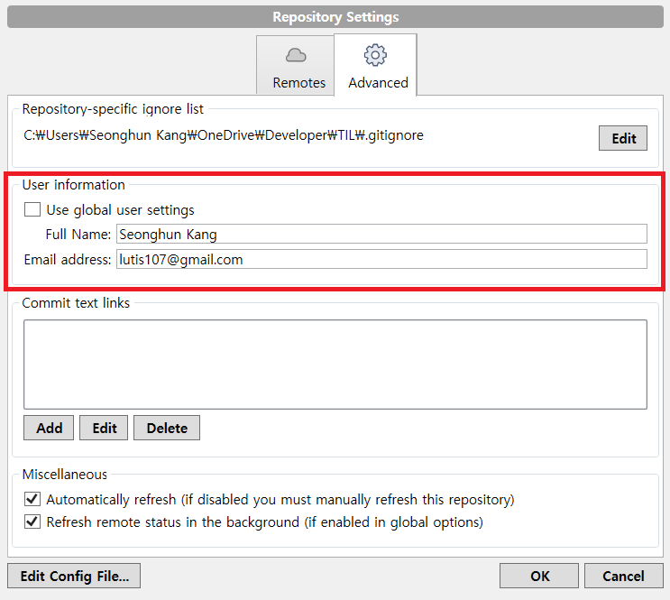
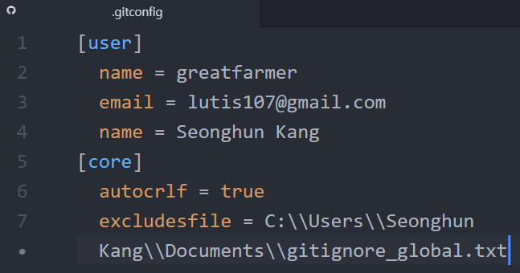

# Git

## 깃을 위한 flight rules
- https://github.com/k88hudson/git-flight-rules/blob/master/README_kr.md

## 자주 사용하는 깃 명령어 모음
- https://github.com/jeonghwan-kim/git-usage

## 좋은 커밋 메시지 작성하기
- https://item4.github.io/2016-11-01/How-to-Write-a-Git-Commit-Message/
- https://sujinlee.me/professional-github/
- https://djkeh.github.io/articles/How-to-write-a-git-commit-message-kor/

## gitignore
- [Tip-Git-gitignore](Tip-Git-gitignore.md)

## GitHub language colors
- [Tip-GiHub-Colors](Tip-GitHub-Colors.md)

## Trouble Shooting
### Sourcetree에서 User information 내용을 변경해도 새 Repository에서 적용이 되지 않을 경우

- .gitconfig 파일에서 내용을 변경
  - `C:\Users\<username>\.gitconfig`
  

> https://community.atlassian.com/t5/Sourcetree-questions/Change-the-author-and-committer-name-and-e-mail-of-multiple/qaq-p/807008

> 같이보기 https://git-scm.com/book/ko/v1/시작하기-Git-최초-설정
